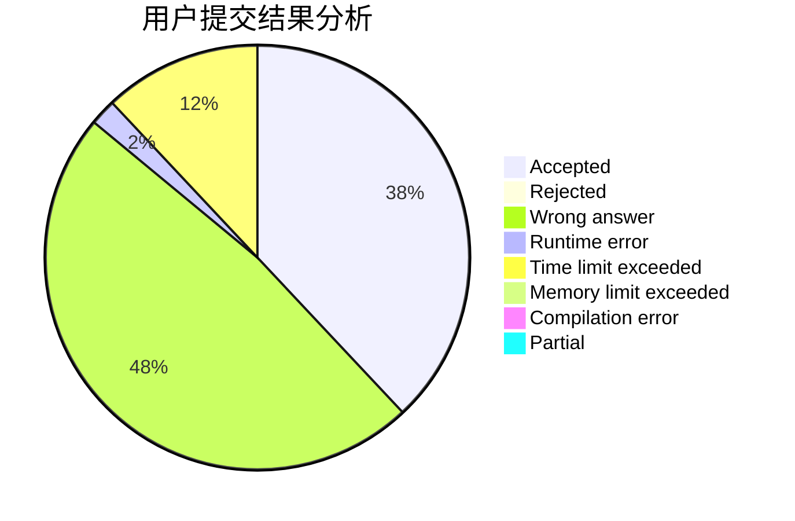
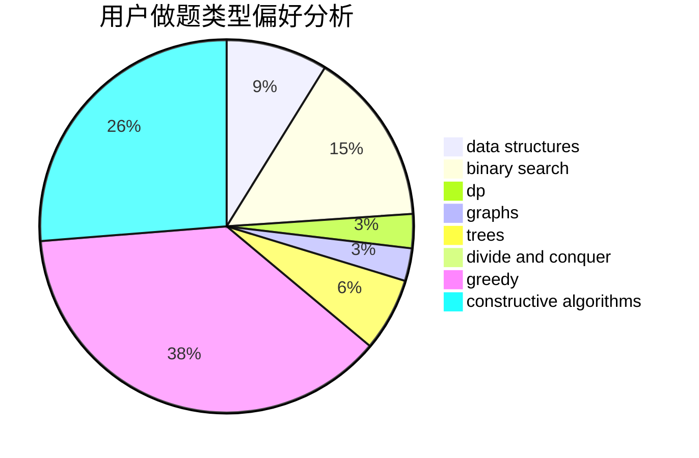
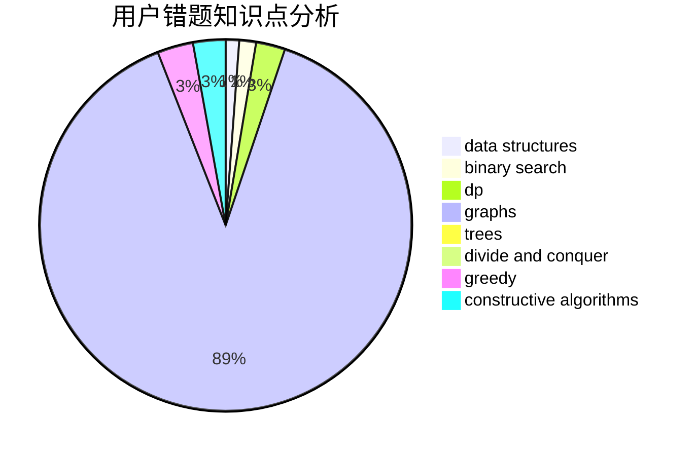

# BuShangGMBuGaiMing

<!-- tabs:start -->

#### **用户提交结果分析**

#### **用户做题类型偏好分析**

#### **用户错题知识点分析**

<!-- tabs:end -->
# 推荐题目
[1294A](https://codeforces.com/contest/1294/problem/A)		math		  
[1457A](https://codeforces.com/contest/1457/problem/A)		dsu,graphs,sortings,trees		  
[1097G](https://codeforces.com/contest/1097/problem/G)		combinatorics,
                        dp,
                        trees		  
[58B](https://codeforces.com/contest/58/problem/B)		greedy		  
[3912](https://codeforces.com/contest/391/problem/2)		dsu,graphs,sortings,trees		  
[1166F](https://codeforces.com/contest/1166/problem/F)		data structures,
                        dsu,
                        graphs,
                        hashing		  
[58E](https://codeforces.com/contest/58/problem/E)		dp		  
[1302F](https://codeforces.com/contest/1302/problem/F)		bitmasks,
                        brute force,
                        expression parsing		  
[1070H](https://codeforces.com/contest/1070/problem/H)		brute force,
                        implementation		  
[383D](https://codeforces.com/contest/383/problem/D)		dp		  
