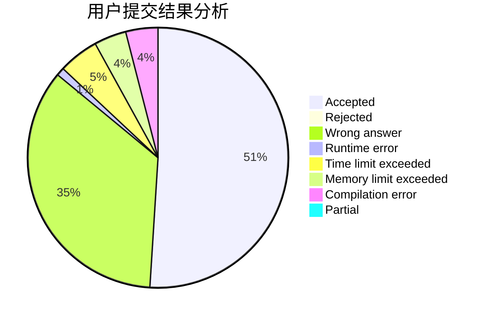
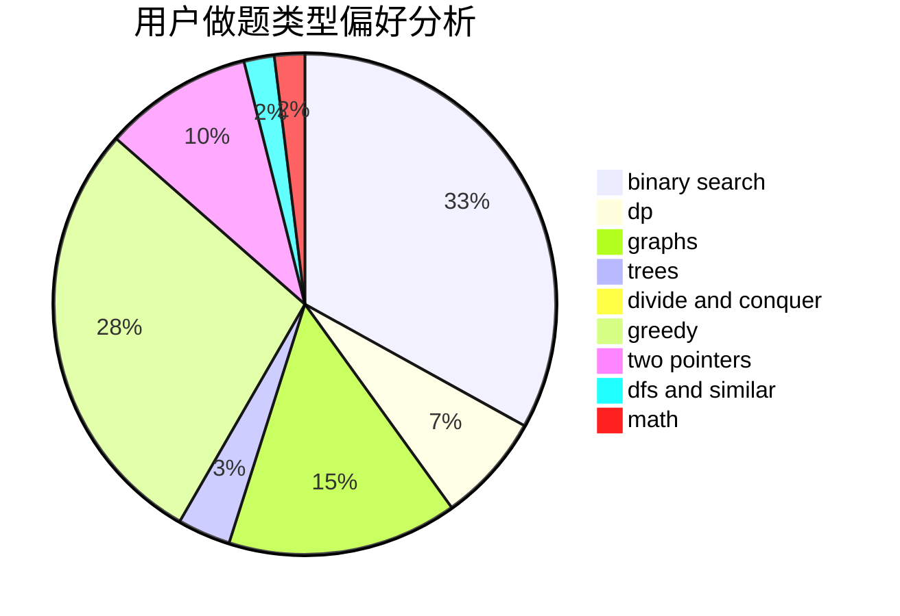

# olahiuj

<!-- tabs:start -->

#### **用户提交结果分析**

#### **用户做题类型偏好分析**

<!-- tabs:end -->
# 推荐题目
[1435C](https://codeforces.com/contest/1435/problem/C)
[494B](https://codeforces.com/contest/494/problem/B)
[7C](https://codeforces.com/contest/7/problem/C)
[25A](https://codeforces.com/contest/25/problem/A)
[1439E](https://codeforces.com/contest/1439/problem/E)
[1346A](https://codeforces.com/contest/1346/problem/A)
[1113D](https://codeforces.com/contest/1113/problem/D)
[814C](https://codeforces.com/contest/814/problem/C)
[708B](https://codeforces.com/contest/708/problem/B)
[246C](https://codeforces.com/contest/246/problem/C)
