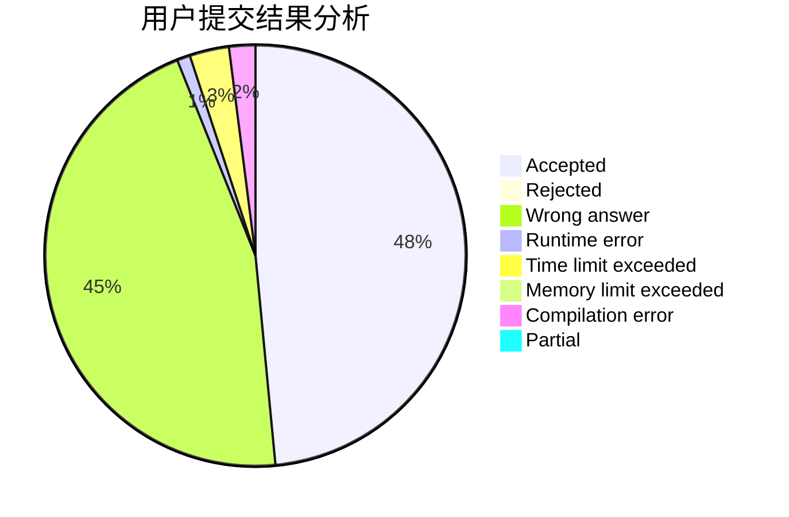
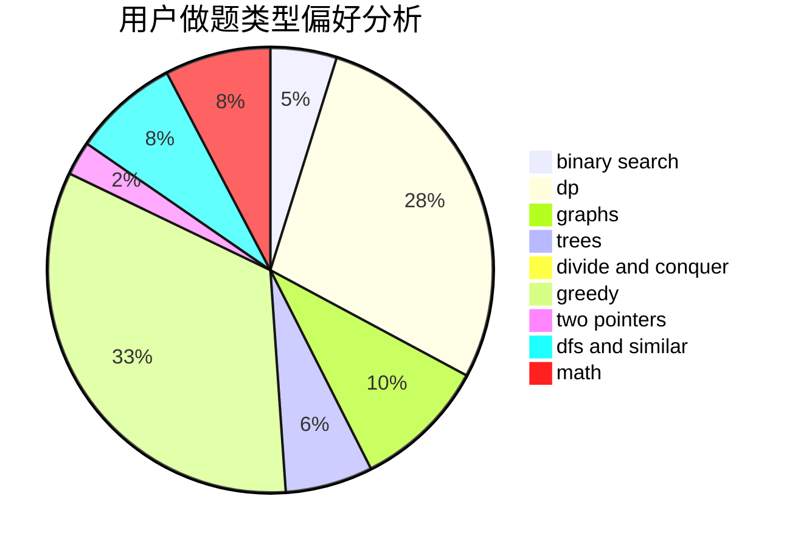

# oldherd

<!-- tabs:start -->

#### **用户提交结果分析**

#### **用户做题类型偏好分析**

<!-- tabs:end -->
# 推荐题目
[1509F](https://codeforces.com/contest/1509/problem/F)
[912C](https://codeforces.com/contest/912/problem/C)
[166A](https://codeforces.com/contest/166/problem/A)
[1063B](https://codeforces.com/contest/1063/problem/B)
[121E](https://codeforces.com/contest/121/problem/E)
[1053E](https://codeforces.com/contest/1053/problem/E)
[1105E](https://codeforces.com/contest/1105/problem/E)
[733A](https://codeforces.com/contest/733/problem/A)
[859B](https://codeforces.com/contest/859/problem/B)
[1288D](https://codeforces.com/contest/1288/problem/D)
