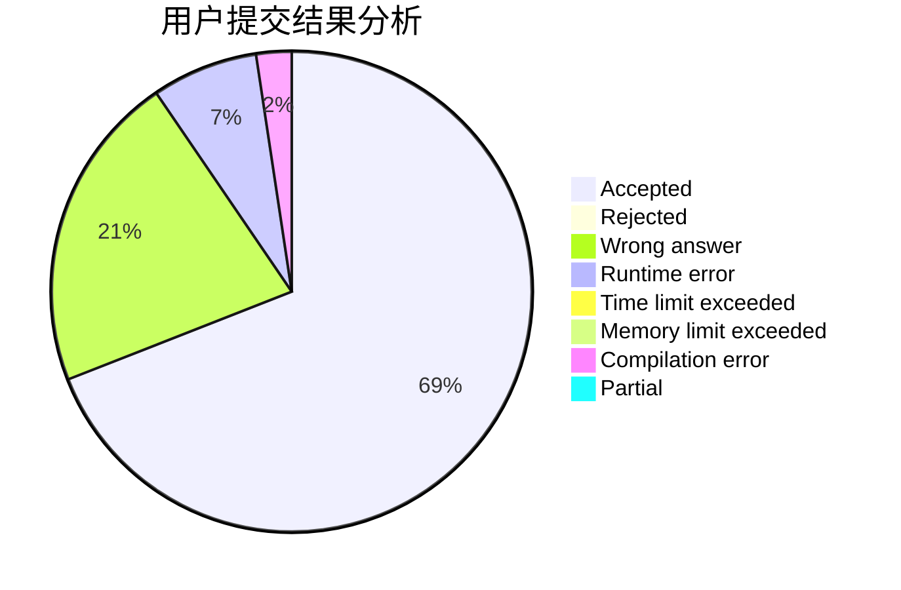
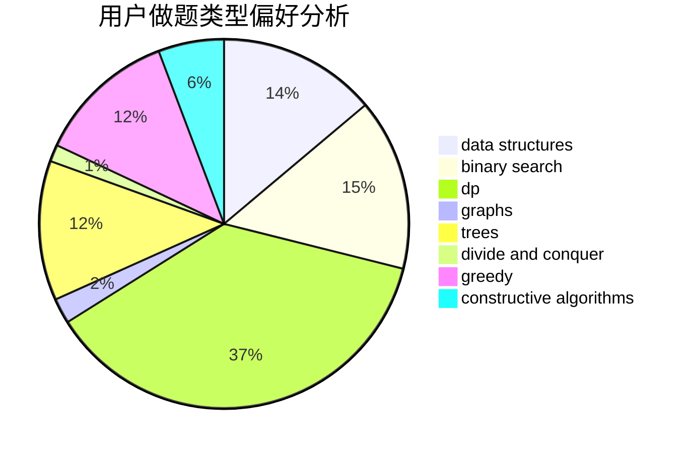
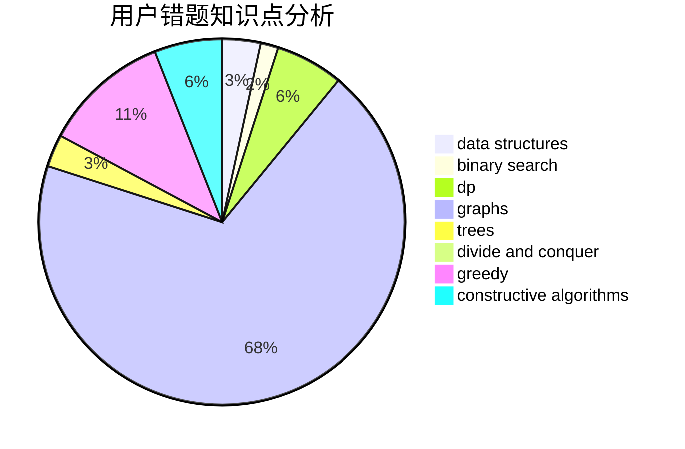

# onlytwelveone

<!-- tabs:start -->

#### **用户提交结果分析**

#### **用户做题类型偏好分析**

#### **用户错题知识点分析**

<!-- tabs:end -->
# 推荐题目
[946F](https://codeforces.com/contest/946/problem/F)		combinatorics,
                        dp,
                        matrices		  
[15C](https://codeforces.com/contest/15/problem/C)		games		  
[297D](https://codeforces.com/contest/297/problem/D)		constructive algorithms		  
[1208F](https://codeforces.com/contest/1208/problem/F)		bitmasks,
                        dfs and similar,
                        dp,
                        greedy		  
[960G](https://codeforces.com/contest/960/problem/G)		combinatorics,
                        dp,
                        fft,
                        math		  
[479E](https://codeforces.com/contest/479/problem/E)		combinatorics,
                        dp		  
[513B2](https://codeforces.com/contest/513B/problem/2)		bitmasks,
                        divide and conquer,
                        math		  
[1185G1](https://codeforces.com/contest/1185G/problem/1)		bitmasks,
                        combinatorics,
                        dp		  
[1103A](https://codeforces.com/contest/1103/problem/A)		constructive algorithms,
                        implementation		  
[509D](https://codeforces.com/contest/509/problem/D)		constructive algorithms,
                        math		  
