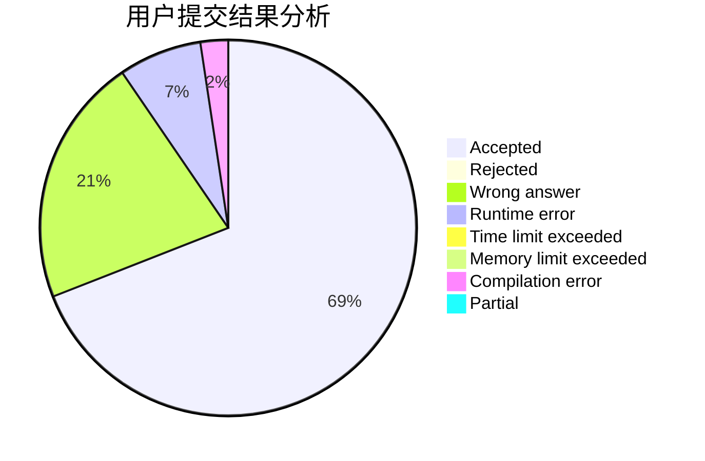
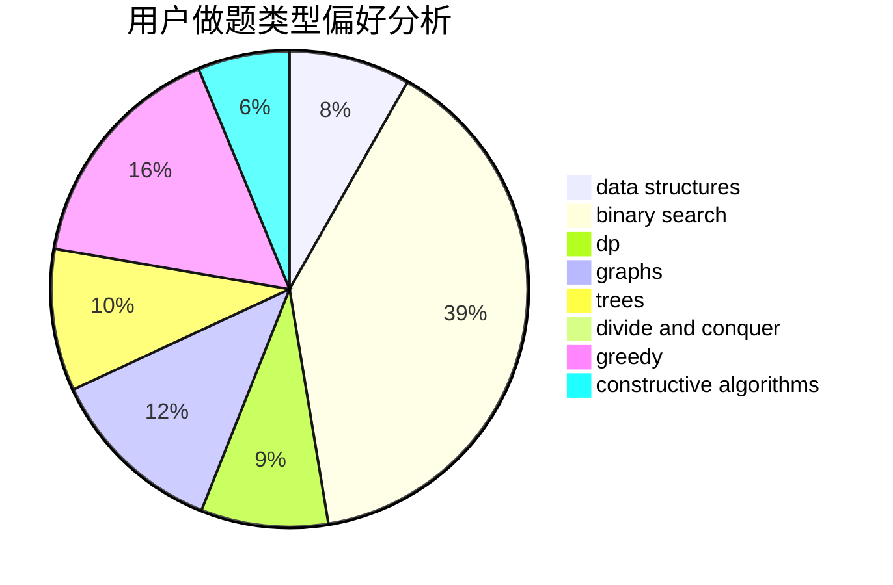
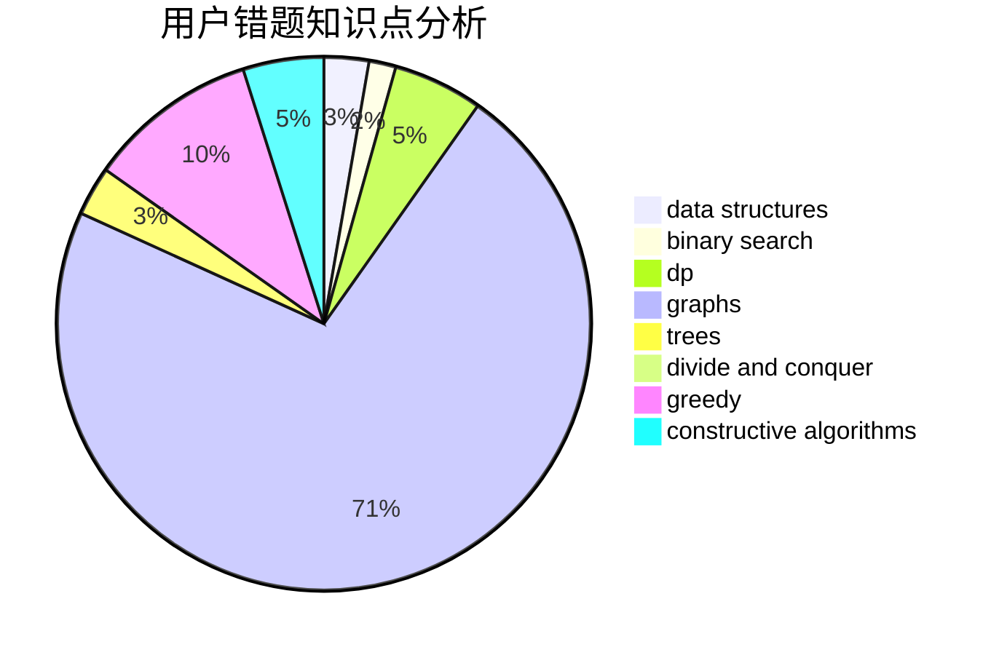

# onlytwelveone

<!-- tabs:start -->

#### **用户提交结果分析**

#### **用户做题类型偏好分析**

#### **用户错题知识点分析**

<!-- tabs:end -->
# 推荐题目
[963C](https://codeforces.com/contest/963/problem/C)		brute force,
                        math,
                        number theory		  
[182D](https://codeforces.com/contest/182/problem/D)		brute force,
                        hashing,
                        implementation,
                        math,
                        strings		  
[314C](https://codeforces.com/contest/314/problem/C)		data structures,
                        dp		  
[1214C](https://codeforces.com/contest/1214/problem/C)		data structures,
                        greedy		  
[982F](https://codeforces.com/contest/982/problem/F)		dfs and similar,
                        graphs		  
[4A](https://codeforces.com/contest/4/problem/A)		brute force,
                        math		  
[538B](https://codeforces.com/contest/538/problem/B)		constructive algorithms,
                        dp,
                        greedy,
                        implementation		  
[118B](https://codeforces.com/contest/118/problem/B)		constructive algorithms,
                        implementation		  
[1103D](https://codeforces.com/contest/1103/problem/D)		bitmasks,
                        dp		  
[52C](https://codeforces.com/contest/52/problem/C)		data structures		  
