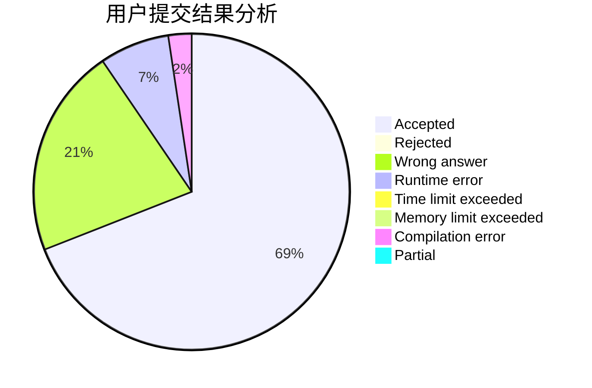
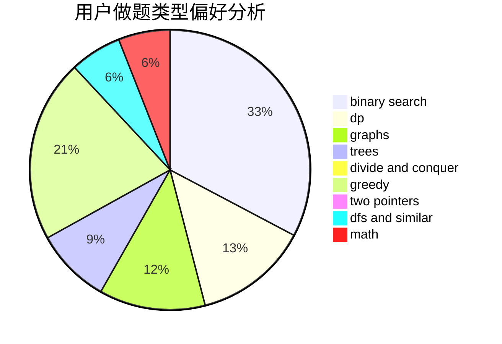

# onlytwelveone

<!-- tabs:start -->

#### **用户提交结果分析**

#### **用户做题类型偏好分析**

<!-- tabs:end -->
# 推荐题目
[963C](https://codeforces.com/contest/963/problem/C)
[182D](https://codeforces.com/contest/182/problem/D)
[314C](https://codeforces.com/contest/314/problem/C)
[1214C](https://codeforces.com/contest/1214/problem/C)
[982F](https://codeforces.com/contest/982/problem/F)
[4A](https://codeforces.com/contest/4/problem/A)
[538B](https://codeforces.com/contest/538/problem/B)
[118B](https://codeforces.com/contest/118/problem/B)
[1103D](https://codeforces.com/contest/1103/problem/D)
[52C](https://codeforces.com/contest/52/problem/C)
