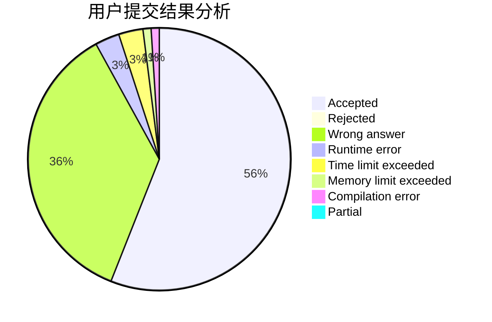
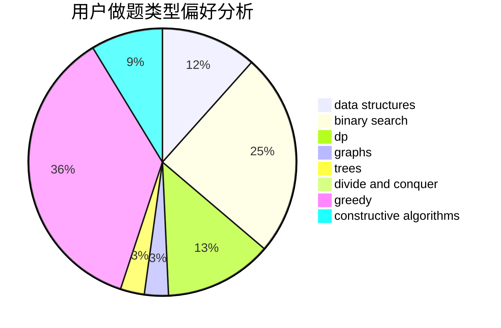

# ooOAM

<!-- tabs:start -->

#### **用户提交结果分析**

#### **用户做题类型偏好分析**

#### **用户错题知识点分析**

<!-- tabs:end -->
# 推荐题目
[1030C](https://codeforces.com/contest/1030/problem/C)		implementation		  
[781C](https://codeforces.com/contest/781/problem/C)		dsu,graphs,sortings,trees		  
[1214G](https://codeforces.com/contest/1214/problem/G)		bitmasks,
                        data structures		  
[932C](https://codeforces.com/contest/932/problem/C)		brute force,
                        constructive algorithms		  
[484A](https://codeforces.com/contest/484/problem/A)		bitmasks,
                        constructive algorithms		  
[825E](https://codeforces.com/contest/825/problem/E)		data structures,
                        dfs and similar,
                        graphs,
                        greedy		  
[493D](https://codeforces.com/contest/493/problem/D)		constructive algorithms,
                        games,
                        math		  
[930B](https://codeforces.com/contest/930/problem/B)		implementation,
                        probabilities,
                        strings		  
[981H](https://codeforces.com/contest/981/problem/H)		combinatorics,
                        data structures,
                        dp,
                        fft,
                        math		  
[743A](https://codeforces.com/contest/743/problem/A)		constructive algorithms,
                        greedy,
                        implementation		  
