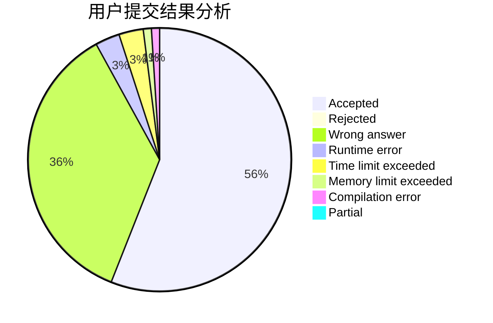
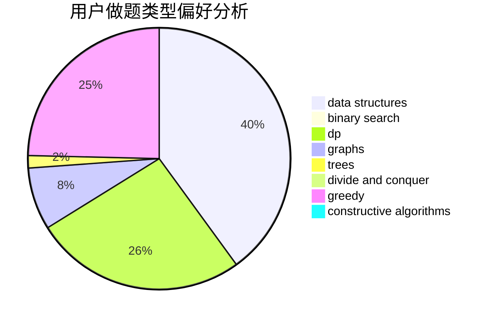

# ooOAM

<!-- tabs:start -->

#### **用户提交结果分析**

#### **用户做题类型偏好分析**

#### **用户错题知识点分析**

<!-- tabs:end -->
# 推荐题目
[1030G](https://codeforces.com/contest/1030/problem/G)		number theory		  
[7A](https://codeforces.com/contest/7/problem/A)		brute force,
                        constructive algorithms		  
[1220C](https://codeforces.com/contest/1220/problem/C)		games,
                        greedy,
                        strings		  
[954C](https://codeforces.com/contest/954/problem/C)		implementation		  
[505B](https://codeforces.com/contest/505/problem/B)		dfs and similar,
                        dp,
                        dsu,
                        graphs		  
[845A](https://codeforces.com/contest/845/problem/A)		implementation,
                        sortings		  
[513A](https://codeforces.com/contest/513/problem/A)		constructive algorithms,
                        math		  
[950A](https://codeforces.com/contest/950/problem/A)		implementation,
                        math		  
[997C](https://codeforces.com/contest/997/problem/C)		combinatorics,
                        math		  
[763C](https://codeforces.com/contest/763/problem/C)		brute force,
                        implementation,
                        math,
                        number theory		  
