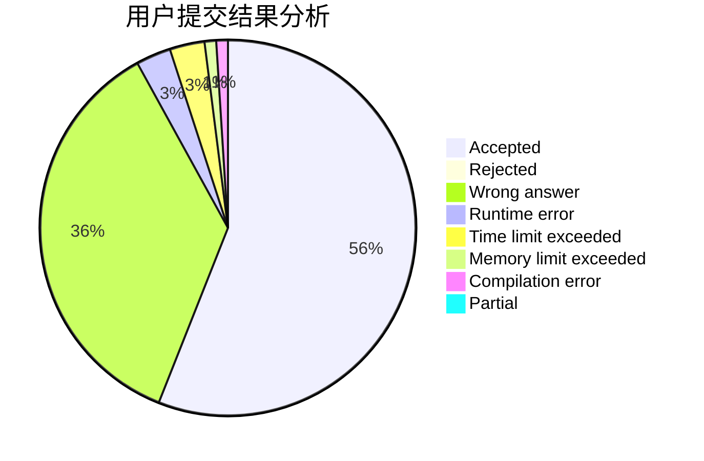
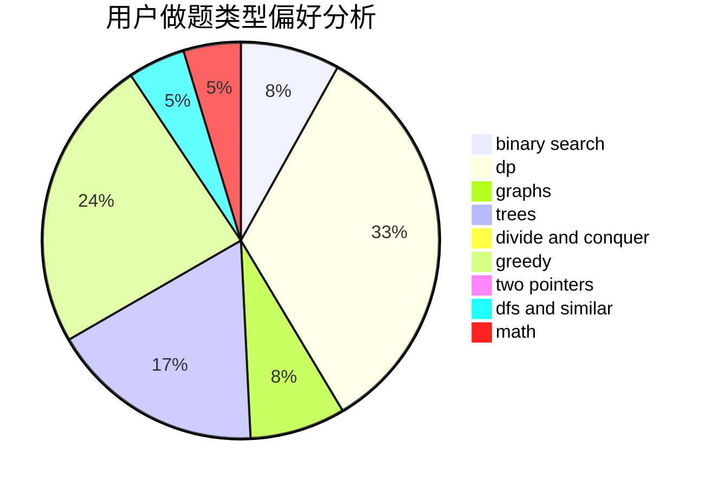

# ooOAM

<!-- tabs:start -->

#### **用户提交结果分析**

#### **用户做题类型偏好分析**

<!-- tabs:end -->
# 推荐题目
[1030G](https://codeforces.com/contest/1030/problem/G)
[7A](https://codeforces.com/contest/7/problem/A)
[1220C](https://codeforces.com/contest/1220/problem/C)
[954C](https://codeforces.com/contest/954/problem/C)
[505B](https://codeforces.com/contest/505/problem/B)
[845A](https://codeforces.com/contest/845/problem/A)
[513A](https://codeforces.com/contest/513/problem/A)
[950A](https://codeforces.com/contest/950/problem/A)
[997C](https://codeforces.com/contest/997/problem/C)
[763C](https://codeforces.com/contest/763/problem/C)
