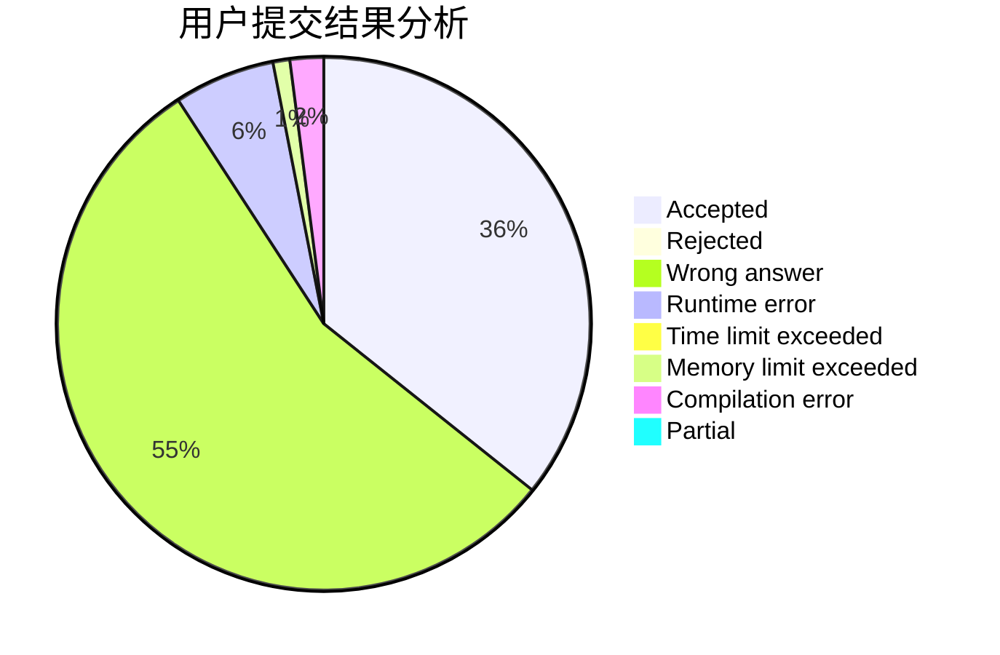
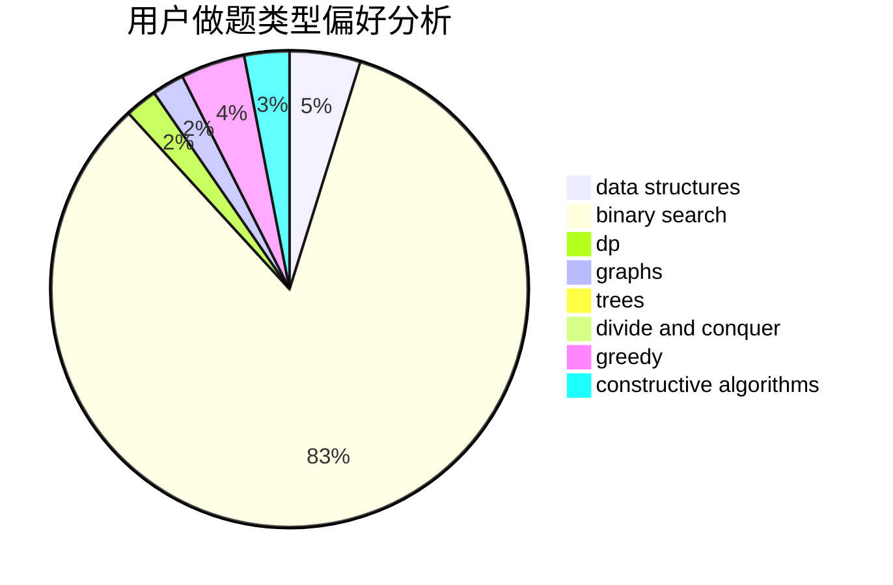

# ooooxxxx

<!-- tabs:start -->

#### **用户提交结果分析**

#### **用户做题类型偏好分析**

#### **用户错题知识点分析**

<!-- tabs:end -->
# 推荐题目
[700D](https://codeforces.com/contest/700/problem/D)		data structures,
                        greedy		  
[80A](https://codeforces.com/contest/80/problem/A)		brute force		  
[957E](https://codeforces.com/contest/957/problem/E)		dsu,graphs,sortings,trees		  
[908A](https://codeforces.com/contest/908/problem/A)		brute force,
                        implementation		  
[1185D](https://codeforces.com/contest/1185/problem/D)		implementation,
                        math		  
[275B](https://codeforces.com/contest/275/problem/B)		constructive algorithms,
                        implementation		  
[570A](https://codeforces.com/contest/570/problem/A)		implementation		  
[812C](https://codeforces.com/contest/812/problem/C)		binary search,
                        sortings		  
[263A](https://codeforces.com/contest/263/problem/A)		implementation		  
[1415B](https://codeforces.com/contest/1415/problem/B)		brute force,
                        brute force,
                        greedy		  
