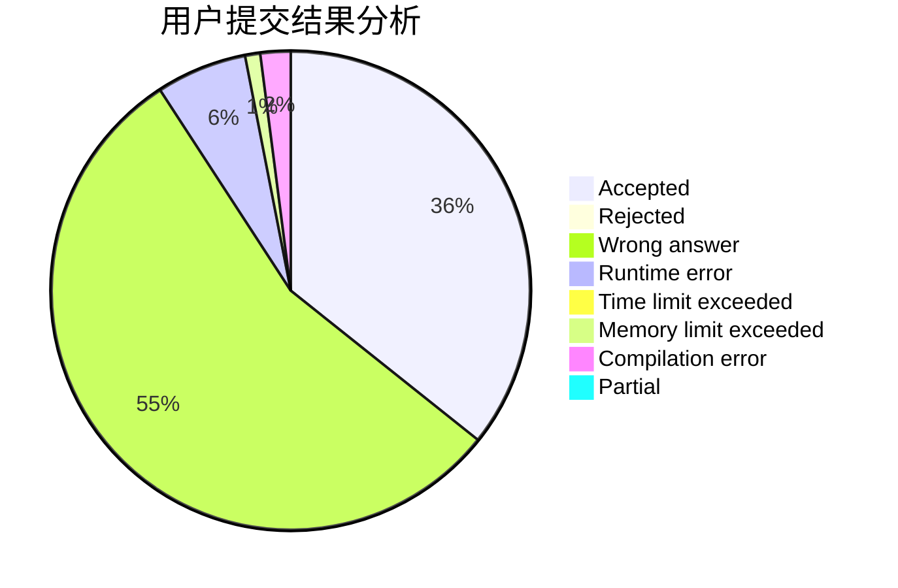
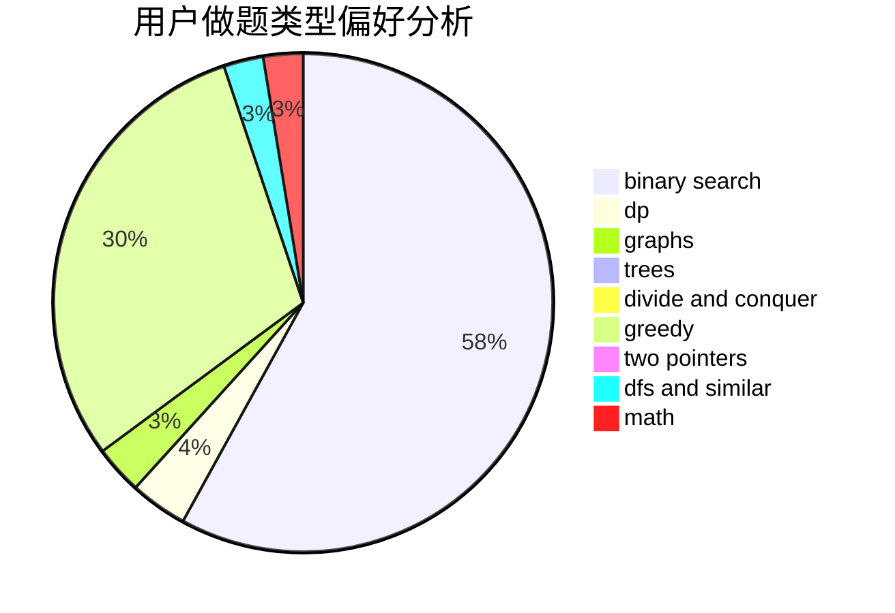

# ooooxxxx

<!-- tabs:start -->

#### **用户提交结果分析**

#### **用户做题类型偏好分析**

<!-- tabs:end -->
# 推荐题目
[700D](https://codeforces.com/contest/700/problem/D)
[80A](https://codeforces.com/contest/80/problem/A)
[957E](https://codeforces.com/contest/957/problem/E)
[908A](https://codeforces.com/contest/908/problem/A)
[1185D](https://codeforces.com/contest/1185/problem/D)
[275B](https://codeforces.com/contest/275/problem/B)
[570A](https://codeforces.com/contest/570/problem/A)
[812C](https://codeforces.com/contest/812/problem/C)
[263A](https://codeforces.com/contest/263/problem/A)
[1415B](https://codeforces.com/contest/1415/problem/B)
