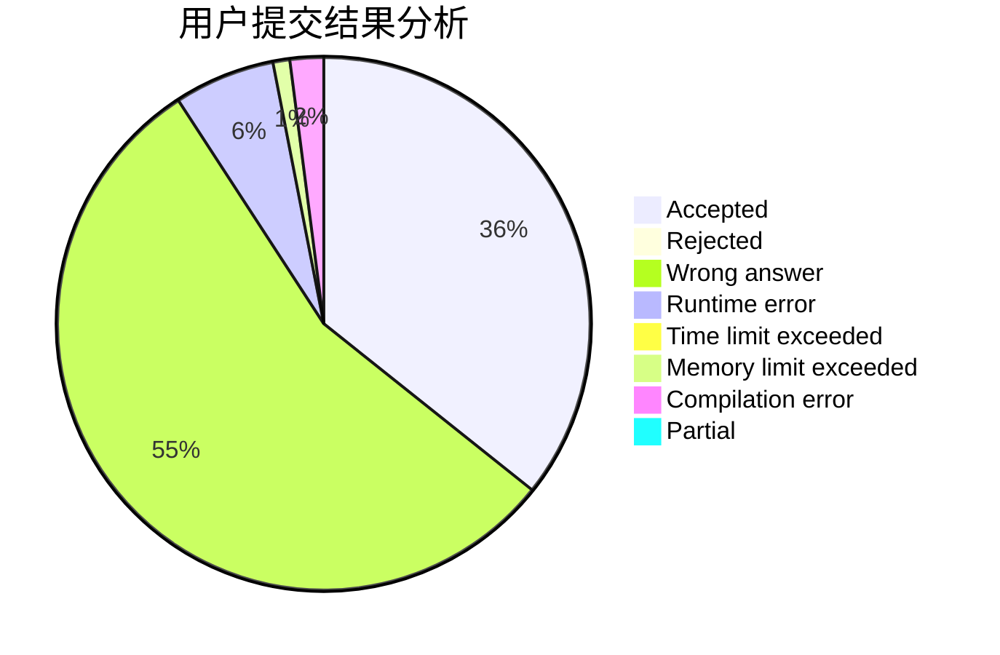
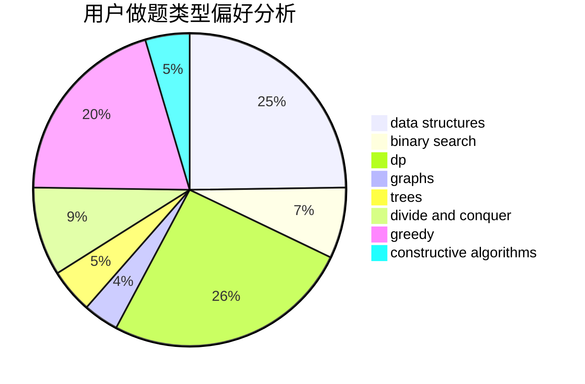

# ooooxxxx

<!-- tabs:start -->

#### **用户提交结果分析**

#### **用户做题类型偏好分析**

#### **用户错题知识点分析**

<!-- tabs:end -->
# 推荐题目
[676D](https://codeforces.com/contest/676/problem/D)		graphs,
                        implementation,
                        shortest paths		  
[794G](https://codeforces.com/contest/794/problem/G)		combinatorics,
                        dp,
                        math		  
[935F](https://codeforces.com/contest/935/problem/F)		data structures,
                        greedy		  
[888C](https://codeforces.com/contest/888/problem/C)		binary search,
                        implementation,
                        two pointers		  
[1183A](https://codeforces.com/contest/1183/problem/A)		implementation		  
[258C](https://codeforces.com/contest/258/problem/C)		binary search,
                        combinatorics,
                        dp,
                        math		  
[545D](https://codeforces.com/contest/545/problem/D)		greedy,
                        implementation,
                        sortings		  
[798C](https://codeforces.com/contest/798/problem/C)		dp,
                        greedy,
                        number theory		  
[241D](https://codeforces.com/contest/241/problem/D)		nan		  
[1403C](https://codeforces.com/contest/1403/problem/C)		*special problem,
                        combinatorics,
                        dp,
                        implementation,
                        math		  
