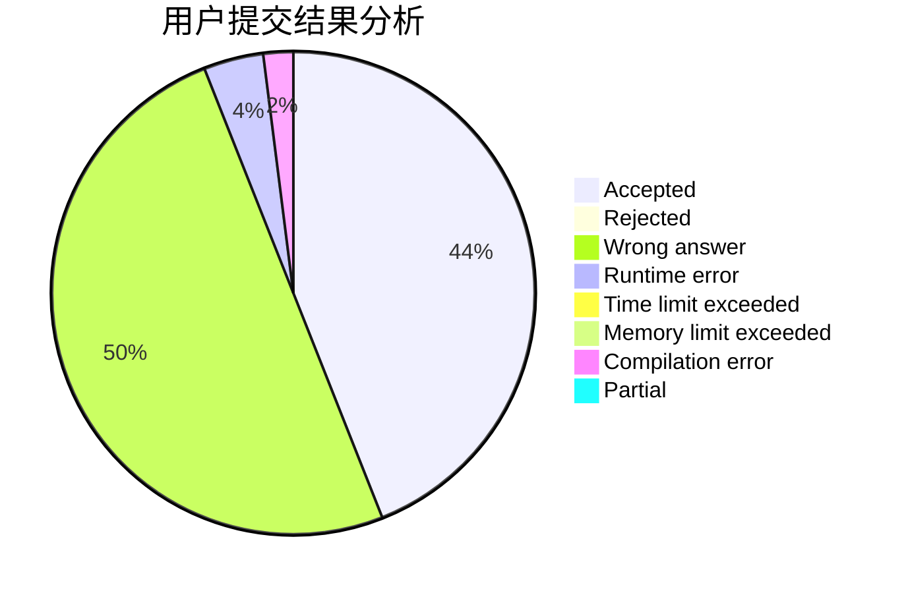
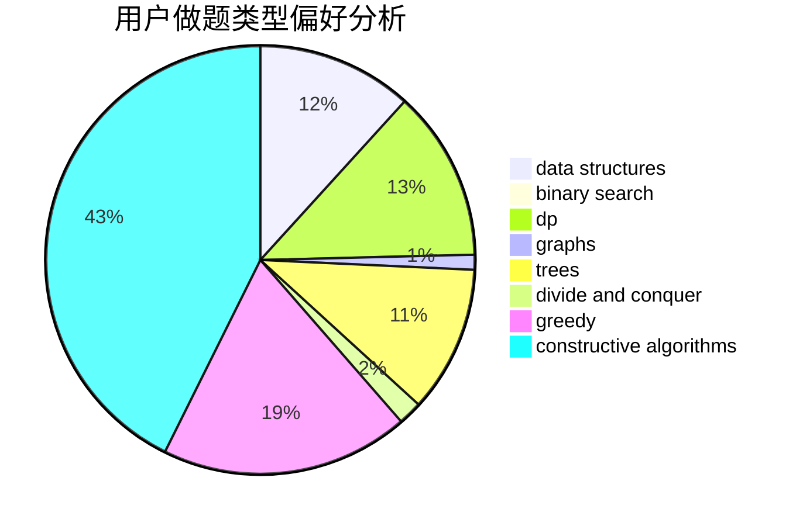

# ooozy

<!-- tabs:start -->

#### **用户提交结果分析**

#### **用户做题类型偏好分析**

#### **用户错题知识点分析**

<!-- tabs:end -->
# 推荐题目
[1178C](https://codeforces.com/contest/1178/problem/C)		combinatorics,
                        greedy,
                        math		  
[864F](https://codeforces.com/contest/864/problem/F)		dfs and similar,
                        graphs,
                        trees		  
[218C](https://codeforces.com/contest/218/problem/C)		dsu,graphs,sortings,trees		  
[977C](https://codeforces.com/contest/977/problem/C)		sortings		  
[1238B](https://codeforces.com/contest/1238/problem/B)		greedy,
                        sortings		  
[1218H](https://codeforces.com/contest/1218/problem/H)		dfs and similar		  
[1411G](https://codeforces.com/contest/1411/problem/G)		bitmasks,
                        games,
                        math,
                        matrices		  
[618D](https://codeforces.com/contest/618/problem/D)		dfs and similar,
                        dp,
                        graph matchings,
                        greedy,
                        trees		  
[1349B](https://codeforces.com/contest/1349/problem/B)		constructive algorithms,
                        greedy,
                        math		  
[374A](https://codeforces.com/contest/374/problem/A)		greedy,
                        implementation		  
