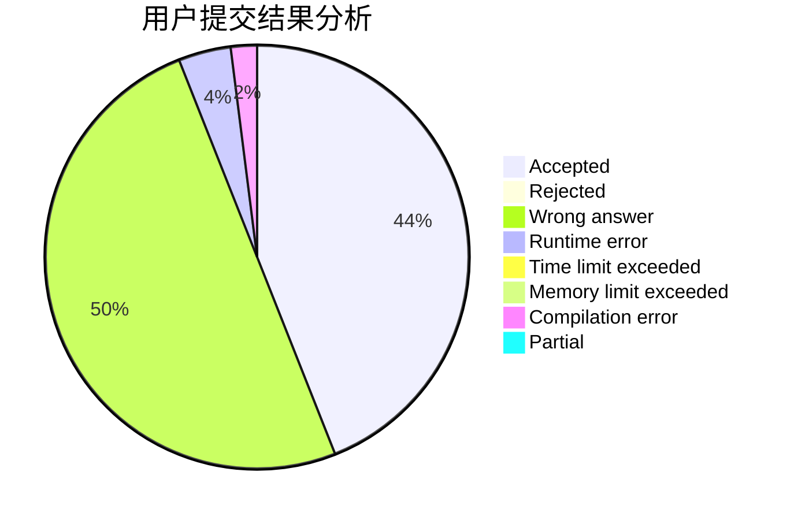
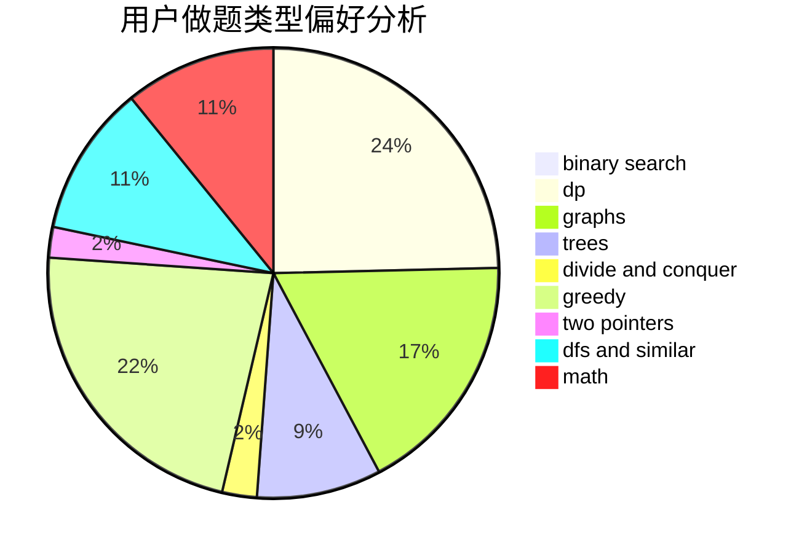

# ooozy

<!-- tabs:start -->

#### **用户提交结果分析**

#### **用户做题类型偏好分析**

<!-- tabs:end -->
# 推荐题目
[1178C](https://codeforces.com/contest/1178/problem/C)
[864F](https://codeforces.com/contest/864/problem/F)
[218C](https://codeforces.com/contest/218/problem/C)
[977C](https://codeforces.com/contest/977/problem/C)
[1238B](https://codeforces.com/contest/1238/problem/B)
[1218H](https://codeforces.com/contest/1218/problem/H)
[1411G](https://codeforces.com/contest/1411/problem/G)
[618D](https://codeforces.com/contest/618/problem/D)
[1349B](https://codeforces.com/contest/1349/problem/B)
[374A](https://codeforces.com/contest/374/problem/A)
