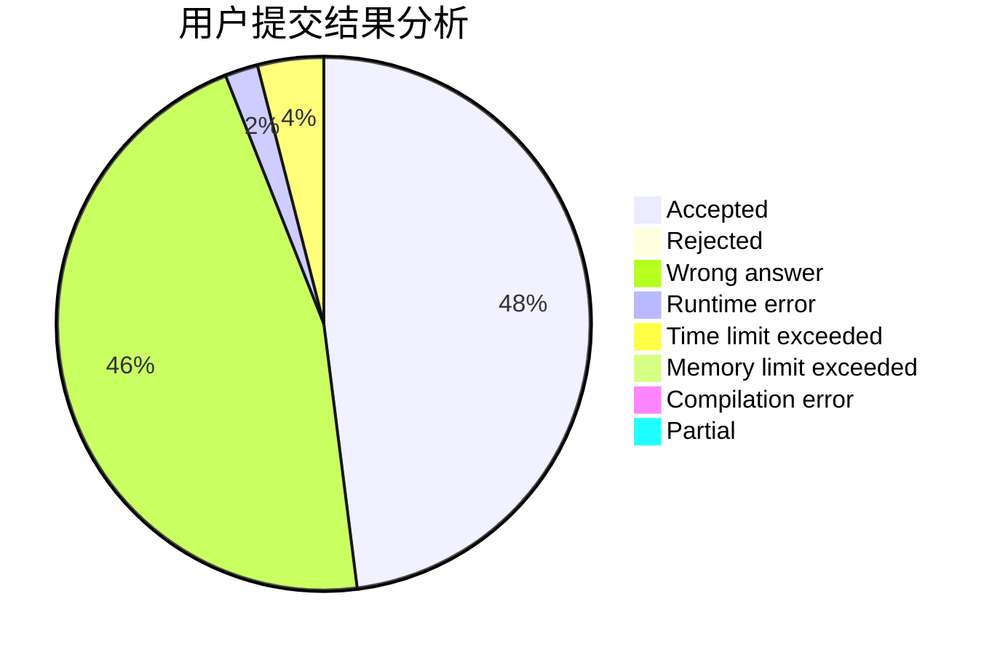
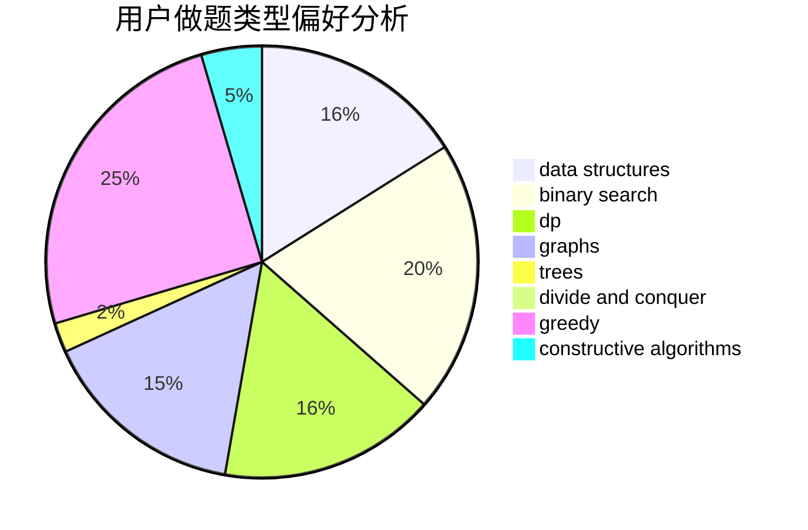
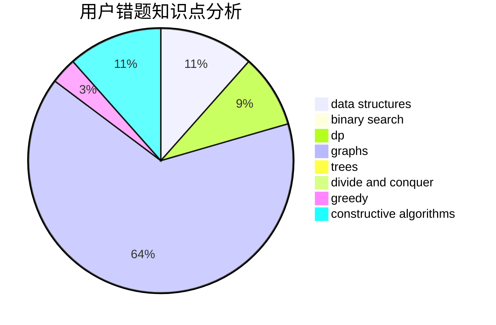

# orbs123
<!-- tabs:start -->
#### **用户提交结果分析**

#### **用户做题类型偏好分析**

#### **用户错题知识点分析**

<!-- tabs:end -->
# 推荐题目
[Prefixes and Suffixes](http://codeforces.com/problemset/problem/432/D)		dp,
                        string suffix structures,
                        strings,
                        two pointers		  
[U2](https://codeforces.com/contest/1143/problem/F)		geometry		  
[A Piece of Cake](http://codeforces.com/problemset/problem/171/C)		*special problem,
                        implementation		  
[Vanya and Brackets](http://codeforces.com/problemset/problem/552/E)		brute force,
                        dp,
                        expression parsing,
                        greedy,
                        implementation,
                        strings		  
[Numbers on the blackboard](http://codeforces.com/problemset/problem/878/E)		combinatorics,
                        dp		  
[Cow and Vacation](http://codeforces.com/problemset/problem/1307/F)		dfs and similar,
                        dsu,
                        trees		  
[Recover the String](https://codeforces.com/contest/709/problem/D)		constructive algorithms,
                        greedy,
                        implementation,
                        math		  
[Vasya and Golden Ticket](http://codeforces.com/problemset/problem/1030/C)		implementation		  
[Co-prime Array](http://codeforces.com/problemset/problem/660/A)		greedy,
                        implementation,
                        math,
                        number theory		  
[Beads](http://codeforces.com/problemset/problem/8/E)		dp,
                        graphs		  
<!-- tabs:start -->
#### **data structures**
[Prefixes and Suffixes](http://codeforces.com/problemset/problem/899/E)		data structures,
                        dsu,
                        flows,
                        implementation,
                        two pointers		  
[U2](http://codeforces.com/problemset/problem/983/E)		binary search,
                        data structures,
                        trees		  
[A Piece of Cake](http://codeforces.com/problemset/problem/1237/G)		data structures,
                        dp,
                        greedy		  
[Vanya and Brackets](https://codeforces.com/contest/1501/problem/F)		data structures,
                        sortings,
                        two pointers		  
[Numbers on the blackboard](http://codeforces.com/problemset/problem/587/C)		data structures,
                        trees		  
[Cow and Vacation](http://codeforces.com/problemset/problem/372/C)		data structures,
                        dp,
                        math		  
[Recover the String](http://codeforces.com/problemset/problem/1083/E)		data structures,
                        dp,
                        geometry		  
[Vasya and Golden Ticket](http://codeforces.com/problemset/problem/348/C)		brute force,
                        data structures		  
[Co-prime Array](http://codeforces.com/problemset/problem/1492/B)		data structures,
                        greedy,
                        math		  
[Beads](http://codeforces.com/problemset/problem/1492/C)		binary search,
                        data structures,
                        dp,
                        greedy,
                        two pointers		  
#### **binary search**
[Prefixes and Suffixes](http://codeforces.com/problemset/problem/983/E)		binary search,
                        data structures,
                        trees		  
[U2](http://codeforces.com/problemset/problem/147/B)		binary search,
                        graphs,
                        matrices		  
[A Piece of Cake](http://codeforces.com/problemset/problem/1033/E)		binary search,
                        constructive algorithms,
                        dfs and similar,
                        graphs,
                        interactive		  
[Vanya and Brackets](http://codeforces.com/problemset/problem/1500/B)		binary search,
                        brute force,
                        chinese remainder theorem,
                        math,
                        number theory		  
[Numbers on the blackboard](http://codeforces.com/problemset/problem/1253/F)		binary search,
                        dsu,
                        graphs,
                        shortest paths,
                        trees		  
[Cow and Vacation](http://codeforces.com/problemset/problem/1474/B)		binary search,
                        constructive algorithms,
                        greedy,
                        math,
                        number theory		  
[Recover the String](http://codeforces.com/problemset/problem/1452/B)		binary search,
                        greedy,
                        math,
                        sortings		  
[Vasya and Golden Ticket](http://codeforces.com/problemset/problem/1492/C)		binary search,
                        data structures,
                        dp,
                        greedy,
                        two pointers		  
[Co-prime Array](http://codeforces.com/problemset/problem/1463/D)		binary search,
                        constructive algorithms,
                        greedy,
                        two pointers		  
[Beads](http://codeforces.com/problemset/problem/1490/G)		binary search,
                        data structures,
                        math		  
#### **dp**
[Prefixes and Suffixes](http://codeforces.com/problemset/problem/432/D)		dp,
                        string suffix structures,
                        strings,
                        two pointers		  
[U2](http://codeforces.com/problemset/problem/552/E)		brute force,
                        dp,
                        expression parsing,
                        greedy,
                        implementation,
                        strings		  
[A Piece of Cake](http://codeforces.com/problemset/problem/878/E)		combinatorics,
                        dp		  
[Vanya and Brackets](http://codeforces.com/problemset/problem/8/E)		dp,
                        graphs		  
[Numbers on the blackboard](http://codeforces.com/problemset/problem/665/C)		dp,
                        greedy,
                        strings		  
[Cow and Vacation](https://codeforces.com/contest/1424/problem/I)		bitmasks,
                        constructive algorithms,
                        dp,
                        math		  
[Recover the String](http://codeforces.com/problemset/problem/1237/G)		data structures,
                        dp,
                        greedy		  
[Vasya and Golden Ticket](http://codeforces.com/problemset/problem/626/D)		brute force,
                        combinatorics,
                        dp,
                        probabilities		  
[Co-prime Array](http://codeforces.com/problemset/problem/455/A)		dp		  
[Beads](http://codeforces.com/problemset/problem/274/B)		dfs and similar,
                        dp,
                        greedy,
                        trees		  
#### **graph**
[Prefixes and Suffixes](http://codeforces.com/problemset/problem/8/E)		dp,
                        graphs		  
[U2](http://codeforces.com/problemset/problem/316/C2)		flows,
                        graph matchings		  
[A Piece of Cake](http://codeforces.com/problemset/problem/590/C)		dfs and similar,
                        graphs,
                        shortest paths		  
[Vanya and Brackets](http://codeforces.com/problemset/problem/1045/C)		dfs and similar,
                        graphs,
                        trees		  
[Numbers on the blackboard](http://codeforces.com/problemset/problem/1147/A)		graphs		  
[Cow and Vacation](http://codeforces.com/problemset/problem/147/B)		binary search,
                        graphs,
                        matrices		  
[Recover the String](http://codeforces.com/problemset/problem/1033/E)		binary search,
                        constructive algorithms,
                        dfs and similar,
                        graphs,
                        interactive		  
[Vasya and Golden Ticket](http://codeforces.com/problemset/problem/1253/F)		binary search,
                        dsu,
                        graphs,
                        shortest paths,
                        trees		  
[Co-prime Array](http://codeforces.com/problemset/problem/1487/C)		brute force,
                        constructive algorithms,
                        dfs and similar,
                        graphs,
                        greedy,
                        implementation,
                        math		  
[Beads](http://codeforces.com/problemset/problem/1437/C)		dp,
                        flows,
                        graph matchings,
                        greedy,
                        math,
                        sortings		  
#### **trees**
[Prefixes and Suffixes](http://codeforces.com/problemset/problem/1307/F)		dfs and similar,
                        dsu,
                        trees		  
[U2](http://codeforces.com/problemset/problem/983/E)		binary search,
                        data structures,
                        trees		  
[A Piece of Cake](http://codeforces.com/problemset/problem/1045/C)		dfs and similar,
                        graphs,
                        trees		  
[Vanya and Brackets](http://codeforces.com/problemset/problem/979/C)		dfs and similar,
                        trees		  
[Numbers on the blackboard](http://codeforces.com/problemset/problem/587/C)		data structures,
                        trees		  
[Cow and Vacation](http://codeforces.com/problemset/problem/274/B)		dfs and similar,
                        dp,
                        greedy,
                        trees		  
[Recover the String](http://codeforces.com/problemset/problem/1253/F)		binary search,
                        dsu,
                        graphs,
                        shortest paths,
                        trees		  
[Vasya and Golden Ticket](http://codeforces.com/problemset/problem/1479/D)		binary search,
                        bitmasks,
                        brute force,
                        data structures,
                        probabilities,
                        trees		  
[Co-prime Array](http://codeforces.com/problemset/problem/1511/C)		brute force,
                        data structures,
                        implementation,
                        trees		  
[Beads](http://codeforces.com/problemset/problem/1499/F)		combinatorics,
                        dfs and similar,
                        dp,
                        trees		  
#### **divide and conquer**
[Prefixes and Suffixes](http://codeforces.com/problemset/problem/1461/D)		binary search,
                        brute force,
                        data structures,
                        divide and conquer,
                        implementation,
                        sortings		  
[U2](http://codeforces.com/problemset/problem/1466/G)		combinatorics,
                        divide and conquer,
                        hashing,
                        math,
                        string suffix structures,
                        strings		  
[A Piece of Cake](http://codeforces.com/problemset/problem/1490/D)		dfs and similar,
                        divide and conquer,
                        implementation		  
[Vanya and Brackets](https://codeforces.com/contest/1483/problem/C)		data structures,
                        divide and conquer,
                        dp		  
[Numbers on the blackboard](http://codeforces.com/problemset/problem/1491/E)		brute force,
                        dfs and similar,
                        divide and conquer,
                        number theory,
                        trees		  
[Cow and Vacation](http://codeforces.com/problemset/problem/1303/G)		data structures,
                        divide and conquer,
                        geometry,
                        trees		  
[Recover the String](http://codeforces.com/problemset/problem/1494/D)		constructive algorithms,
                        data structures,
                        dfs and similar,
                        divide and conquer,
                        dsu,
                        greedy,
                        sortings,
                        trees		  
[Vasya and Golden Ticket](http://codeforces.com/problemset/problem/1482/E)		data structures,
                        divide and conquer,
                        dp		  
[Co-prime Array](http://codeforces.com/problemset/problem/566/C)		dfs and similar,
                        divide and conquer,
                        trees		  
[Beads](http://codeforces.com/problemset/problem/1428/F)		binary search,
                        data structures,
                        divide and conquer,
                        dp,
                        two pointers		  
#### **greedy**
[Prefixes and Suffixes](http://codeforces.com/problemset/problem/552/E)		brute force,
                        dp,
                        expression parsing,
                        greedy,
                        implementation,
                        strings		  
[U2](https://codeforces.com/contest/709/problem/D)		constructive algorithms,
                        greedy,
                        implementation,
                        math		  
[A Piece of Cake](http://codeforces.com/problemset/problem/660/A)		greedy,
                        implementation,
                        math,
                        number theory		  
[Vanya and Brackets](http://codeforces.com/problemset/problem/665/C)		dp,
                        greedy,
                        strings		  
[Numbers on the blackboard](http://codeforces.com/problemset/problem/1237/G)		data structures,
                        dp,
                        greedy		  
[Cow and Vacation](http://codeforces.com/problemset/problem/810/B)		greedy,
                        sortings		  
[Recover the String](http://codeforces.com/problemset/problem/1051/A)		greedy,
                        implementation,
                        strings		  
[Vasya and Golden Ticket](http://codeforces.com/problemset/problem/914/B)		games,
                        greedy,
                        implementation		  
[Co-prime Array](http://codeforces.com/problemset/problem/274/B)		dfs and similar,
                        dp,
                        greedy,
                        trees		  
[Beads](http://codeforces.com/problemset/problem/1207/A)		brute force,
                        greedy,
                        implementation,
                        math		  
#### **constructive algorithms**
[Prefixes and Suffixes](https://codeforces.com/contest/709/problem/D)		constructive algorithms,
                        greedy,
                        implementation,
                        math		  
[U2](http://codeforces.com/problemset/problem/644/A)		*special problem,
                        constructive algorithms		  
[A Piece of Cake](https://codeforces.com/contest/1424/problem/I)		bitmasks,
                        constructive algorithms,
                        dp,
                        math		  
[Vanya and Brackets](http://codeforces.com/problemset/problem/899/D)		constructive algorithms,
                        math		  
[Numbers on the blackboard](http://codeforces.com/problemset/problem/1255/C)		constructive algorithms,
                        implementation		  
[Cow and Vacation](http://codeforces.com/problemset/problem/805/B)		constructive algorithms		  
[Recover the String](http://codeforces.com/problemset/problem/1033/E)		binary search,
                        constructive algorithms,
                        dfs and similar,
                        graphs,
                        interactive		  
[Vasya and Golden Ticket](https://codeforces.com/contest/1269/problem/C)		constructive algorithms,
                        greedy,
                        implementation,
                        strings		  
[Co-prime Array](http://codeforces.com/problemset/problem/1454/D)		constructive algorithms,
                        math,
                        number theory		  
[Beads](http://codeforces.com/problemset/problem/1474/B)		binary search,
                        constructive algorithms,
                        greedy,
                        math,
                        number theory		  
#### **sortings**
[Prefixes and Suffixes](http://codeforces.com/problemset/problem/810/B)		greedy,
                        sortings		  
[U2](https://codeforces.com/contest/1501/problem/F)		data structures,
                        sortings,
                        two pointers		  
[A Piece of Cake](http://codeforces.com/problemset/problem/1495/A)		geometry,
                        greedy,
                        math,
                        sortings		  
[Vanya and Brackets](http://codeforces.com/problemset/problem/1452/B)		binary search,
                        greedy,
                        math,
                        sortings		  
[Numbers on the blackboard](https://codeforces.com/contest/1496/problem/C)		geometry,
                        greedy,
                        math,
                        sortings		  
[Cow and Vacation](http://codeforces.com/problemset/problem/1495/A)		geometry,
                        greedy,
                        math,
                        sortings		  
[Recover the String](http://codeforces.com/problemset/problem/1497/A)		brute force,
                        data structures,
                        greedy,
                        sortings		  
[Vasya and Golden Ticket](http://codeforces.com/problemset/problem/1427/A)		math,
                        sortings		  
[Co-prime Array](http://codeforces.com/problemset/problem/1461/D)		binary search,
                        brute force,
                        data structures,
                        divide and conquer,
                        implementation,
                        sortings		  
[Beads](http://codeforces.com/problemset/problem/1437/C)		dp,
                        flows,
                        graph matchings,
                        greedy,
                        math,
                        sortings		  
<!-- tabs:end -->
