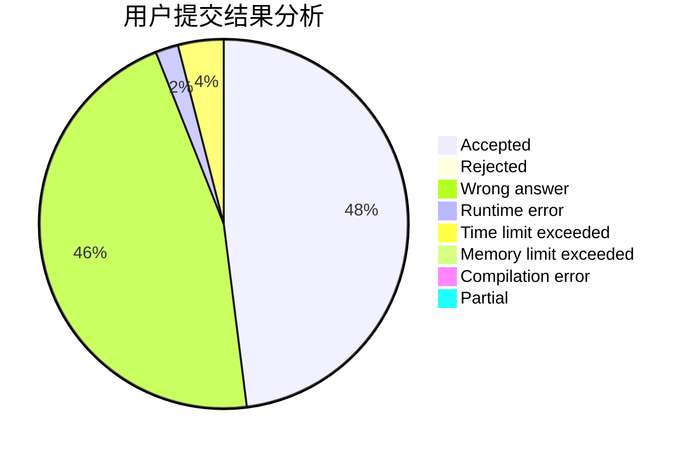
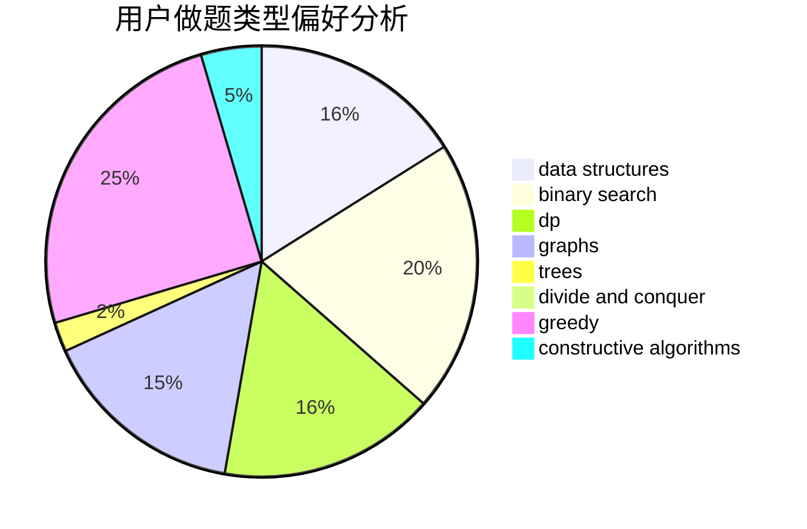
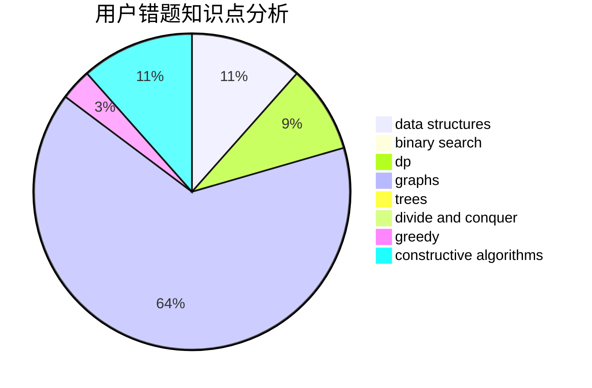

# orbs123

<!-- tabs:start -->

#### **用户提交结果分析**

#### **用户做题类型偏好分析**

#### **用户错题知识点分析**

<!-- tabs:end -->
# 推荐题目
[552E](https://codeforces.com/contest/552/problem/E)		brute force,
                        dp,
                        expression parsing,
                        greedy,
                        implementation,
                        strings		  
[878E](https://codeforces.com/contest/878/problem/E)		combinatorics,
                        dp		  
[1143F](https://codeforces.com/contest/1143/problem/F)		dsu,graphs,sortings,trees		  
[1307F](https://codeforces.com/contest/1307/problem/F)		dfs and similar,
                        dsu,
                        trees		  
[1030C](https://codeforces.com/contest/1030/problem/C)		implementation		  
[171C](https://codeforces.com/contest/171/problem/C)		*special problem,
                        implementation		  
[626D](https://codeforces.com/contest/626/problem/D)		brute force,
                        combinatorics,
                        dp,
                        probabilities		  
[432D](https://codeforces.com/contest/432/problem/D)		dp,
                        string suffix structures,
                        strings,
                        two pointers		  
[810A](https://codeforces.com/contest/810/problem/A)		implementation,
                        math		  
[805B](https://codeforces.com/contest/805/problem/B)		constructive algorithms		  
