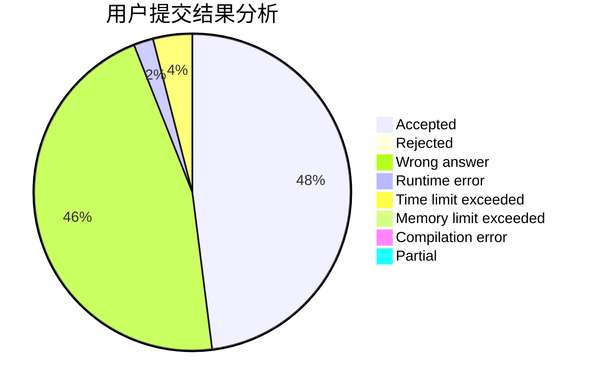
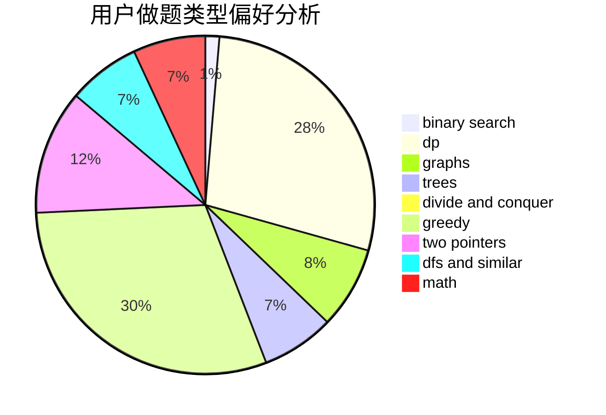

# orbs123

<!-- tabs:start -->

#### **用户提交结果分析**

#### **用户做题类型偏好分析**

<!-- tabs:end -->
# 推荐题目
[578B](https://codeforces.com/contest/578/problem/B)
[899D](https://codeforces.com/contest/899/problem/D)
[1146A](https://codeforces.com/contest/1146/problem/A)
[1316B](https://codeforces.com/contest/1316/problem/B)
[1030G](https://codeforces.com/contest/1030/problem/G)
[198C](https://codeforces.com/contest/198/problem/C)
[652E](https://codeforces.com/contest/652/problem/E)
[453D](https://codeforces.com/contest/453/problem/D)
[828A](https://codeforces.com/contest/828/problem/A)
[821C](https://codeforces.com/contest/821/problem/C)
