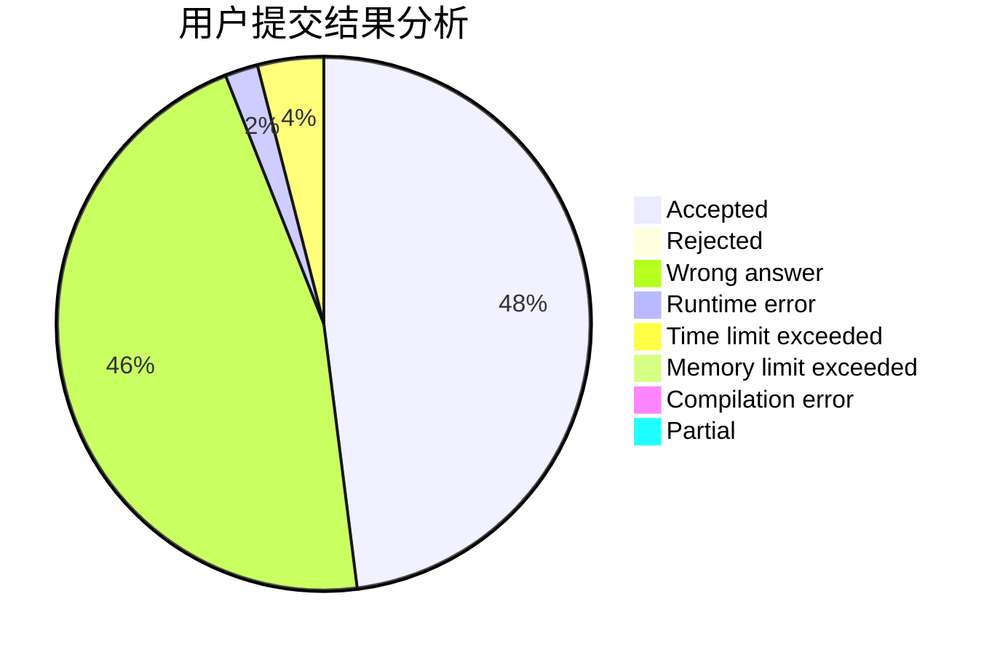
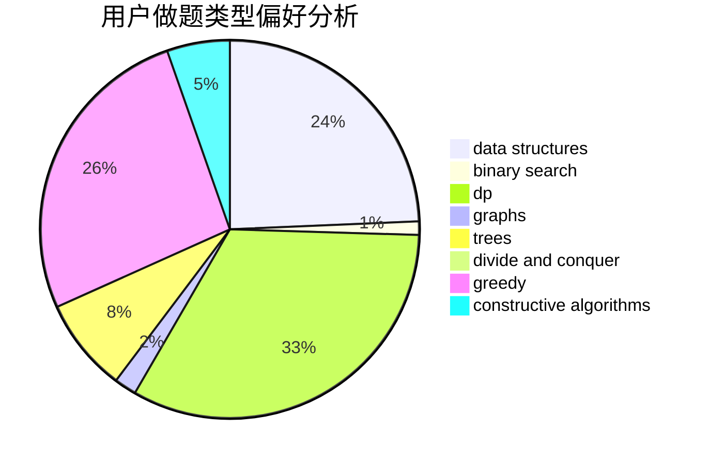
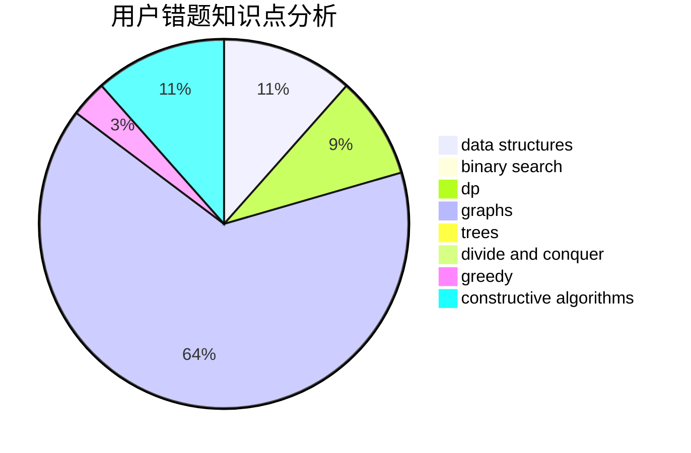

# orbs123

<!-- tabs:start -->

#### **用户提交结果分析**

#### **用户做题类型偏好分析**

#### **用户错题知识点分析**

<!-- tabs:end -->
# 推荐题目
[578B](https://codeforces.com/contest/578/problem/B)		brute force,
                        greedy		  
[899D](https://codeforces.com/contest/899/problem/D)		constructive algorithms,
                        math		  
[1146A](https://codeforces.com/contest/1146/problem/A)		implementation,
                        strings		  
[1316B](https://codeforces.com/contest/1316/problem/B)		brute force,
                        constructive algorithms,
                        implementation,
                        sortings,
                        strings		  
[1030G](https://codeforces.com/contest/1030/problem/G)		number theory		  
[198C](https://codeforces.com/contest/198/problem/C)		binary search,
                        geometry		  
[652E](https://codeforces.com/contest/652/problem/E)		dfs and similar,
                        dsu,
                        graphs,
                        trees		  
[453D](https://codeforces.com/contest/453/problem/D)		dp,
                        matrices		  
[828A](https://codeforces.com/contest/828/problem/A)		implementation		  
[821C](https://codeforces.com/contest/821/problem/C)		data structures,
                        greedy,
                        trees		  
