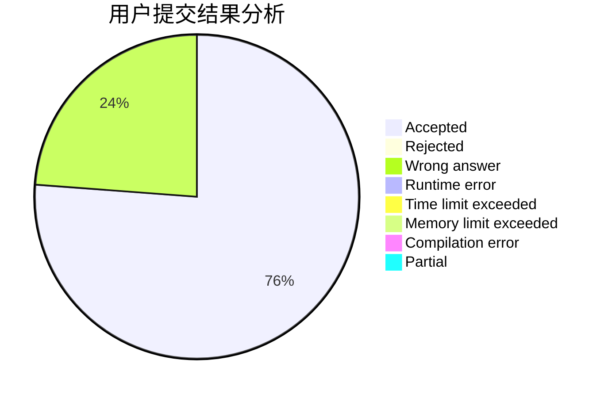
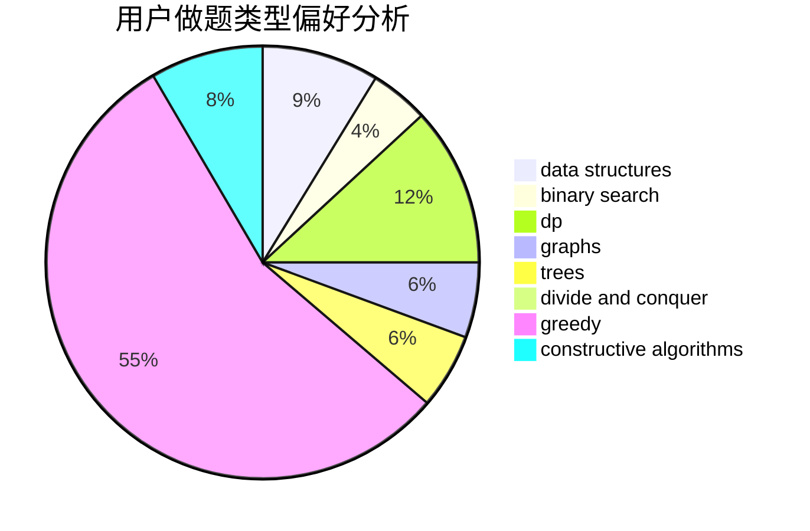

# orzdbh

<!-- tabs:start -->

#### **用户提交结果分析**

#### **用户做题类型偏好分析**

#### **用户错题知识点分析**

<!-- tabs:end -->
# 推荐题目
[936A](https://codeforces.com/contest/936/problem/A)		binary search,
                        implementation,
                        math		  
[1406E](https://codeforces.com/contest/1406/problem/E)		interactive,
                        math,
                        number theory		  
[796D](https://codeforces.com/contest/796/problem/D)		constructive algorithms,
                        dfs and similar,
                        dp,
                        graphs,
                        shortest paths,
                        trees		  
[273D](https://codeforces.com/contest/273/problem/D)		dp		  
[293C](https://codeforces.com/contest/293/problem/C)		brute force,
                        math,
                        number theory		  
[863C](https://codeforces.com/contest/863/problem/C)		graphs,
                        implementation		  
[626E](https://codeforces.com/contest/626/problem/E)		binary search,
                        math,
                        ternary search		  
[297B](https://codeforces.com/contest/297/problem/B)		constructive algorithms,
                        greedy		  
[600B](https://codeforces.com/contest/600/problem/B)		binary search,
                        data structures,
                        sortings,
                        two pointers		  
[899B](https://codeforces.com/contest/899/problem/B)		implementation		  
