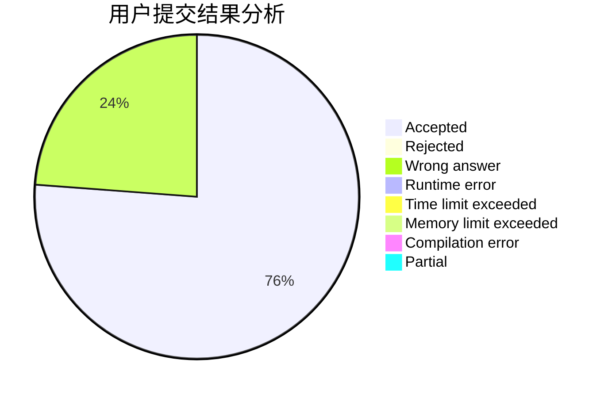
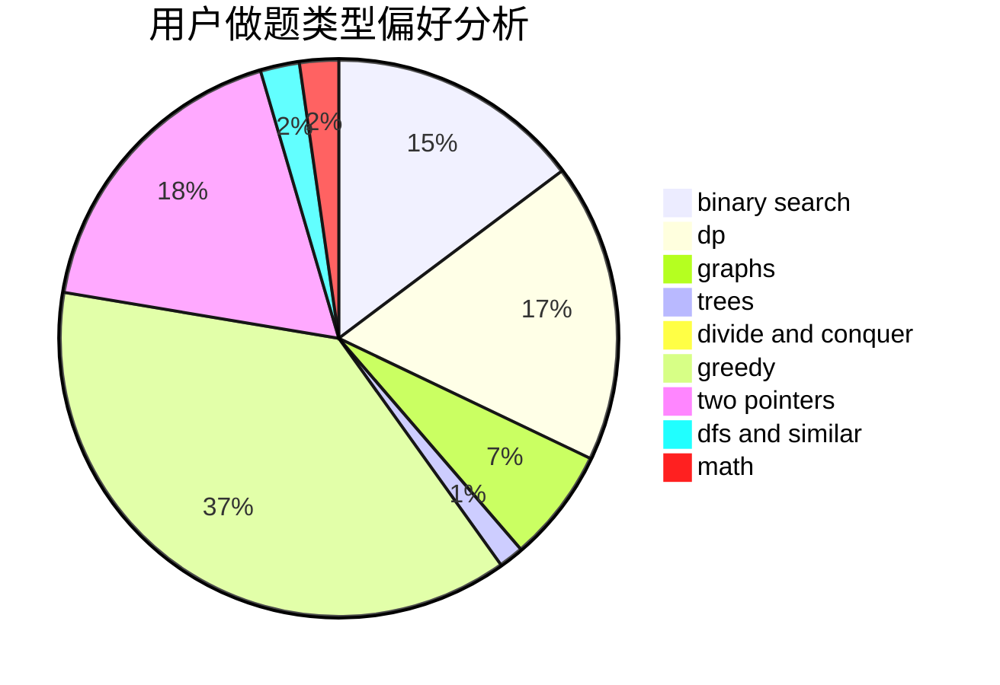

# orzdbh

<!-- tabs:start -->

#### **用户提交结果分析**

#### **用户做题类型偏好分析**

<!-- tabs:end -->
# 推荐题目
[936A](https://codeforces.com/contest/936/problem/A)
[1406E](https://codeforces.com/contest/1406/problem/E)
[796D](https://codeforces.com/contest/796/problem/D)
[273D](https://codeforces.com/contest/273/problem/D)
[293C](https://codeforces.com/contest/293/problem/C)
[863C](https://codeforces.com/contest/863/problem/C)
[626E](https://codeforces.com/contest/626/problem/E)
[297B](https://codeforces.com/contest/297/problem/B)
[600B](https://codeforces.com/contest/600/problem/B)
[899B](https://codeforces.com/contest/899/problem/B)
