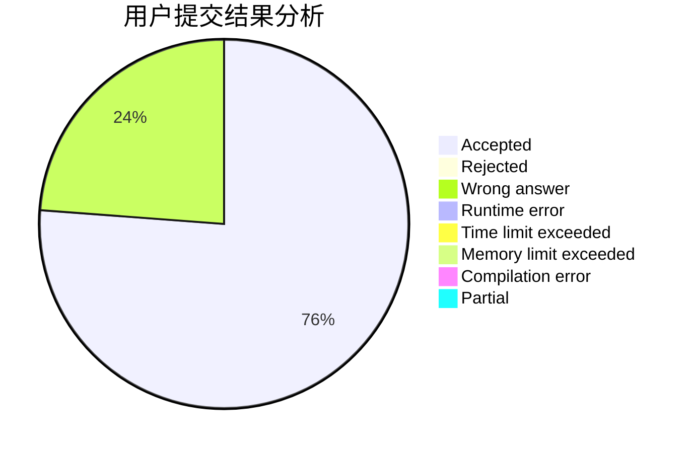
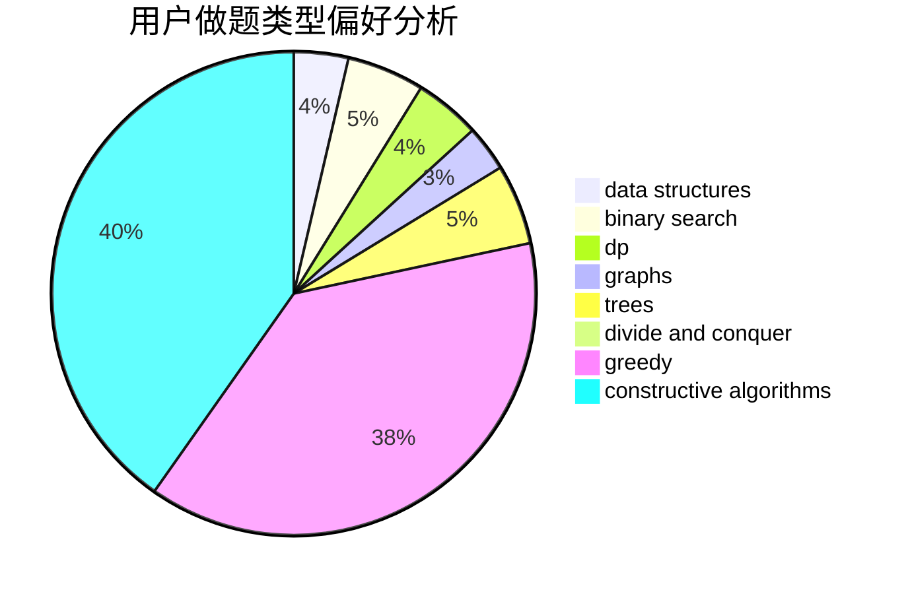

# orzdbh

<!-- tabs:start -->

#### **用户提交结果分析**

#### **用户做题类型偏好分析**

#### **用户错题知识点分析**

<!-- tabs:end -->
# 推荐题目
[916A](https://codeforces.com/contest/916/problem/A)		brute force,
                        implementation,
                        math		  
[1398A](https://codeforces.com/contest/1398/problem/A)		geometry,
                        math		  
[778C](https://codeforces.com/contest/778/problem/C)		brute force,
                        dfs and similar,
                        dsu,
                        hashing,
                        strings,
                        trees		  
[254D](https://codeforces.com/contest/254/problem/D)		brute force,
                        dfs and similar,
                        graphs,
                        implementation,
                        shortest paths		  
[278C](https://codeforces.com/contest/278/problem/C)		dsu,graphs,sortings,trees		  
[845B](https://codeforces.com/contest/845/problem/B)		brute force,
                        greedy,
                        implementation		  
[607D](https://codeforces.com/contest/607/problem/D)		data structures,
                        trees		  
[280E](https://codeforces.com/contest/280/problem/E)		data structures,
                        dp,
                        implementation,
                        math		  
[57D](https://codeforces.com/contest/57/problem/D)		dp,
                        math		  
[878C](https://codeforces.com/contest/878/problem/C)		data structures,
                        graphs		  
