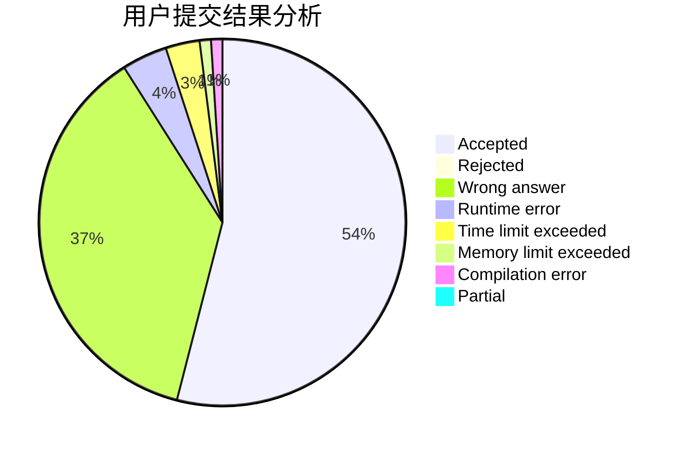
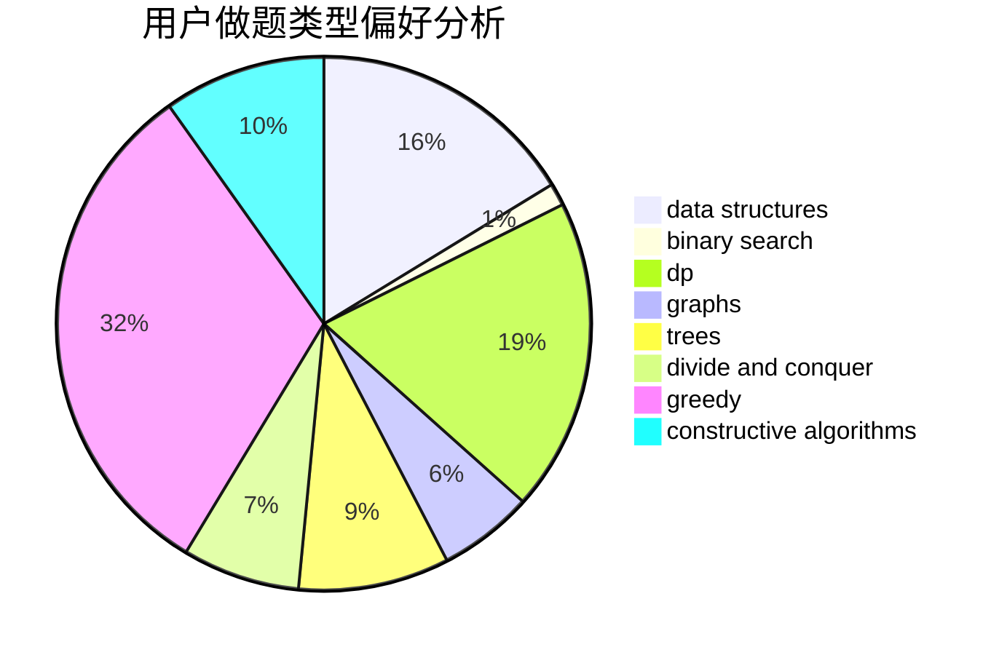
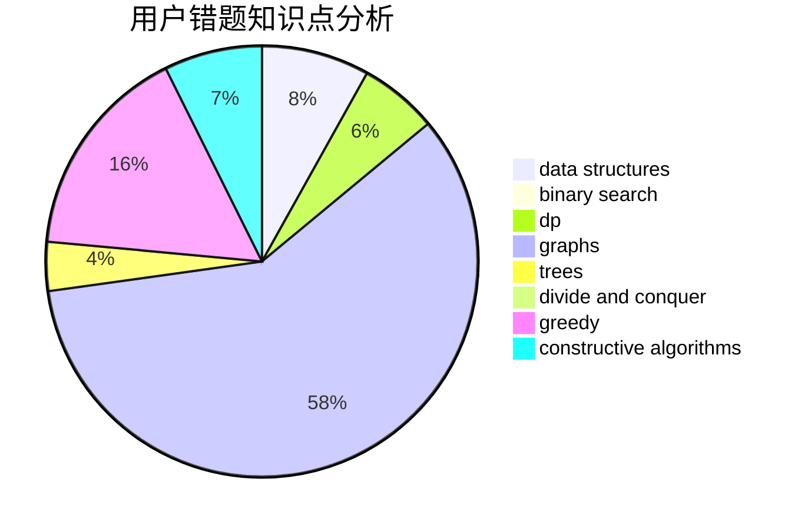

# orzdevinwang

<!-- tabs:start -->

#### **用户提交结果分析**

#### **用户做题类型偏好分析**

#### **用户错题知识点分析**

<!-- tabs:end -->
# 推荐题目
[1215E](https://codeforces.com/contest/1215/problem/E)		bitmasks,
                        dp		  
[622F](https://codeforces.com/contest/622/problem/F)		math		  
[936A](https://codeforces.com/contest/936/problem/A)		binary search,
                        implementation,
                        math		  
[20A](https://codeforces.com/contest/20/problem/A)		implementation		  
[295C](https://codeforces.com/contest/295/problem/C)		combinatorics,
                        dp,
                        graphs,
                        shortest paths		  
[1156B](https://codeforces.com/contest/1156/problem/B)		dfs and similar,
                        greedy,
                        implementation,
                        sortings,
                        strings		  
[1016D](https://codeforces.com/contest/1016/problem/D)		constructive algorithms,
                        flows,
                        math		  
[833C](https://codeforces.com/contest/833/problem/C)		brute force,
                        combinatorics,
                        greedy,
                        math		  
[958B1](https://codeforces.com/contest/958B/problem/1)		implementation		  
[1008B](https://codeforces.com/contest/1008/problem/B)		greedy,
                        sortings		  
