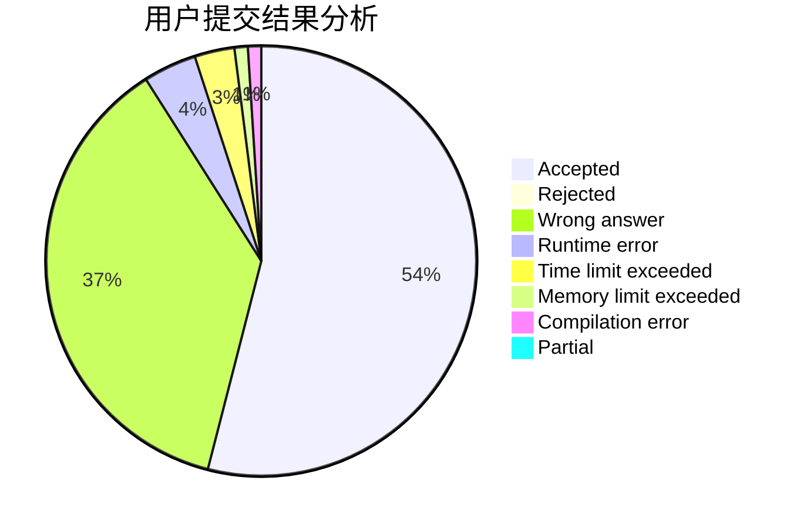
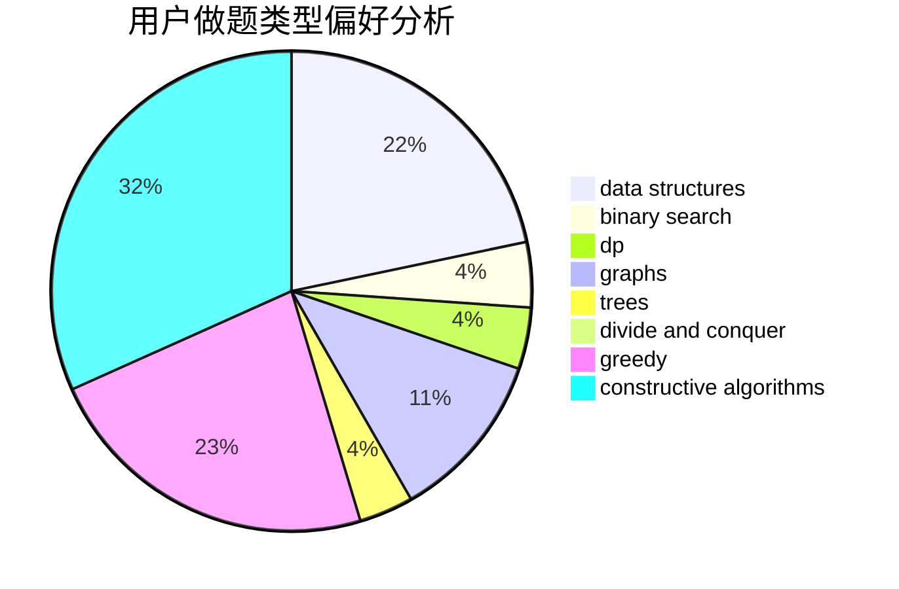
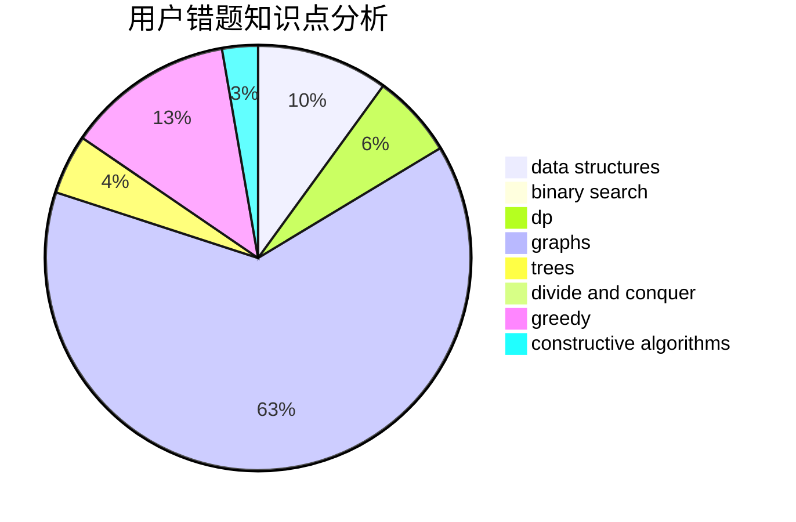

# orzdevinwang

<!-- tabs:start -->

#### **用户提交结果分析**

#### **用户做题类型偏好分析**

#### **用户错题知识点分析**

<!-- tabs:end -->
# 推荐题目
[1221C](https://codeforces.com/contest/1221/problem/C)		binary search,
                        math		  
[650E](https://codeforces.com/contest/650/problem/E)		data structures,
                        dfs and similar,
                        dsu,
                        greedy,
                        trees		  
[9581](https://codeforces.com/contest/958/problem/1)		dsu,graphs,sortings,trees		  
[231C](https://codeforces.com/contest/231/problem/C)		binary search,
                        sortings,
                        two pointers		  
[312A](https://codeforces.com/contest/312/problem/A)		implementation,
                        strings		  
[1157G](https://codeforces.com/contest/1157/problem/G)		brute force,
                        constructive algorithms		  
[1016G](https://codeforces.com/contest/1016/problem/G)		bitmasks,
                        math,
                        number theory		  
[851C](https://codeforces.com/contest/851/problem/C)		dsu,graphs,sortings,trees		  
[979D](https://codeforces.com/contest/979/problem/D)		binary search,
                        bitmasks,
                        brute force,
                        data structures,
                        dp,
                        dsu,
                        greedy,
                        math,
                        number theory,
                        strings,
                        trees		  
[1008E](https://codeforces.com/contest/1008/problem/E)		dsu,graphs,sortings,trees		  
