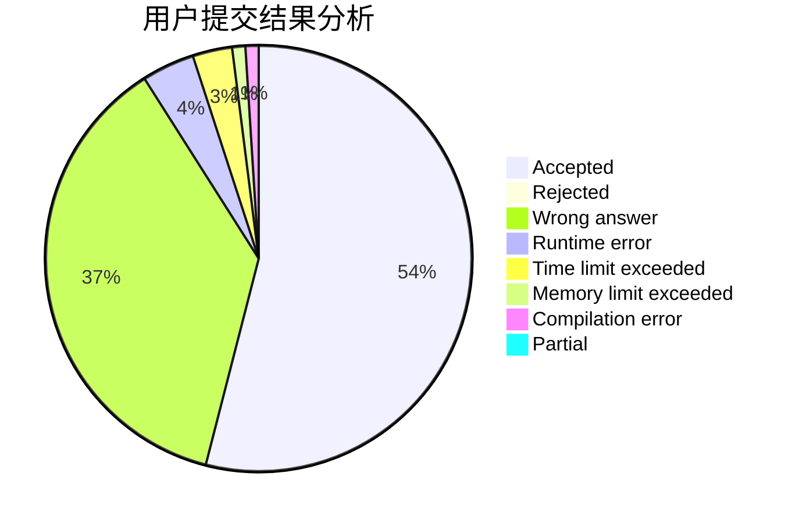
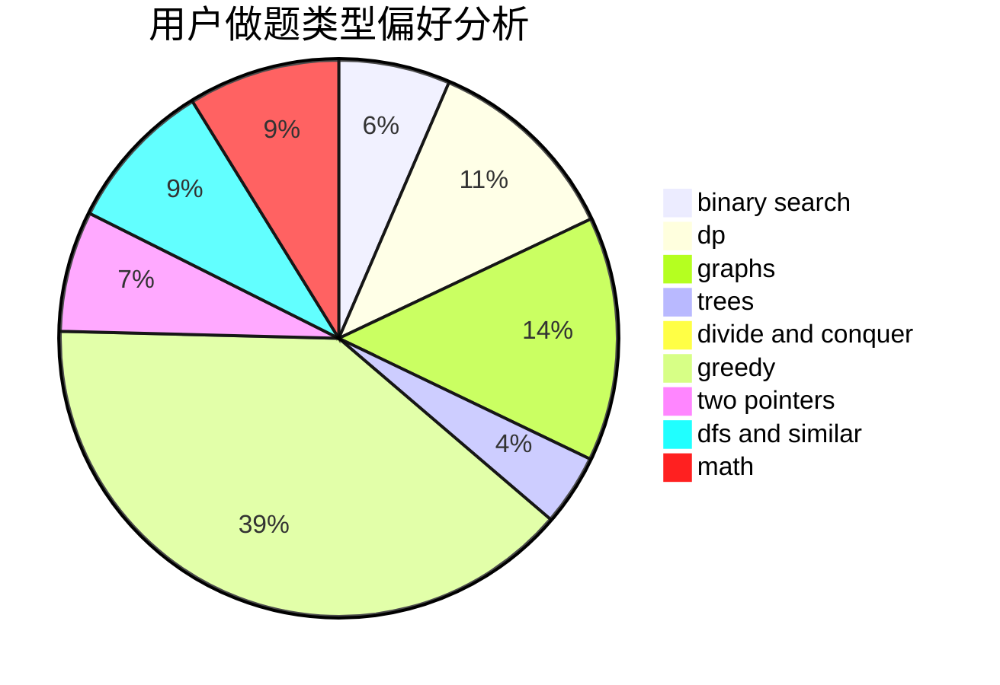

# orzdevinwang

<!-- tabs:start -->

#### **用户提交结果分析**

#### **用户做题类型偏好分析**

<!-- tabs:end -->
# 推荐题目
[1221C](https://codeforces.com/contest/1221/problem/C)
[650E](https://codeforces.com/contest/650/problem/E)
[9581](https://codeforces.com/contest/958/problem/1)
[231C](https://codeforces.com/contest/231/problem/C)
[312A](https://codeforces.com/contest/312/problem/A)
[1157G](https://codeforces.com/contest/1157/problem/G)
[1016G](https://codeforces.com/contest/1016/problem/G)
[851C](https://codeforces.com/contest/851/problem/C)
[979D](https://codeforces.com/contest/979/problem/D)
[1008E](https://codeforces.com/contest/1008/problem/E)
