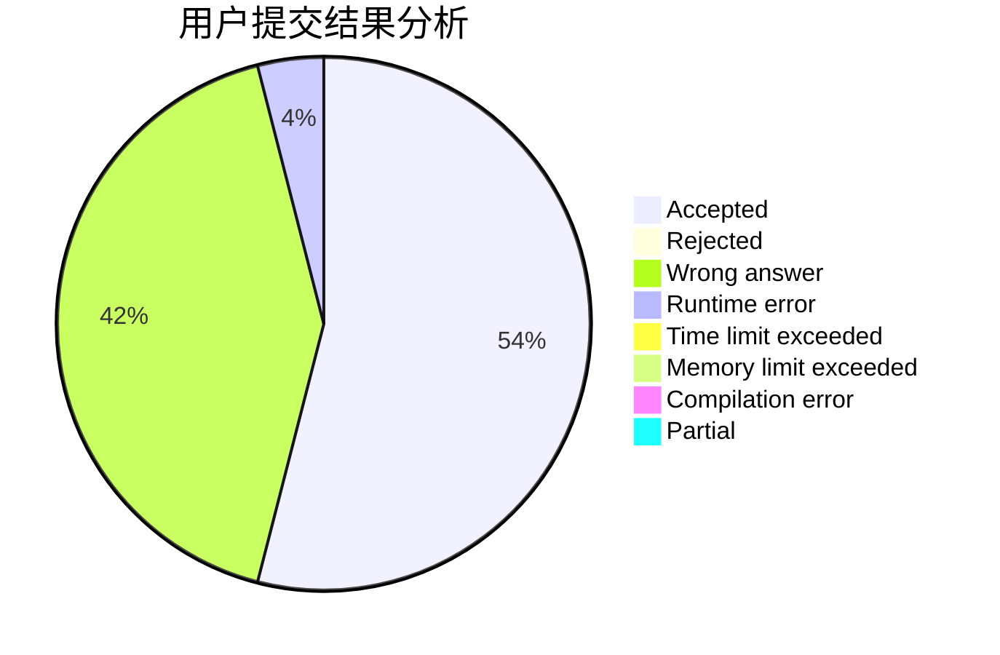
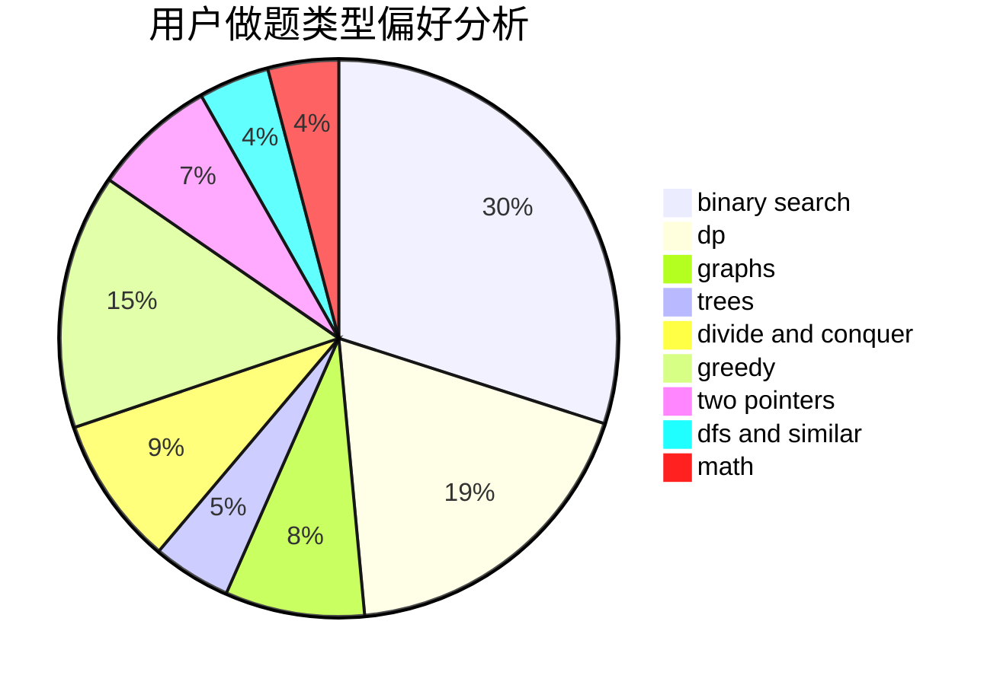

# orzhyh

<!-- tabs:start -->

#### **用户提交结果分析**

#### **用户做题类型偏好分析**

<!-- tabs:end -->
# 推荐题目
[495B](https://codeforces.com/contest/495/problem/B)
[672A](https://codeforces.com/contest/672/problem/A)
[1194F](https://codeforces.com/contest/1194/problem/F)
[750F](https://codeforces.com/contest/750/problem/F)
[634D](https://codeforces.com/contest/634/problem/D)
[922B](https://codeforces.com/contest/922/problem/B)
[616A](https://codeforces.com/contest/616/problem/A)
[620F](https://codeforces.com/contest/620/problem/F)
[1032F](https://codeforces.com/contest/1032/problem/F)
[47E](https://codeforces.com/contest/47/problem/E)
