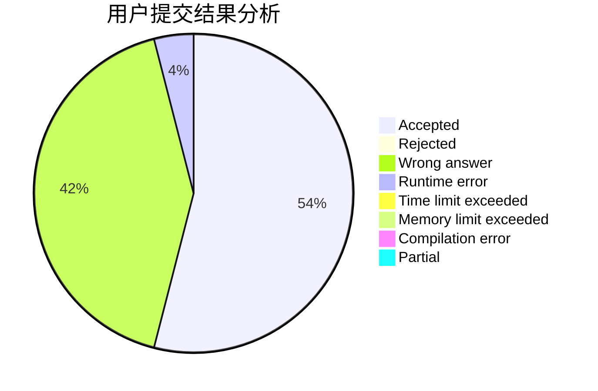
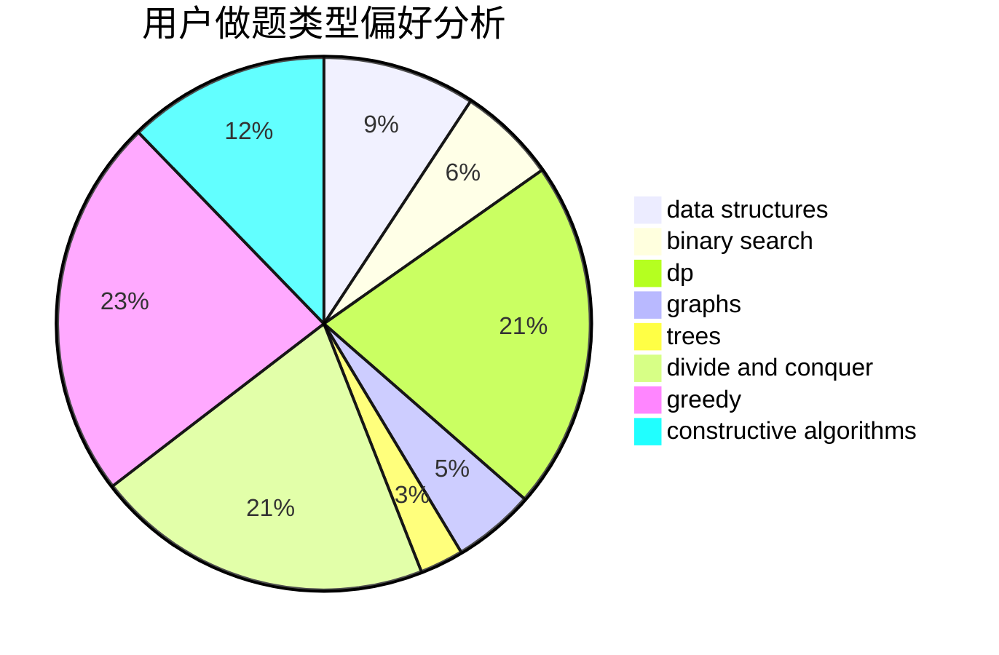
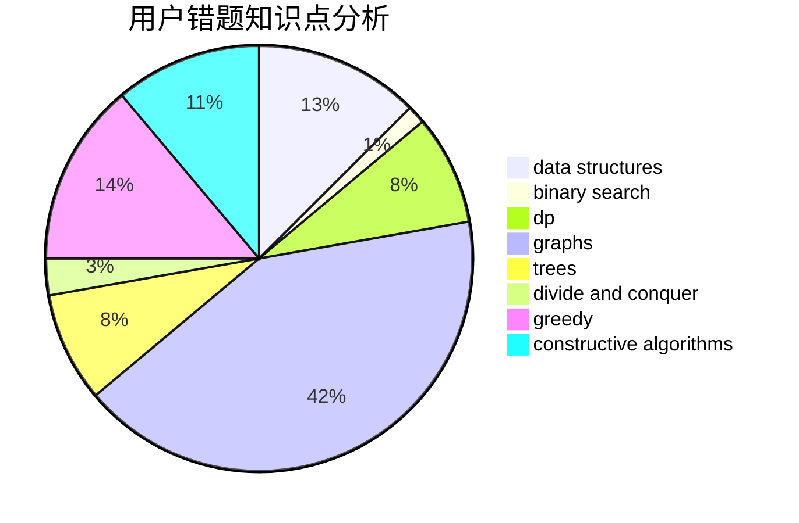

# orzhyh

<!-- tabs:start -->

#### **用户提交结果分析**

#### **用户做题类型偏好分析**

#### **用户错题知识点分析**

<!-- tabs:end -->
# 推荐题目
[495B](https://codeforces.com/contest/495/problem/B)		math,
                        number theory		  
[672A](https://codeforces.com/contest/672/problem/A)		implementation		  
[1194F](https://codeforces.com/contest/1194/problem/F)		combinatorics,
                        dp,
                        number theory,
                        probabilities,
                        two pointers		  
[750F](https://codeforces.com/contest/750/problem/F)		constructive algorithms,
                        implementation,
                        interactive,
                        trees		  
[634D](https://codeforces.com/contest/634/problem/D)		dsu,graphs,sortings,trees		  
[922B](https://codeforces.com/contest/922/problem/B)		brute force		  
[616A](https://codeforces.com/contest/616/problem/A)		implementation,
                        strings		  
[620F](https://codeforces.com/contest/620/problem/F)		data structures,
                        strings,
                        trees		  
[1032F](https://codeforces.com/contest/1032/problem/F)		dp,
                        trees		  
[47E](https://codeforces.com/contest/47/problem/E)		data structures,
                        geometry,
                        sortings		  
