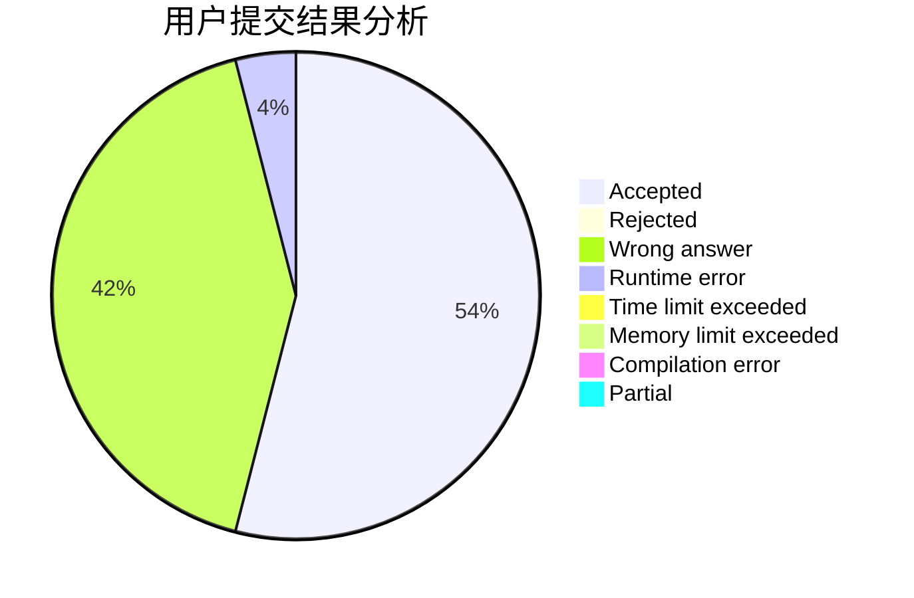
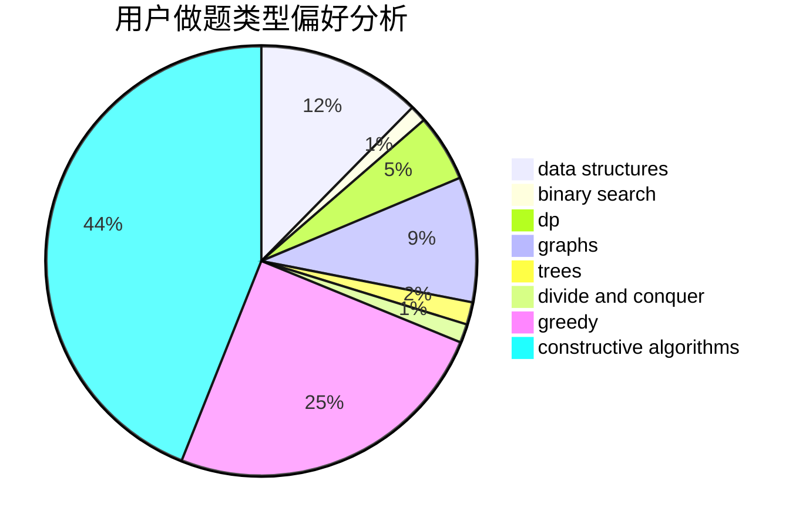
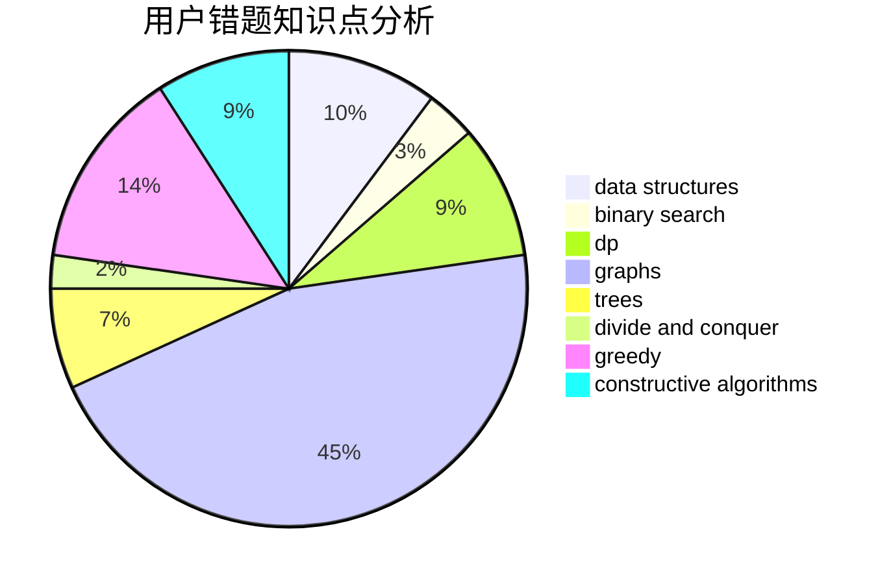

# orzhyh

<!-- tabs:start -->

#### **用户提交结果分析**

#### **用户做题类型偏好分析**

#### **用户错题知识点分析**

<!-- tabs:end -->
# 推荐题目
[476B](https://codeforces.com/contest/476/problem/B)		bitmasks,
                        brute force,
                        combinatorics,
                        dp,
                        math,
                        probabilities		  
[645E](https://codeforces.com/contest/645/problem/E)		dp,
                        greedy,
                        strings		  
[1189D1](https://codeforces.com/contest/1189D/problem/1)		dsu,graphs,sortings,trees		  
[733A](https://codeforces.com/contest/733/problem/A)		implementation		  
[616F](https://codeforces.com/contest/616/problem/F)		string suffix structures,
                        strings		  
[908A](https://codeforces.com/contest/908/problem/A)		brute force,
                        implementation		  
[598B](https://codeforces.com/contest/598/problem/B)		implementation,
                        strings		  
[601D](https://codeforces.com/contest/601/problem/D)		data structures,
                        dfs and similar,
                        dsu,
                        hashing,
                        strings,
                        trees		  
[1031D](https://codeforces.com/contest/1031/problem/D)		greedy		  
[460E](https://codeforces.com/contest/460/problem/E)		brute force,
                        geometry,
                        math,
                        sortings		  
