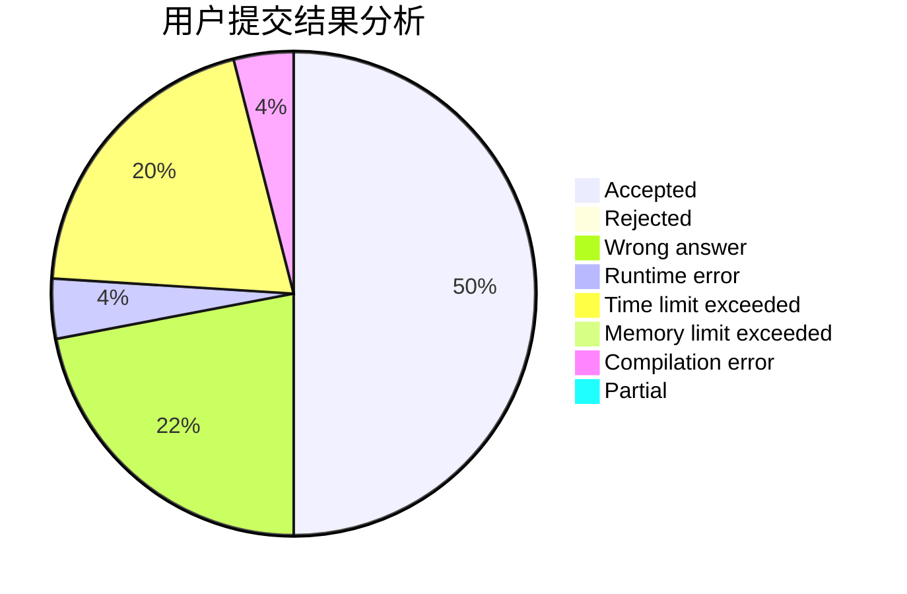
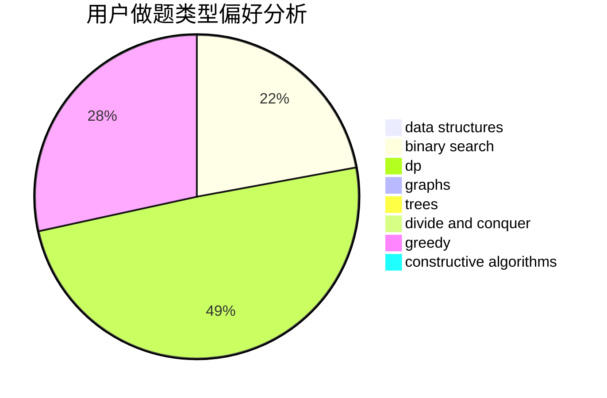

# Bubbles.

<!-- tabs:start -->

#### **用户提交结果分析**

#### **用户做题类型偏好分析**

#### **用户错题知识点分析**

<!-- tabs:end -->
# 推荐题目
[1080E](https://codeforces.com/contest/1080/problem/E)		strings		  
[591B](https://codeforces.com/contest/591/problem/B)		implementation,
                        strings		  
[409B](https://codeforces.com/contest/409/problem/B)		*special problem		  
[1413F](https://codeforces.com/contest/1413/problem/F)		data structures,
                        trees		  
[12552](https://codeforces.com/contest/1255/problem/2)		dsu,graphs,sortings,trees		  
[1063C](https://codeforces.com/contest/1063/problem/C)		binary search,
                        constructive algorithms,
                        geometry,
                        interactive		  
[1490C](https://codeforces.com/contest/1490/problem/C)		binary search,
                        brute force,
                        brute force,
                        math		  
[1497B](https://codeforces.com/contest/1497/problem/B)		constructive algorithms,
                        greedy,
                        math		  
[1491C](https://codeforces.com/contest/1491/problem/C)		brute force,
                        data structures,
                        dp,
                        greedy,
                        implementation		  
[1484C](https://codeforces.com/contest/1484/problem/C)		dsu,graphs,sortings,trees		  
