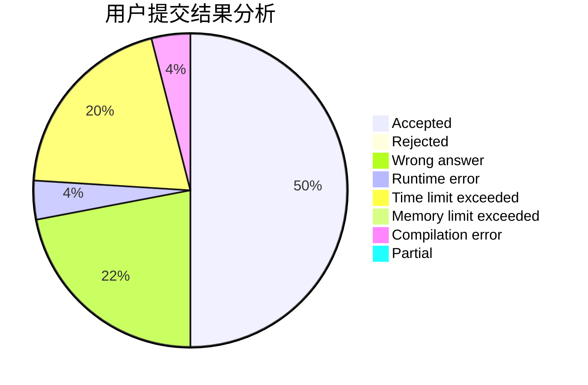
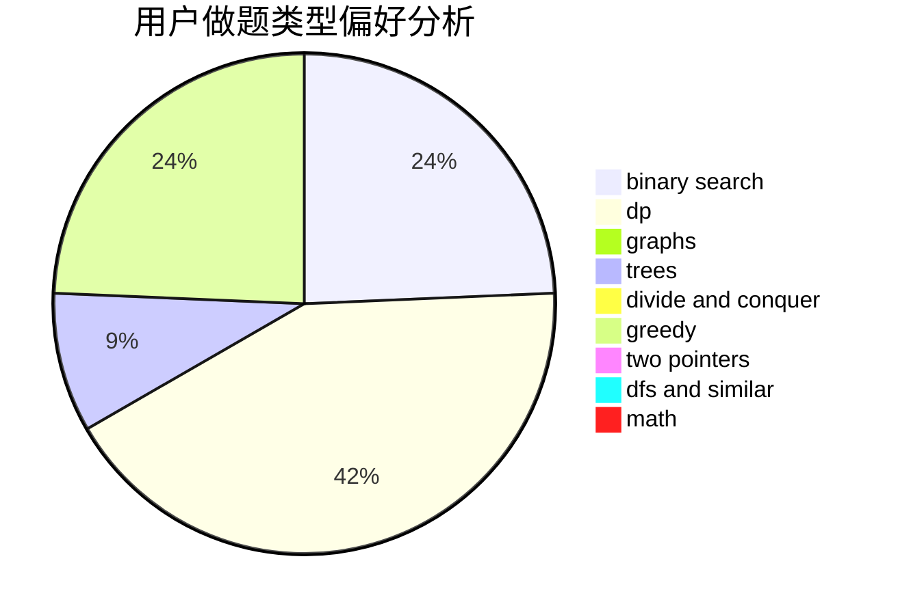

# Bubbles.

<!-- tabs:start -->

#### **用户提交结果分析**

#### **用户做题类型偏好分析**

<!-- tabs:end -->
# 推荐题目
[1080E](https://codeforces.com/contest/1080/problem/E)
[591B](https://codeforces.com/contest/591/problem/B)
[409B](https://codeforces.com/contest/409/problem/B)
[1413F](https://codeforces.com/contest/1413/problem/F)
[12552](https://codeforces.com/contest/1255/problem/2)
[1063C](https://codeforces.com/contest/1063/problem/C)
[1490C](https://codeforces.com/contest/1490/problem/C)
[1497B](https://codeforces.com/contest/1497/problem/B)
[1491C](https://codeforces.com/contest/1491/problem/C)
[1484C](https://codeforces.com/contest/1484/problem/C)
