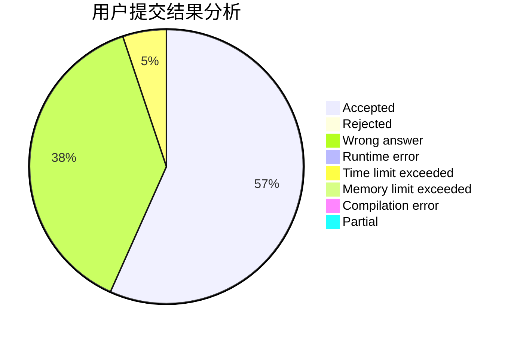
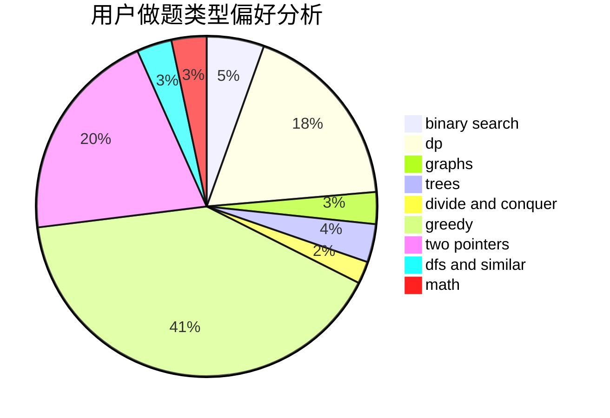

# orzzzzzz

<!-- tabs:start -->

#### **用户提交结果分析**

#### **用户做题类型偏好分析**

<!-- tabs:end -->
# 推荐题目
[710D](https://codeforces.com/contest/710/problem/D)
[1109F](https://codeforces.com/contest/1109/problem/F)
[268E](https://codeforces.com/contest/268/problem/E)
[1505D](https://codeforces.com/contest/1505/problem/D)
[464A](https://codeforces.com/contest/464/problem/A)
[172A](https://codeforces.com/contest/172/problem/A)
[363D](https://codeforces.com/contest/363/problem/D)
[80B](https://codeforces.com/contest/80/problem/B)
[1782](https://codeforces.com/contest/178/problem/2)
[107D](https://codeforces.com/contest/107/problem/D)
