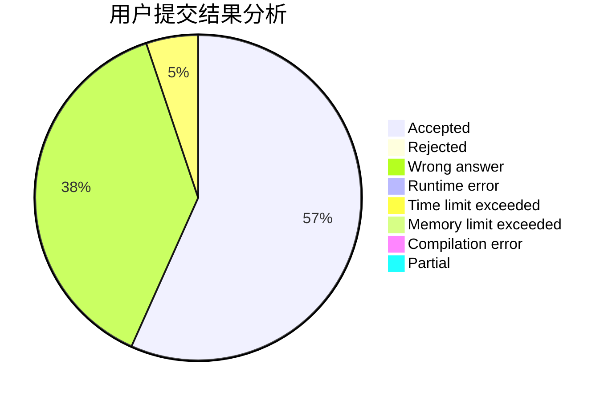
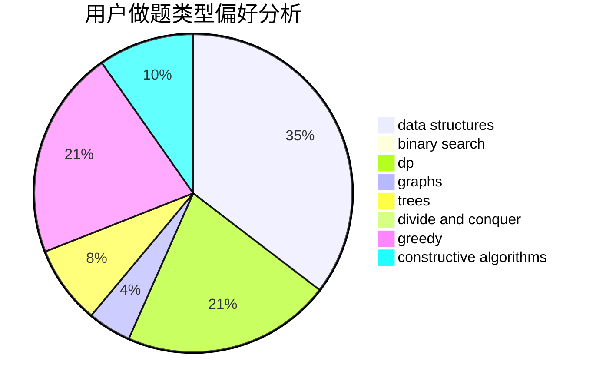

# orzzzzzz

<!-- tabs:start -->

#### **用户提交结果分析**

#### **用户做题类型偏好分析**

#### **用户错题知识点分析**

<!-- tabs:end -->
# 推荐题目
[710D](https://codeforces.com/contest/710/problem/D)		math,
                        number theory		  
[1109F](https://codeforces.com/contest/1109/problem/F)		data structures,
                        trees		  
[268E](https://codeforces.com/contest/268/problem/E)		math,
                        probabilities,
                        sortings		  
[1505D](https://codeforces.com/contest/1505/problem/D)		number theory		  
[464A](https://codeforces.com/contest/464/problem/A)		greedy,
                        strings		  
[172A](https://codeforces.com/contest/172/problem/A)		*special problem,
                        brute force,
                        implementation		  
[363D](https://codeforces.com/contest/363/problem/D)		binary search,
                        greedy		  
[80B](https://codeforces.com/contest/80/problem/B)		geometry,
                        math		  
[1782](https://codeforces.com/contest/178/problem/2)		dsu,graphs,sortings,trees		  
[107D](https://codeforces.com/contest/107/problem/D)		dp,
                        graphs,
                        matrices		  
