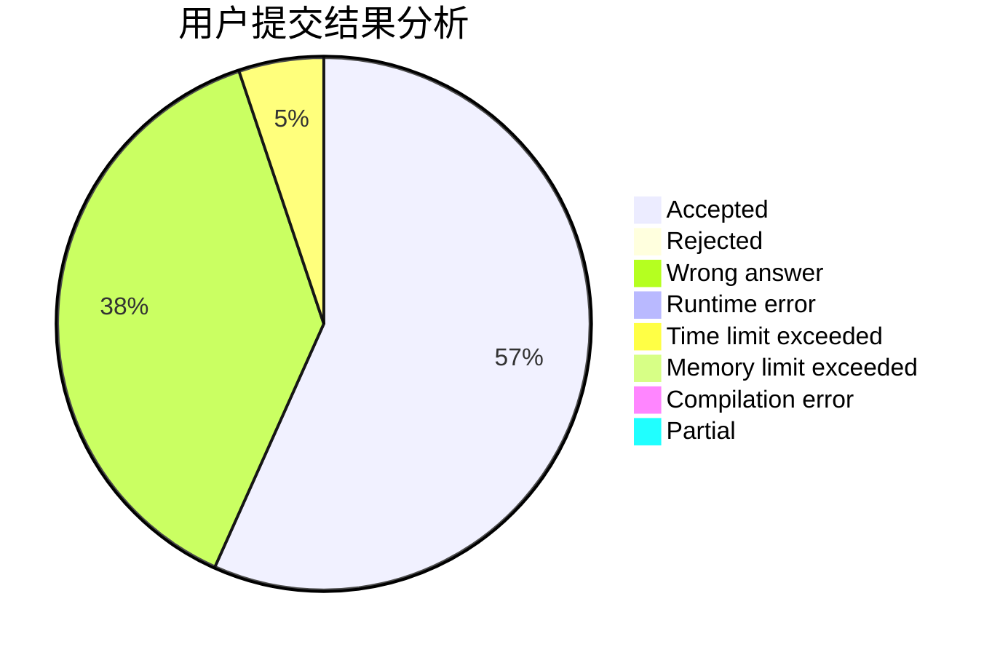
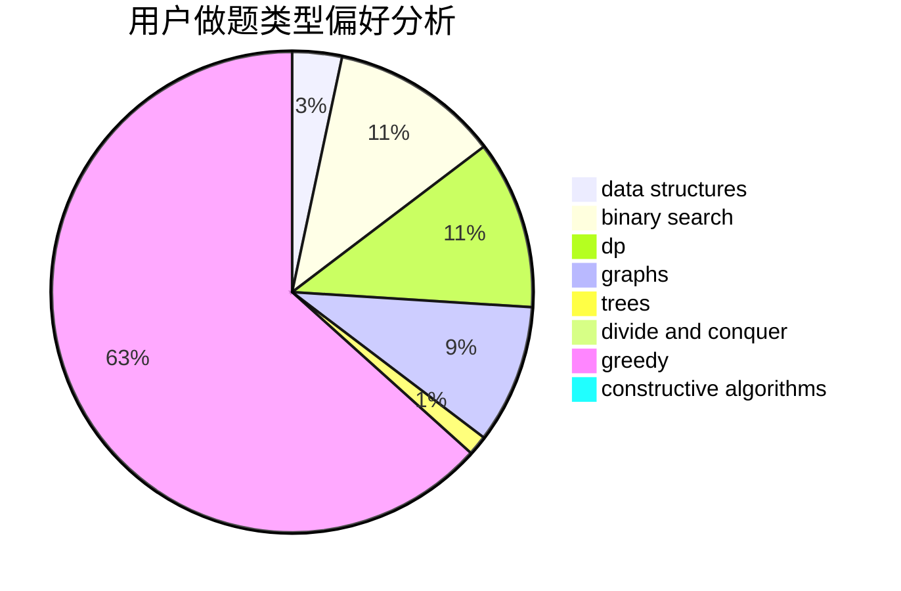

# orzzzzzz

<!-- tabs:start -->

#### **用户提交结果分析**

#### **用户做题类型偏好分析**

#### **用户错题知识点分析**

<!-- tabs:end -->
# 推荐题目
[690D1](https://codeforces.com/contest/690D/problem/1)		nan		  
[1109B](https://codeforces.com/contest/1109/problem/B)		constructive algorithms,
                        hashing,
                        strings		  
[24D](https://codeforces.com/contest/24/problem/D)		dp,
                        math,
                        probabilities		  
[1496D](https://codeforces.com/contest/1496/problem/D)		dsu,graphs,sortings,trees		  
[443D](https://codeforces.com/contest/443/problem/D)		dsu,graphs,sortings,trees		  
[1513B](https://codeforces.com/contest/1513/problem/B)		bitmasks,
                        combinatorics,
                        constructive algorithms,
                        math		  
[337B](https://codeforces.com/contest/337/problem/B)		greedy,
                        math,
                        number theory		  
[795D](https://codeforces.com/contest/795/problem/D)		dsu,graphs,sortings,trees		  
[157C](https://codeforces.com/contest/157/problem/C)		dsu,graphs,sortings,trees		  
[107A](https://codeforces.com/contest/107/problem/A)		dfs and similar,
                        graphs		  
