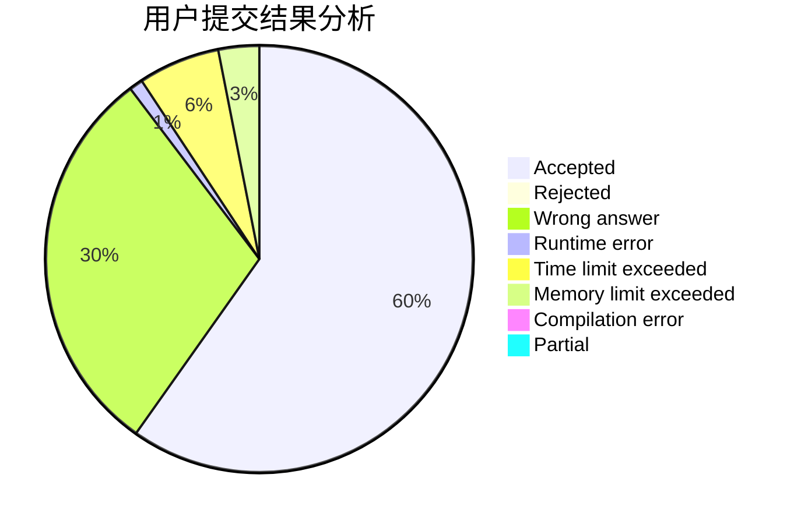
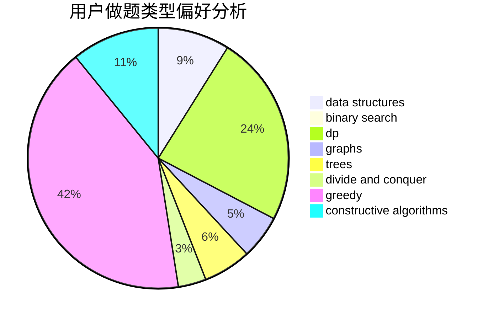
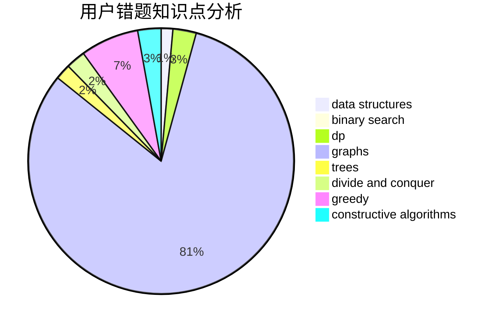

# ouqingliang

<!-- tabs:start -->

#### **用户提交结果分析**

#### **用户做题类型偏好分析**

#### **用户错题知识点分析**

<!-- tabs:end -->
# 推荐题目
[886F](https://codeforces.com/contest/886/problem/F)		geometry		  
[163E](https://codeforces.com/contest/163/problem/E)		data structures,
                        dfs and similar,
                        dp,
                        strings,
                        trees		  
[4B](https://codeforces.com/contest/4/problem/B)		constructive algorithms,
                        greedy		  
[954B](https://codeforces.com/contest/954/problem/B)		implementation,
                        strings		  
[845E](https://codeforces.com/contest/845/problem/E)		binary search,
                        data structures		  
[914F](https://codeforces.com/contest/914/problem/F)		bitmasks,
                        brute force,
                        data structures,
                        string suffix structures,
                        strings		  
[1491A](https://codeforces.com/contest/1491/problem/A)		brute force,
                        greedy,
                        implementation		  
[828D](https://codeforces.com/contest/828/problem/D)		dsu,graphs,sortings,trees		  
[884F](https://codeforces.com/contest/884/problem/F)		flows,
                        graphs,
                        greedy		  
[587F](https://codeforces.com/contest/587/problem/F)		data structures,
                        strings		  
