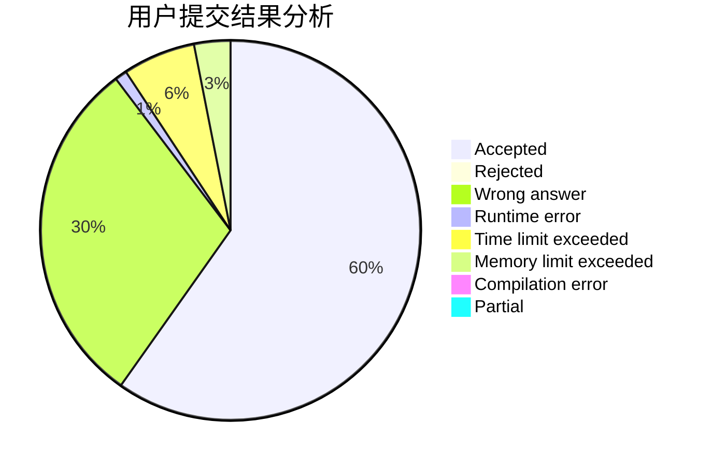
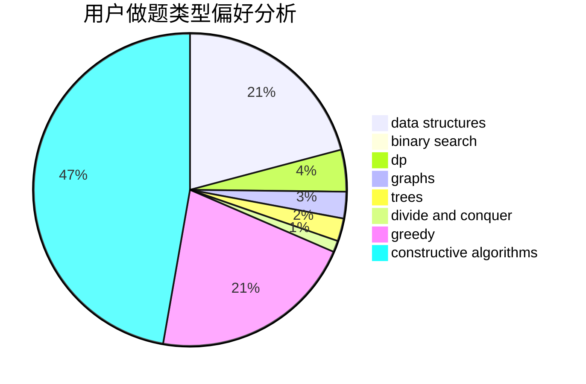
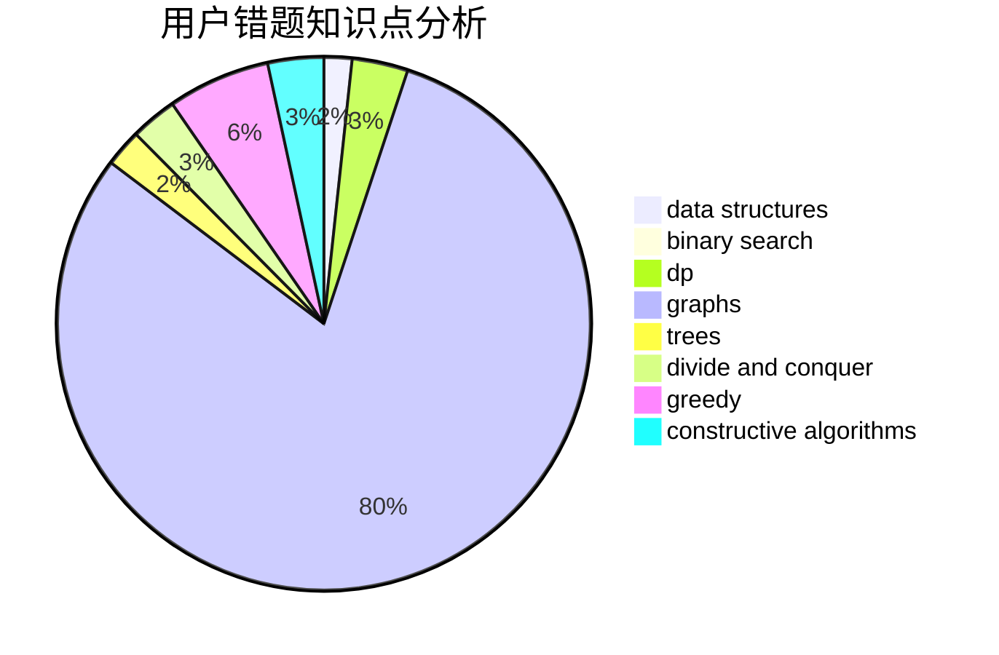

# ouqingliang

<!-- tabs:start -->

#### **用户提交结果分析**

#### **用户做题类型偏好分析**

#### **用户错题知识点分析**

<!-- tabs:end -->
# 推荐题目
[906A](https://codeforces.com/contest/906/problem/A)		implementation,
                        strings		  
[189E](https://codeforces.com/contest/189/problem/E)		dsu,graphs,sortings,trees		  
[520B](https://codeforces.com/contest/520/problem/B)		dfs and similar,
                        graphs,
                        greedy,
                        implementation,
                        math,
                        shortest paths		  
[976A](https://codeforces.com/contest/976/problem/A)		implementation		  
[863F](https://codeforces.com/contest/863/problem/F)		flows		  
[934B](https://codeforces.com/contest/934/problem/B)		constructive algorithms,
                        implementation		  
[1499G](https://codeforces.com/contest/1499/problem/G)		data structures,
                        graphs,
                        interactive		  
[847B](https://codeforces.com/contest/847/problem/B)		binary search,
                        data structures		  
[903B](https://codeforces.com/contest/903/problem/B)		greedy,
                        implementation		  
[608B](https://codeforces.com/contest/608/problem/B)		combinatorics,
                        strings		  
