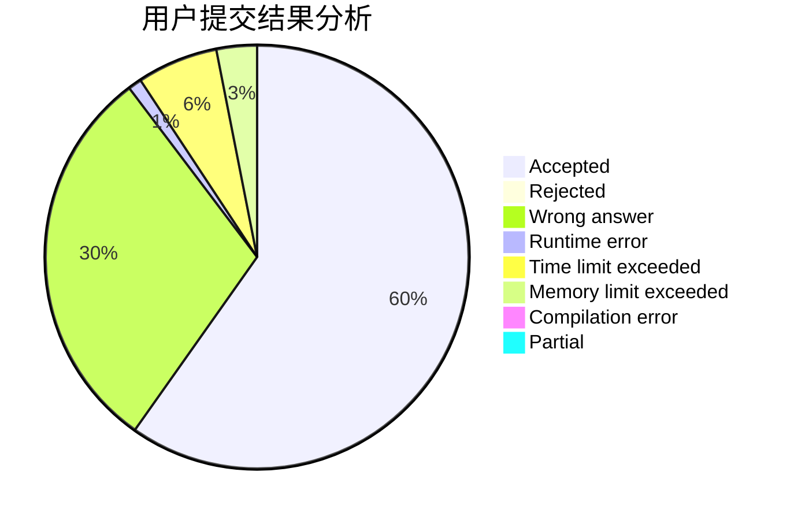
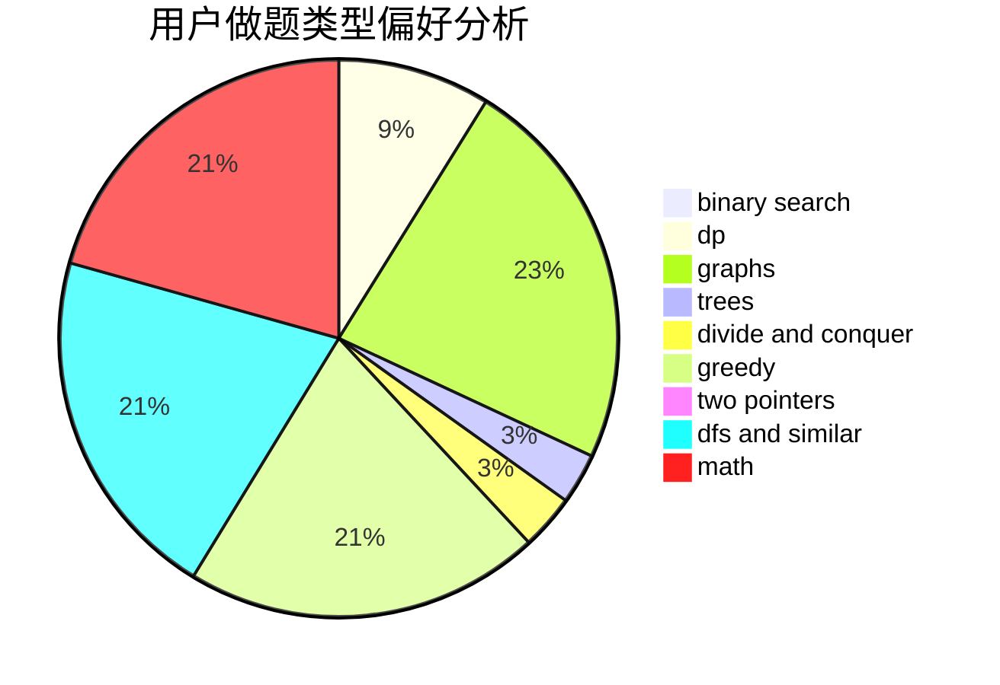

# ouqingliang

<!-- tabs:start -->

#### **用户提交结果分析**

#### **用户做题类型偏好分析**

<!-- tabs:end -->
# 推荐题目
[906A](https://codeforces.com/contest/906/problem/A)
[189E](https://codeforces.com/contest/189/problem/E)
[520B](https://codeforces.com/contest/520/problem/B)
[976A](https://codeforces.com/contest/976/problem/A)
[863F](https://codeforces.com/contest/863/problem/F)
[934B](https://codeforces.com/contest/934/problem/B)
[1499G](https://codeforces.com/contest/1499/problem/G)
[847B](https://codeforces.com/contest/847/problem/B)
[903B](https://codeforces.com/contest/903/problem/B)
[608B](https://codeforces.com/contest/608/problem/B)
