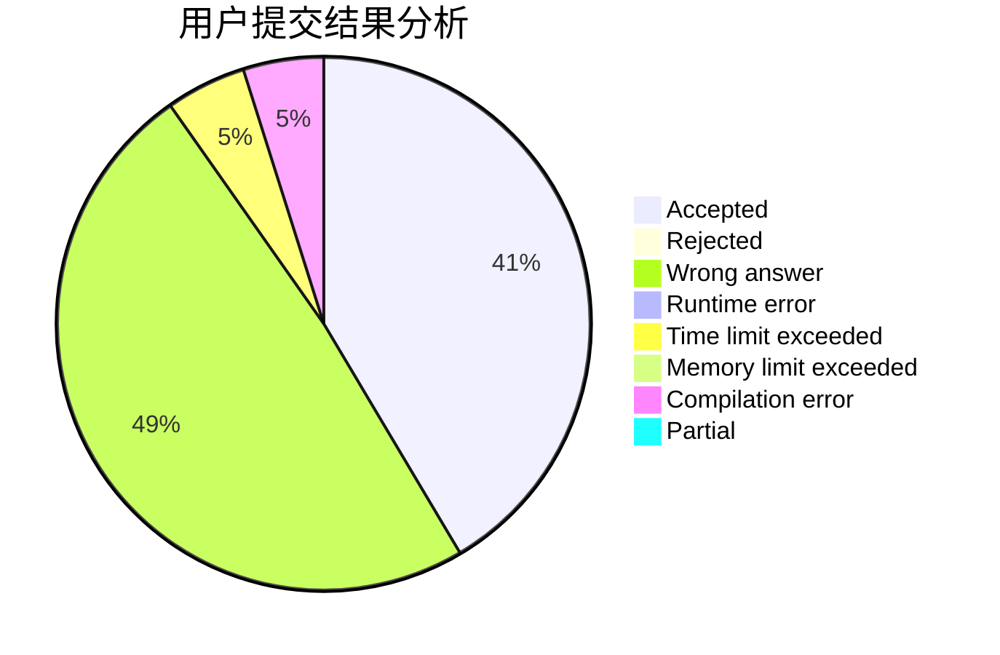
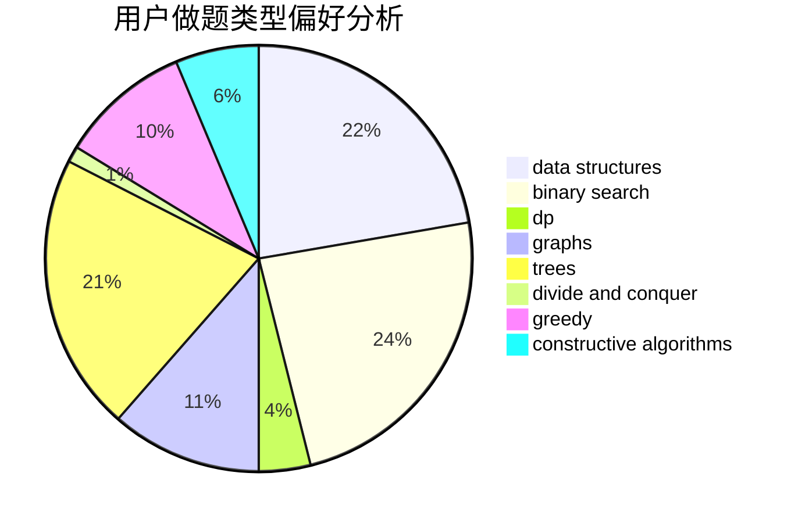

# overshadowed

<!-- tabs:start -->

#### **用户提交结果分析**

#### **用户做题类型偏好分析**

#### **用户错题知识点分析**

<!-- tabs:end -->
# 推荐题目
[1346A](https://codeforces.com/contest/1346/problem/A)		*special problem,
                        math		  
[490B](https://codeforces.com/contest/490/problem/B)		dsu,
                        implementation		  
[474D](https://codeforces.com/contest/474/problem/D)		dp		  
[883E](https://codeforces.com/contest/883/problem/E)		implementation,
                        strings		  
[110A](https://codeforces.com/contest/110/problem/A)		implementation		  
[1221F](https://codeforces.com/contest/1221/problem/F)		binary search,
                        data structures,
                        sortings		  
[840A](https://codeforces.com/contest/840/problem/A)		combinatorics,
                        greedy,
                        math,
                        number theory,
                        sortings		  
[820D](https://codeforces.com/contest/820/problem/D)		dsu,graphs,sortings,trees		  
[482D](https://codeforces.com/contest/482/problem/D)		combinatorics,
                        dp,
                        trees		  
[1016F](https://codeforces.com/contest/1016/problem/F)		dfs and similar,
                        dp,
                        trees		  
