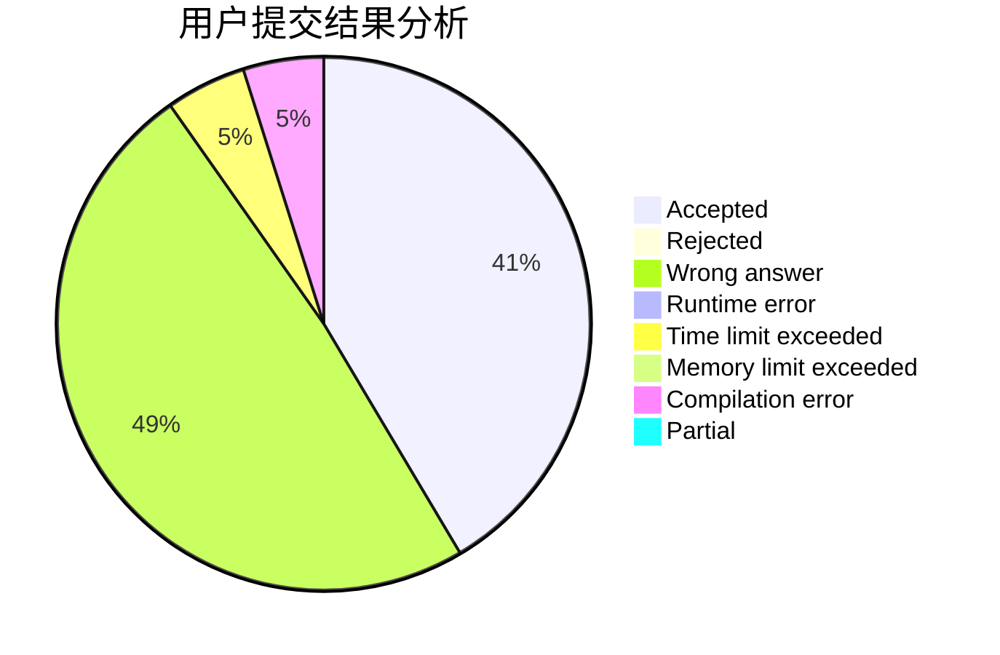
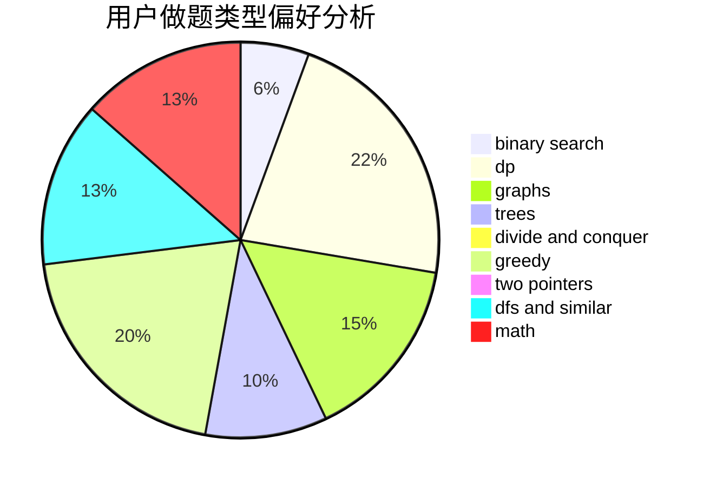

# overshadowed

<!-- tabs:start -->

#### **用户提交结果分析**

#### **用户做题类型偏好分析**

<!-- tabs:end -->
# 推荐题目
[1353B](https://codeforces.com/contest/1353/problem/B)
[510C](https://codeforces.com/contest/510/problem/C)
[492E](https://codeforces.com/contest/492/problem/E)
[900D](https://codeforces.com/contest/900/problem/D)
[1110C](https://codeforces.com/contest/1110/problem/C)
[122B](https://codeforces.com/contest/122/problem/B)
[859E](https://codeforces.com/contest/859/problem/E)
[840D](https://codeforces.com/contest/840/problem/D)
[501C](https://codeforces.com/contest/501/problem/C)
[1017B](https://codeforces.com/contest/1017/problem/B)
