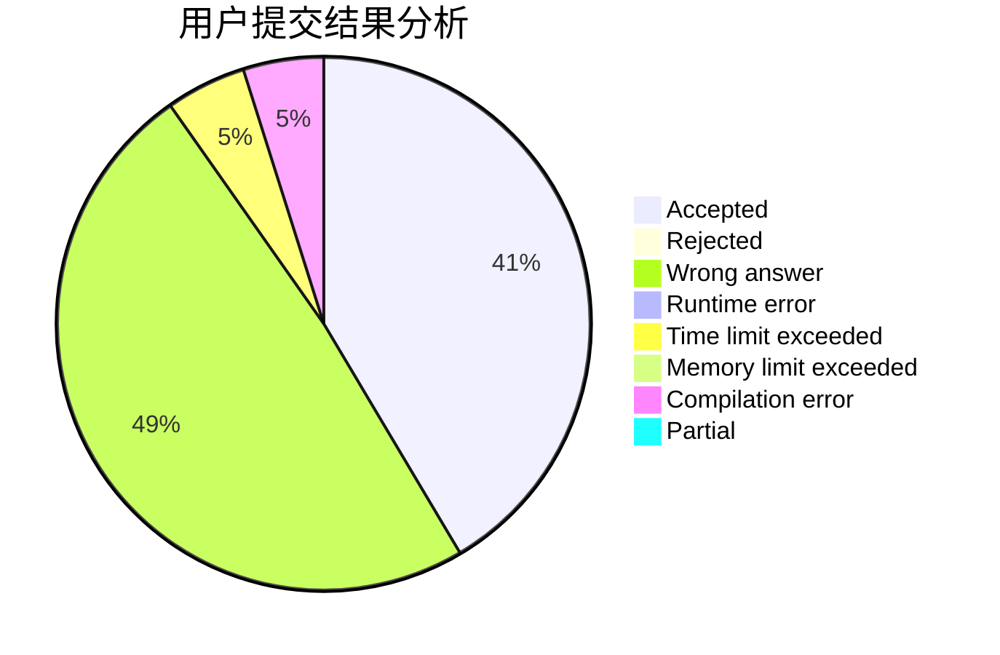
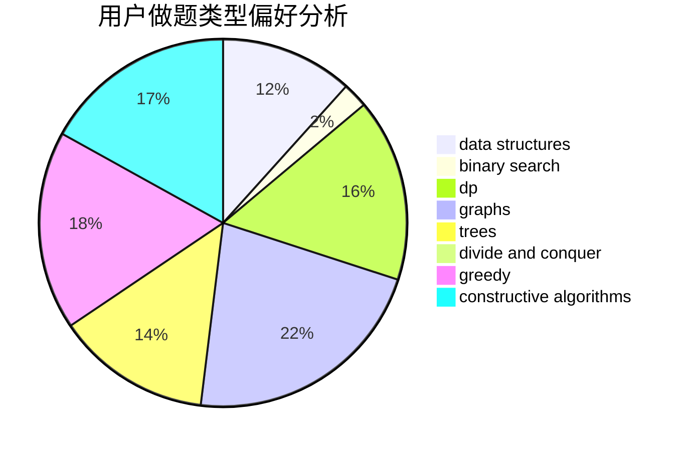
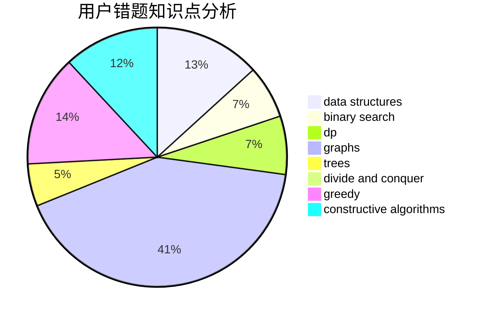

# overshadowed

<!-- tabs:start -->

#### **用户提交结果分析**

#### **用户做题类型偏好分析**

#### **用户错题知识点分析**

<!-- tabs:end -->
# 推荐题目
[1353B](https://codeforces.com/contest/1353/problem/B)		greedy,
                        sortings		  
[510C](https://codeforces.com/contest/510/problem/C)		dfs and similar,
                        graphs,
                        sortings		  
[492E](https://codeforces.com/contest/492/problem/E)		math		  
[900D](https://codeforces.com/contest/900/problem/D)		bitmasks,
                        combinatorics,
                        dp,
                        math,
                        number theory		  
[1110C](https://codeforces.com/contest/1110/problem/C)		constructive algorithms,
                        math,
                        number theory		  
[122B](https://codeforces.com/contest/122/problem/B)		brute force,
                        implementation		  
[859E](https://codeforces.com/contest/859/problem/E)		combinatorics,
                        dfs and similar,
                        dsu,
                        graphs,
                        trees		  
[840D](https://codeforces.com/contest/840/problem/D)		data structures,
                        probabilities		  
[501C](https://codeforces.com/contest/501/problem/C)		constructive algorithms,
                        data structures,
                        greedy,
                        sortings,
                        trees		  
[1017B](https://codeforces.com/contest/1017/problem/B)		implementation,
                        math		  
