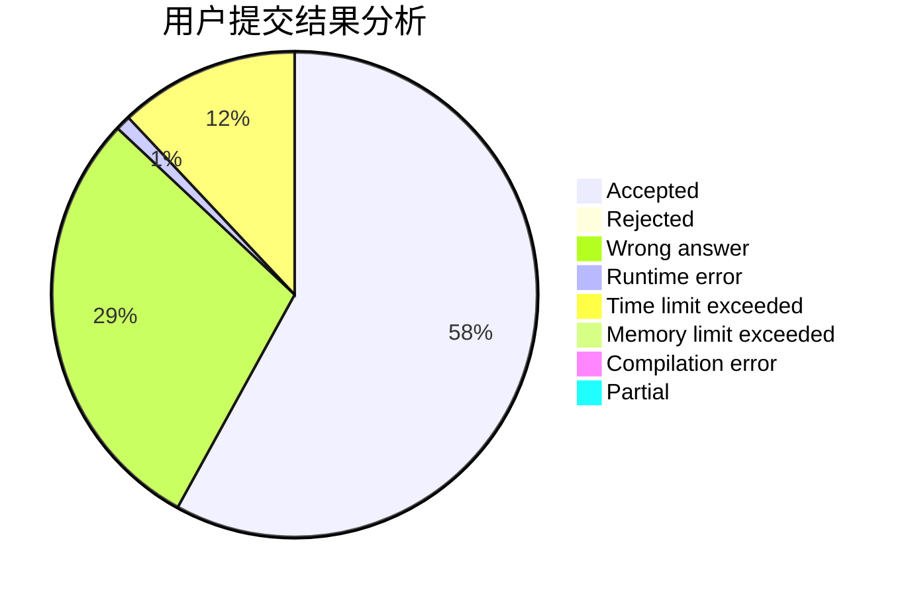
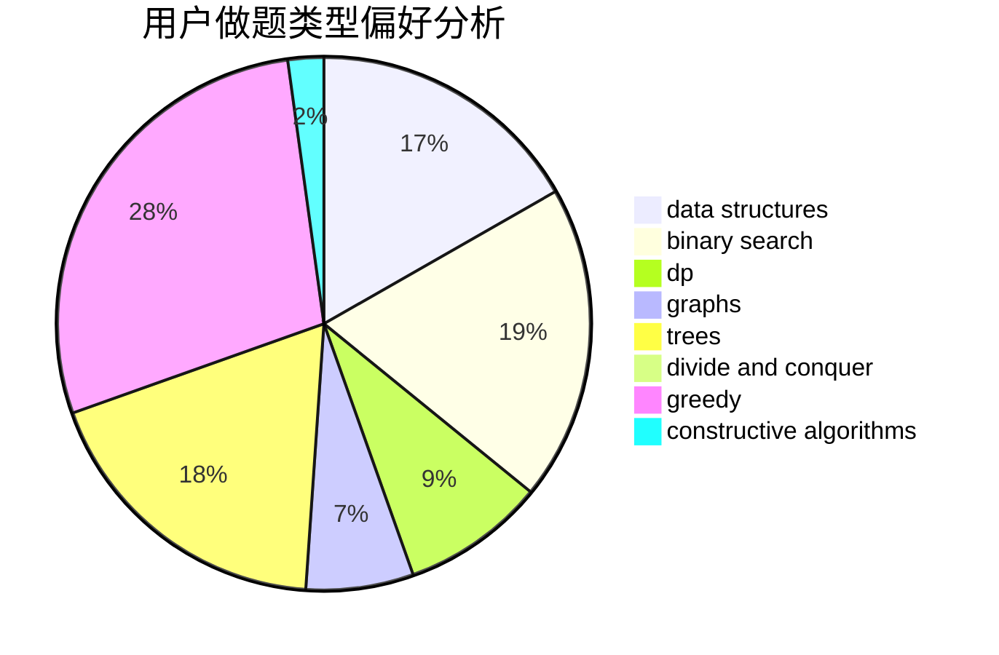
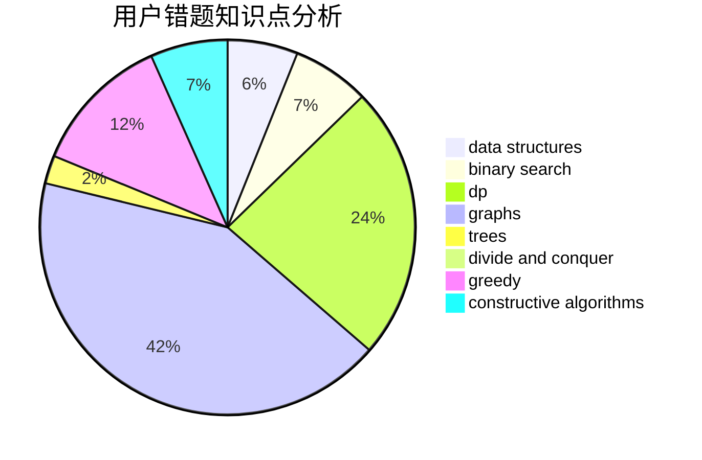

# oyqy1203

<!-- tabs:start -->

#### **用户提交结果分析**

#### **用户做题类型偏好分析**

#### **用户错题知识点分析**

<!-- tabs:end -->
# 推荐题目
[1033D](https://codeforces.com/contest/1033/problem/D)		interactive,
                        math,
                        number theory		  
[1238E](https://codeforces.com/contest/1238/problem/E)		bitmasks,
                        dp		  
[499C](https://codeforces.com/contest/499/problem/C)		dsu,graphs,sortings,trees		  
[1394C](https://codeforces.com/contest/1394/problem/C)		binary search,
                        geometry,
                        ternary search		  
[615D](https://codeforces.com/contest/615/problem/D)		math,
                        number theory		  
[737E](https://codeforces.com/contest/737/problem/E)		graph matchings,
                        graphs,
                        greedy,
                        schedules		  
[722C](https://codeforces.com/contest/722/problem/C)		data structures,
                        dsu		  
[853C](https://codeforces.com/contest/853/problem/C)		data structures		  
[1374A](https://codeforces.com/contest/1374/problem/A)		math		  
[1421A](https://codeforces.com/contest/1421/problem/A)		bitmasks,
                        greedy,
                        math		  
