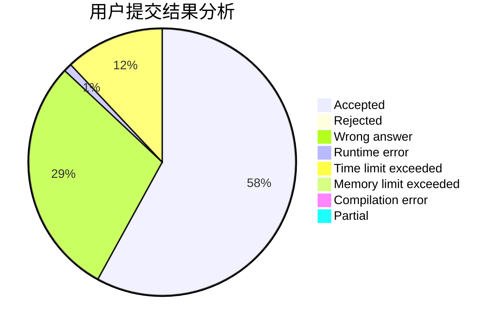
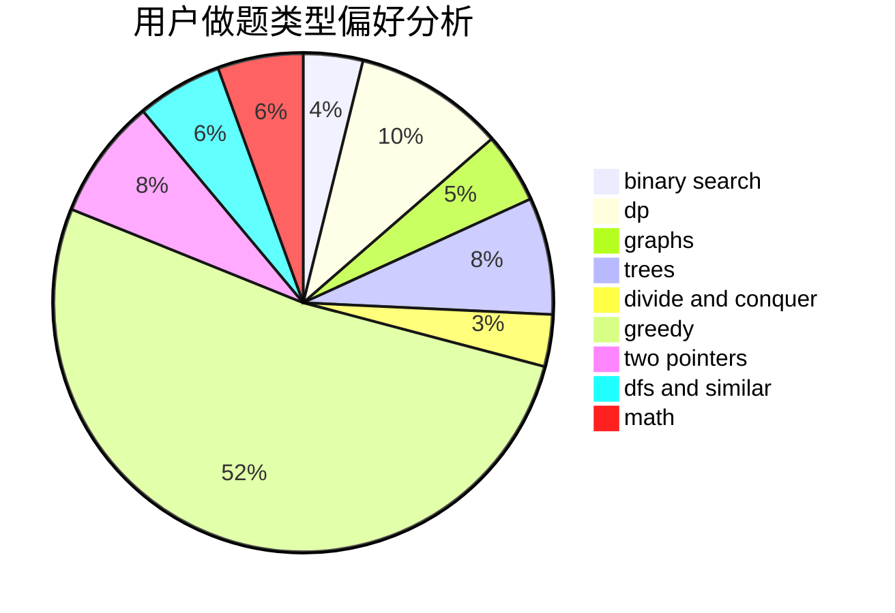

# oyqy1203

<!-- tabs:start -->

#### **用户提交结果分析**

#### **用户做题类型偏好分析**

<!-- tabs:end -->
# 推荐题目
[1033G](https://codeforces.com/contest/1033/problem/G)
[1243E](https://codeforces.com/contest/1243/problem/E)
[51A](https://codeforces.com/contest/51/problem/A)
[1402B](https://codeforces.com/contest/1402/problem/B)
[633D](https://codeforces.com/contest/633/problem/D)
[759B](https://codeforces.com/contest/759/problem/B)
[739D](https://codeforces.com/contest/739/problem/D)
[871E](https://codeforces.com/contest/871/problem/E)
[1382E](https://codeforces.com/contest/1382/problem/E)
[1428D](https://codeforces.com/contest/1428/problem/D)
