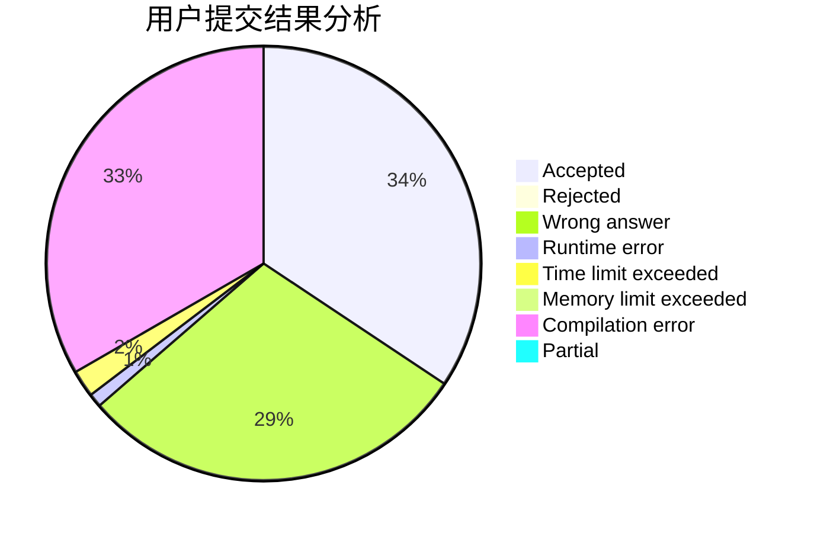
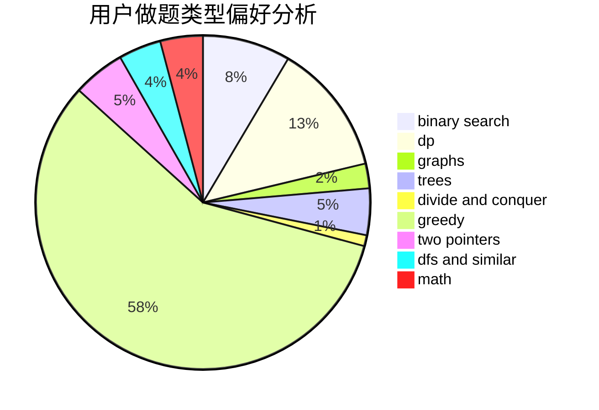

# p_b_p_b

<!-- tabs:start -->

#### **用户提交结果分析**

#### **用户做题类型偏好分析**

<!-- tabs:end -->
# 推荐题目
[679E](https://codeforces.com/contest/679/problem/E)
[1243E](https://codeforces.com/contest/1243/problem/E)
[295B](https://codeforces.com/contest/295/problem/B)
[1205E](https://codeforces.com/contest/1205/problem/E)
[725A](https://codeforces.com/contest/725/problem/A)
[575C](https://codeforces.com/contest/575/problem/C)
[560A](https://codeforces.com/contest/560/problem/A)
[844A](https://codeforces.com/contest/844/problem/A)
[635E](https://codeforces.com/contest/635/problem/E)
[16A](https://codeforces.com/contest/16/problem/A)
