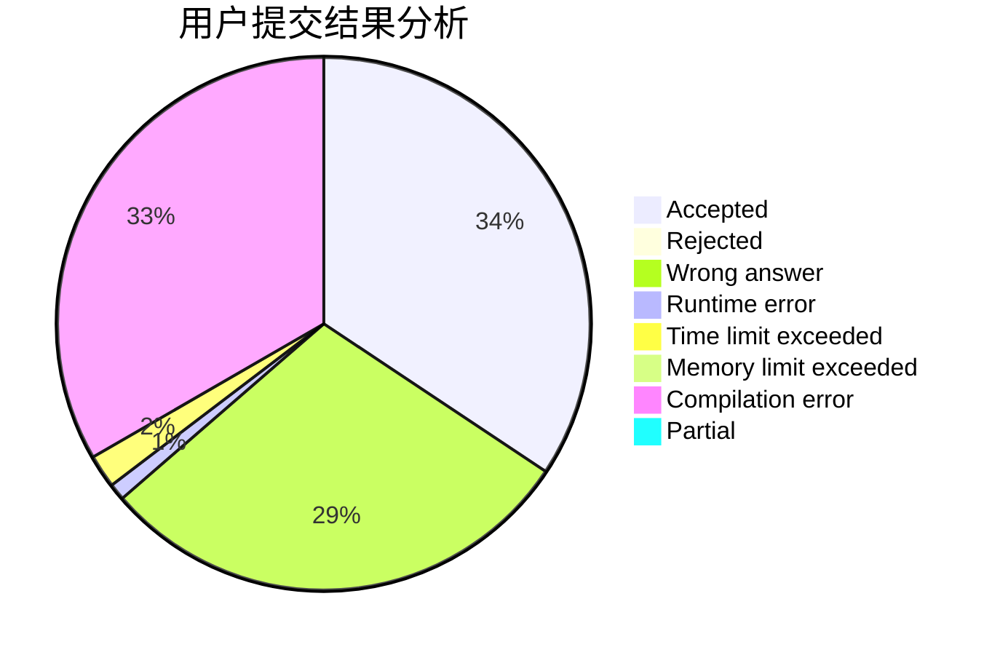
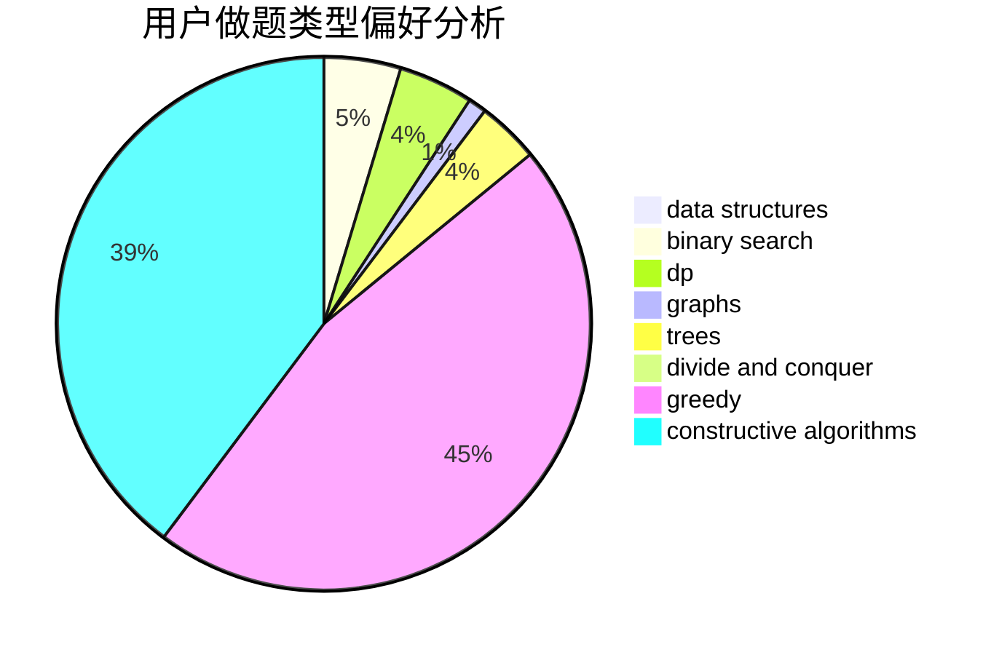
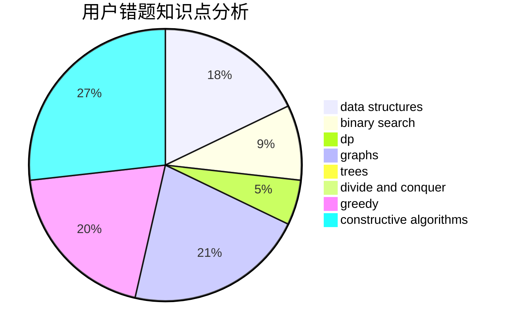

# p_b_p_b

<!-- tabs:start -->

#### **用户提交结果分析**

#### **用户做题类型偏好分析**

#### **用户错题知识点分析**

<!-- tabs:end -->
# 推荐题目
[679E](https://codeforces.com/contest/679/problem/E)		data structures		  
[1243E](https://codeforces.com/contest/1243/problem/E)		dsu,graphs,sortings,trees		  
[295B](https://codeforces.com/contest/295/problem/B)		dp,
                        graphs,
                        shortest paths		  
[1205E](https://codeforces.com/contest/1205/problem/E)		combinatorics,
                        strings		  
[725A](https://codeforces.com/contest/725/problem/A)		implementation		  
[575C](https://codeforces.com/contest/575/problem/C)		bitmasks,
                        brute force,
                        graph matchings		  
[560A](https://codeforces.com/contest/560/problem/A)		implementation,
                        sortings		  
[844A](https://codeforces.com/contest/844/problem/A)		greedy,
                        implementation,
                        strings		  
[635E](https://codeforces.com/contest/635/problem/E)		dsu,graphs,sortings,trees		  
[16A](https://codeforces.com/contest/16/problem/A)		implementation		  
