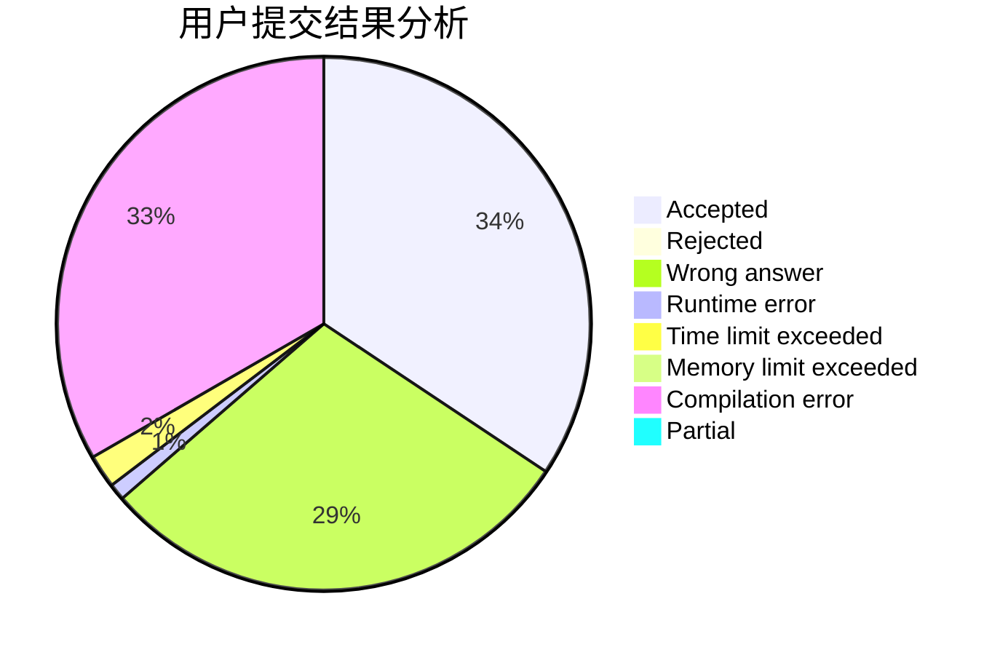
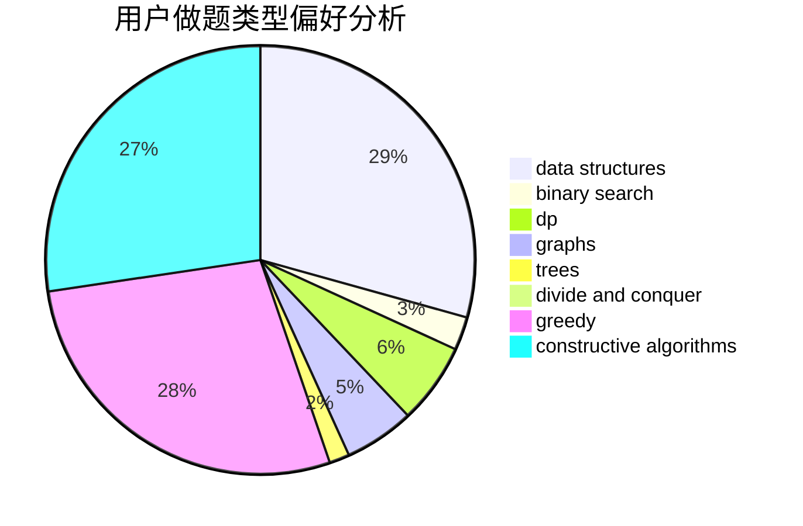
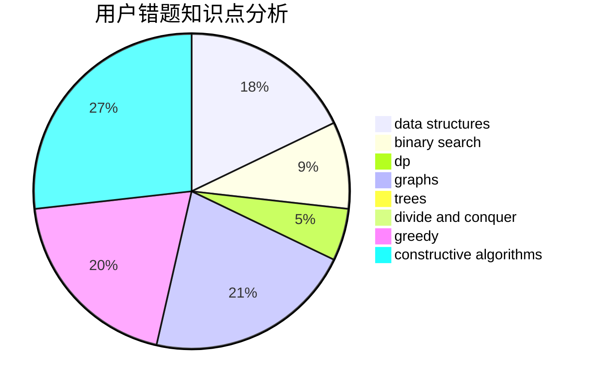

# p_b_p_b

<!-- tabs:start -->

#### **用户提交结果分析**

#### **用户做题类型偏好分析**

#### **用户错题知识点分析**

<!-- tabs:end -->
# 推荐题目
[659E](https://codeforces.com/contest/659/problem/E)		data structures,
                        dfs and similar,
                        dsu,
                        graphs,
                        greedy		  
[1238E](https://codeforces.com/contest/1238/problem/E)		bitmasks,
                        dp		  
[27C](https://codeforces.com/contest/27/problem/C)		constructive algorithms,
                        greedy		  
[1201A](https://codeforces.com/contest/1201/problem/A)		implementation,
                        strings		  
[706D](https://codeforces.com/contest/706/problem/D)		binary search,
                        bitmasks,
                        data structures,
                        trees		  
[550A](https://codeforces.com/contest/550/problem/A)		brute force,
                        dp,
                        greedy,
                        implementation,
                        strings		  
[53D](https://codeforces.com/contest/53/problem/D)		sortings		  
[825D](https://codeforces.com/contest/825/problem/D)		binary search,
                        greedy,
                        implementation		  
[617E](https://codeforces.com/contest/617/problem/E)		data structures		  
[1511D](https://codeforces.com/contest/1511/problem/D)		brute force,
                        constructive algorithms,
                        graphs,
                        greedy,
                        strings		  
