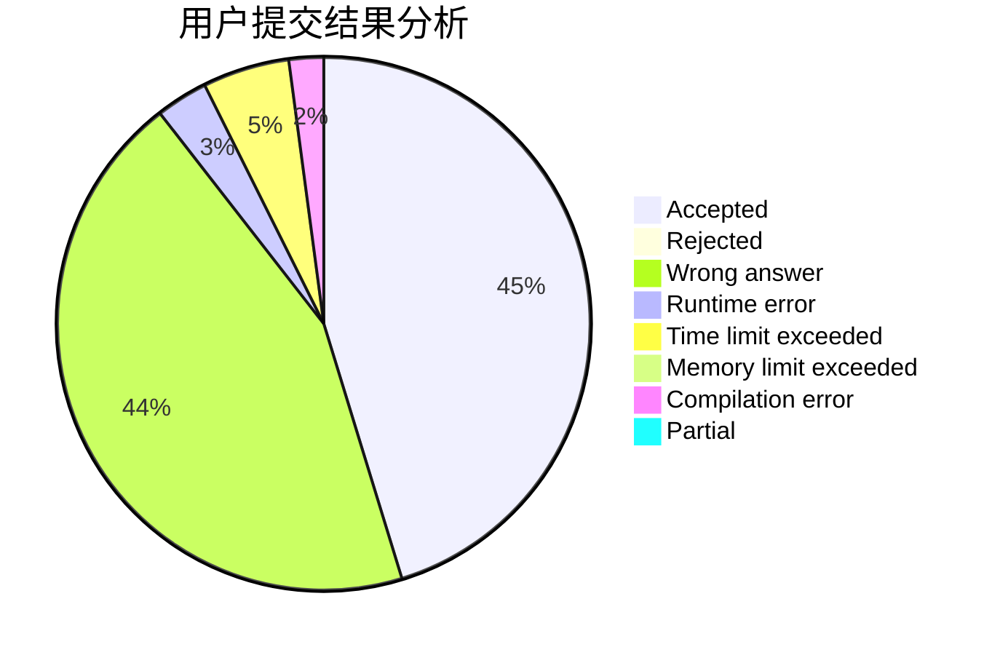
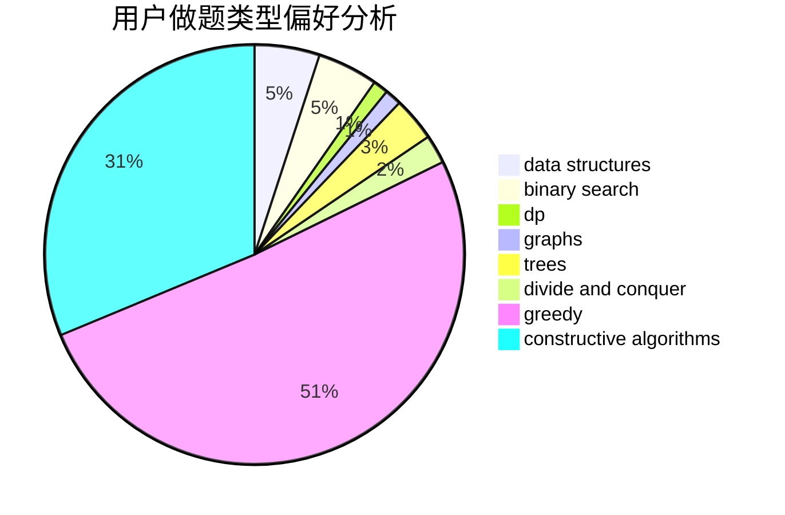

# paispls

<!-- tabs:start -->

#### **用户提交结果分析**

#### **用户做题类型偏好分析**

#### **用户错题知识点分析**

<!-- tabs:end -->
# 推荐题目
[1189A](https://codeforces.com/contest/1189/problem/A)		strings		  
[872B](https://codeforces.com/contest/872/problem/B)		dsu,graphs,sortings,trees		  
[1434E](https://codeforces.com/contest/1434/problem/E)		dsu,
                        games		  
[1028H](https://codeforces.com/contest/1028/problem/H)		math		  
[449B](https://codeforces.com/contest/449/problem/B)		graphs,
                        greedy,
                        shortest paths		  
[401C](https://codeforces.com/contest/401/problem/C)		constructive algorithms,
                        greedy,
                        implementation		  
[717H](https://codeforces.com/contest/717/problem/H)		math,
                        probabilities		  
[134B](https://codeforces.com/contest/134/problem/B)		brute force,
                        dfs and similar,
                        math,
                        number theory		  
[631E](https://codeforces.com/contest/631/problem/E)		data structures,
                        dp,
                        geometry		  
[1070C](https://codeforces.com/contest/1070/problem/C)		data structures,
                        greedy		  
