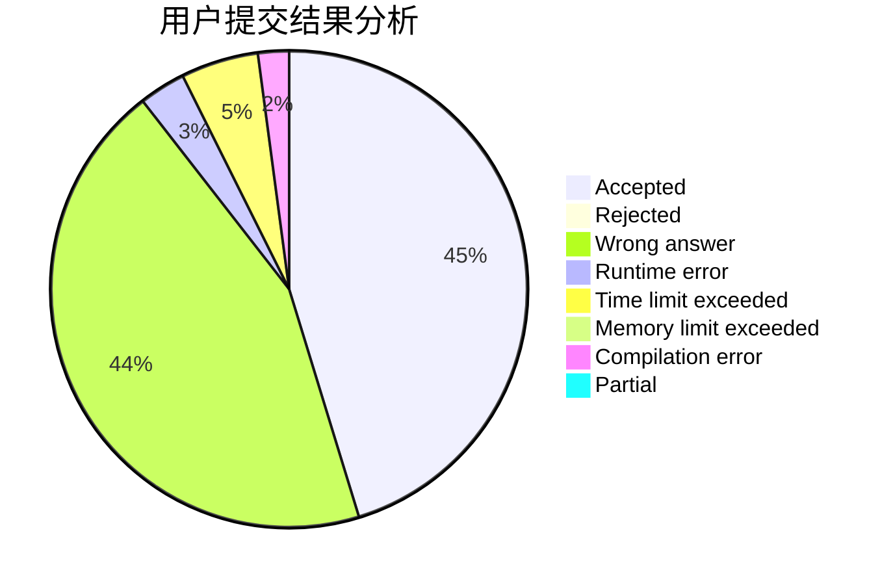
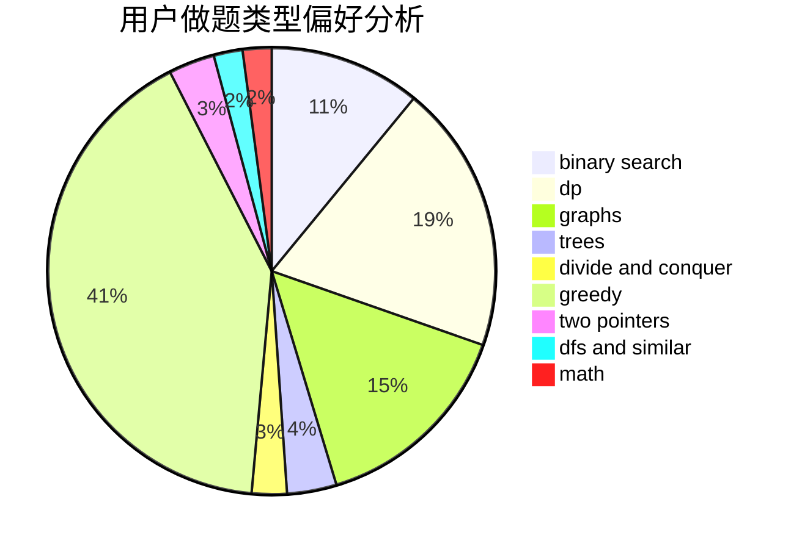

# paispls

<!-- tabs:start -->

#### **用户提交结果分析**

#### **用户做题类型偏好分析**

<!-- tabs:end -->
# 推荐题目
[1194C](https://codeforces.com/contest/1194/problem/C)
[893D](https://codeforces.com/contest/893/problem/D)
[1444E](https://codeforces.com/contest/1444/problem/E)
[1029C](https://codeforces.com/contest/1029/problem/C)
[468E](https://codeforces.com/contest/468/problem/E)
[42C](https://codeforces.com/contest/42/problem/C)
[735B](https://codeforces.com/contest/735/problem/B)
[13573](https://codeforces.com/contest/1357/problem/3)
[662D](https://codeforces.com/contest/662/problem/D)
[1070F](https://codeforces.com/contest/1070/problem/F)
