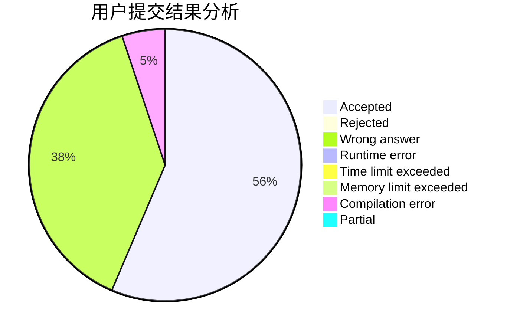
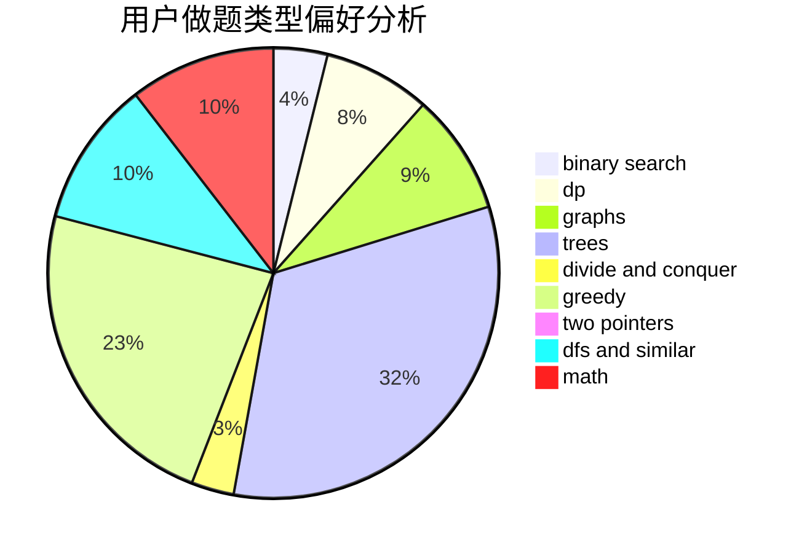

# paleprince

<!-- tabs:start -->

#### **用户提交结果分析**

#### **用户做题类型偏好分析**

<!-- tabs:end -->
# 推荐题目
[1243A](https://codeforces.com/contest/1243/problem/A)
[710D](https://codeforces.com/contest/710/problem/D)
[785D](https://codeforces.com/contest/785/problem/D)
[107B](https://codeforces.com/contest/107/problem/B)
[1236D](https://codeforces.com/contest/1236/problem/D)
[1012B](https://codeforces.com/contest/1012/problem/B)
[1220A](https://codeforces.com/contest/1220/problem/A)
[13783](https://codeforces.com/contest/1378/problem/3)
[802O](https://codeforces.com/contest/802/problem/O)
[474C](https://codeforces.com/contest/474/problem/C)
