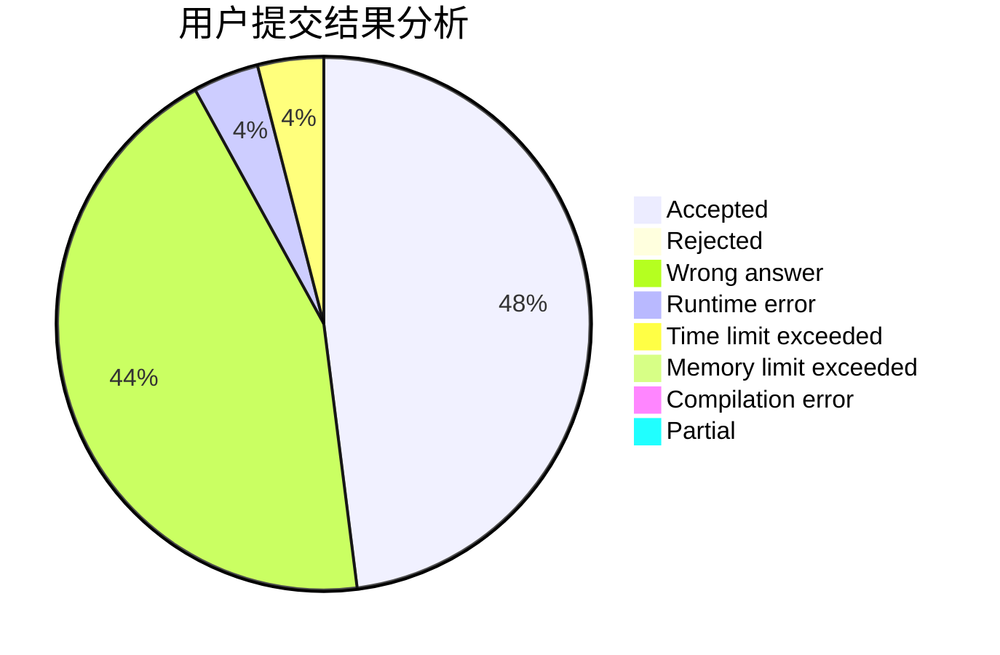
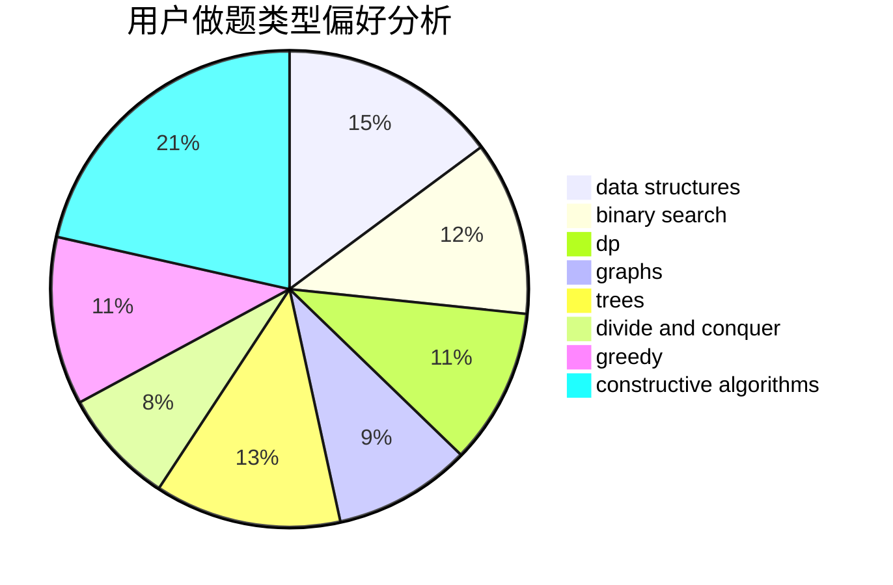
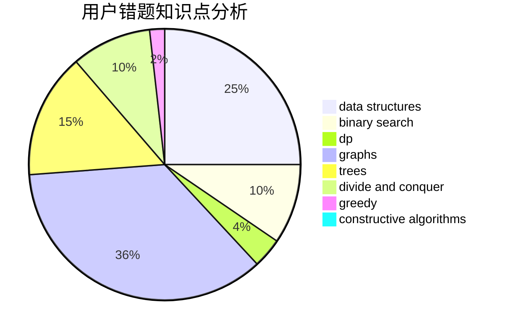

# pan64271

<!-- tabs:start -->

#### **用户提交结果分析**

#### **用户做题类型偏好分析**

#### **用户错题知识点分析**

<!-- tabs:end -->
# 推荐题目
[1436B](https://codeforces.com/contest/1436/problem/B)		constructive algorithms,
                        math		  
[27D](https://codeforces.com/contest/27/problem/D)		2-sat,
                        dfs and similar,
                        dsu,
                        graphs		  
[289D](https://codeforces.com/contest/289/problem/D)		dsu,graphs,sortings,trees		  
[659F](https://codeforces.com/contest/659/problem/F)		dfs and similar,
                        dsu,
                        graphs,
                        greedy,
                        sortings		  
[876A](https://codeforces.com/contest/876/problem/A)		math		  
[1388E](https://codeforces.com/contest/1388/problem/E)		data structures,
                        geometry,
                        sortings		  
[1366E](https://codeforces.com/contest/1366/problem/E)		binary search,
                        brute force,
                        combinatorics,
                        constructive algorithms,
                        dp,
                        two pointers		  
[27A](https://codeforces.com/contest/27/problem/A)		implementation,
                        sortings		  
[345A](https://codeforces.com/contest/345/problem/A)		*special problem,
                        probabilities		  
[260A](https://codeforces.com/contest/260/problem/A)		implementation,
                        math		  
