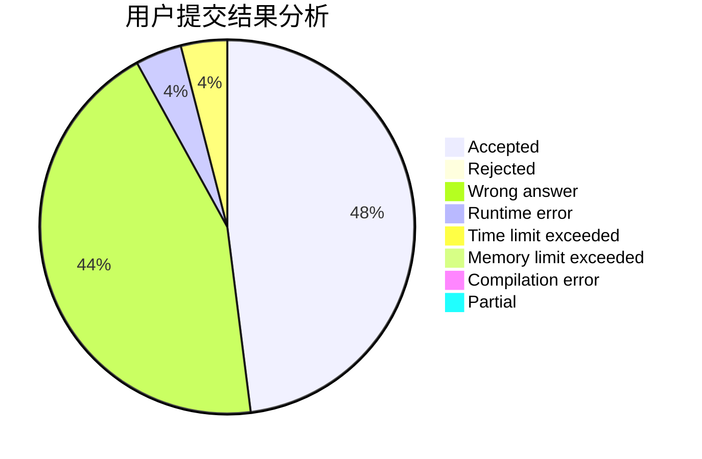
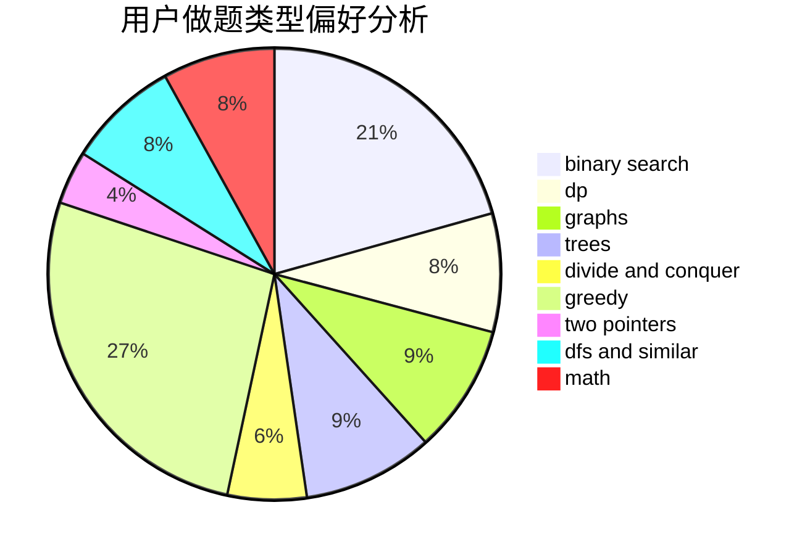

# pan64271

<!-- tabs:start -->

#### **用户提交结果分析**

#### **用户做题类型偏好分析**

<!-- tabs:end -->
# 推荐题目
[1436B](https://codeforces.com/contest/1436/problem/B)
[27D](https://codeforces.com/contest/27/problem/D)
[289D](https://codeforces.com/contest/289/problem/D)
[659F](https://codeforces.com/contest/659/problem/F)
[876A](https://codeforces.com/contest/876/problem/A)
[1388E](https://codeforces.com/contest/1388/problem/E)
[1366E](https://codeforces.com/contest/1366/problem/E)
[27A](https://codeforces.com/contest/27/problem/A)
[345A](https://codeforces.com/contest/345/problem/A)
[260A](https://codeforces.com/contest/260/problem/A)
