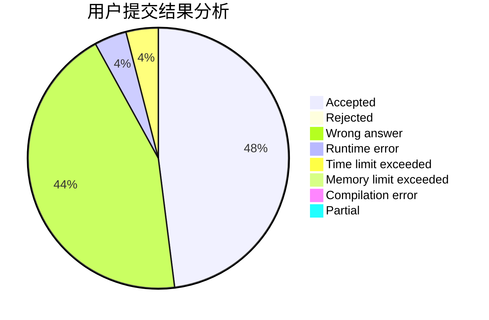
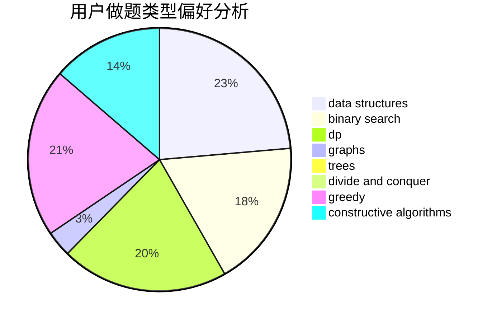
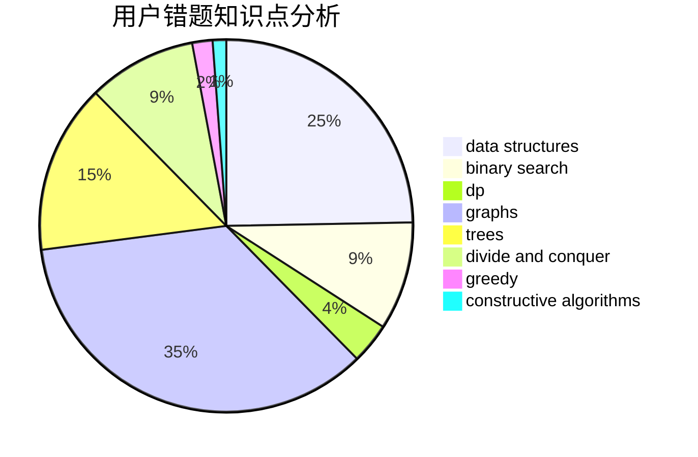

# pan64271

<!-- tabs:start -->

#### **用户提交结果分析**

#### **用户做题类型偏好分析**

#### **用户错题知识点分析**

<!-- tabs:end -->
# 推荐题目
[1427D](https://codeforces.com/contest/1427/problem/D)		constructive algorithms,
                        implementation		  
[263A](https://codeforces.com/contest/263/problem/A)		implementation		  
[273E](https://codeforces.com/contest/273/problem/E)		dp,
                        games		  
[62A](https://codeforces.com/contest/62/problem/A)		greedy,
                        math		  
[858A](https://codeforces.com/contest/858/problem/A)		brute force,
                        math,
                        number theory		  
[1379E](https://codeforces.com/contest/1379/problem/E)		constructive algorithms,
                        divide and conquer,
                        dp,
                        math,
                        trees		  
[1358C](https://codeforces.com/contest/1358/problem/C)		math		  
[261C](https://codeforces.com/contest/261/problem/C)		constructive algorithms,
                        dp,
                        math		  
[316G2](https://codeforces.com/contest/316G/problem/2)		string suffix structures		  
[238D](https://codeforces.com/contest/238/problem/D)		data structures,
                        implementation		  
