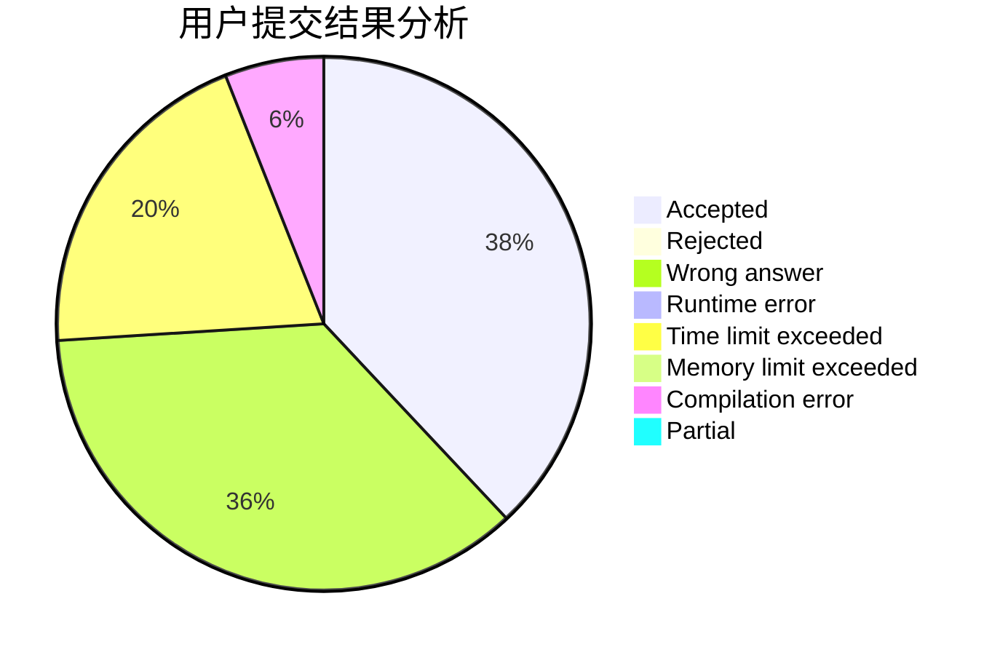
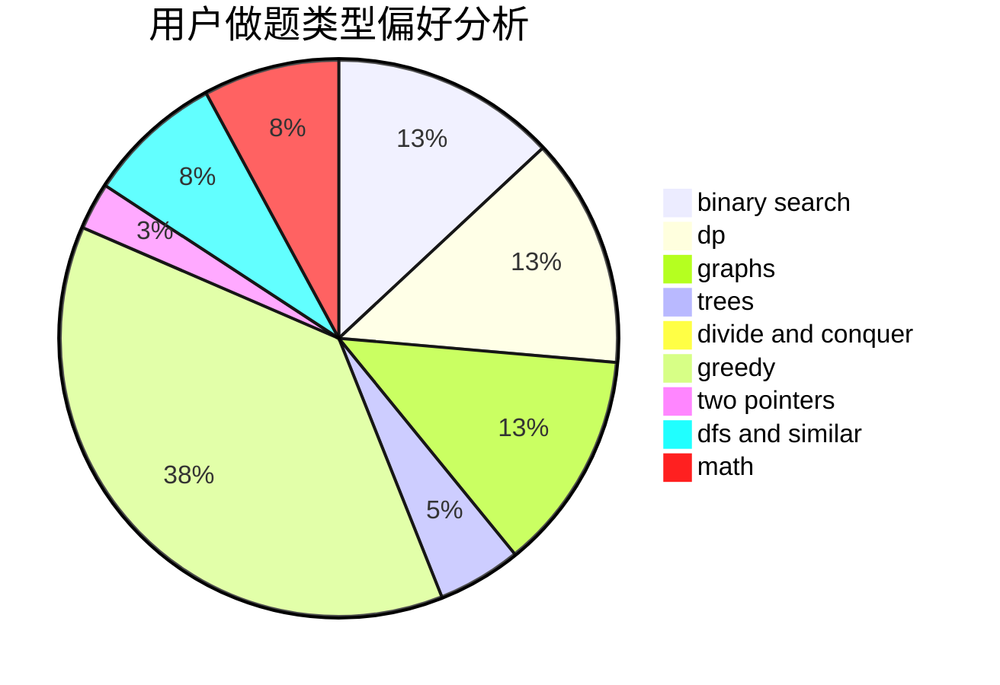

# panjinhua

<!-- tabs:start -->

#### **用户提交结果分析**

#### **用户做题类型偏好分析**

<!-- tabs:end -->
# 推荐题目
[1369B](https://codeforces.com/contest/1369/problem/B)
[1468L](https://codeforces.com/contest/1468/problem/L)
[708C](https://codeforces.com/contest/708/problem/C)
[1108A](https://codeforces.com/contest/1108/problem/A)
[1374B](https://codeforces.com/contest/1374/problem/B)
[1279E](https://codeforces.com/contest/1279/problem/E)
[489B](https://codeforces.com/contest/489/problem/B)
[314C](https://codeforces.com/contest/314/problem/C)
[567D](https://codeforces.com/contest/567/problem/D)
[1188E](https://codeforces.com/contest/1188/problem/E)
